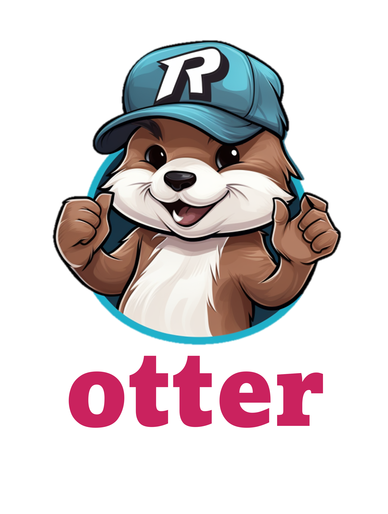

# Willkommen zu *otter*

<!-- badges: start -->

<!-- badges: end -->

**otter** ist ein **o**nline **T**utorial **T**ool für das **E**rlernen
von **R**.

Die Website mit Zugang zum Tool ist hier zu finden:
<https://meikesteinhilber.github.io/otter/>
