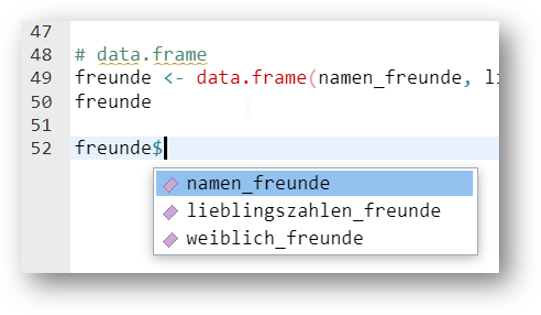
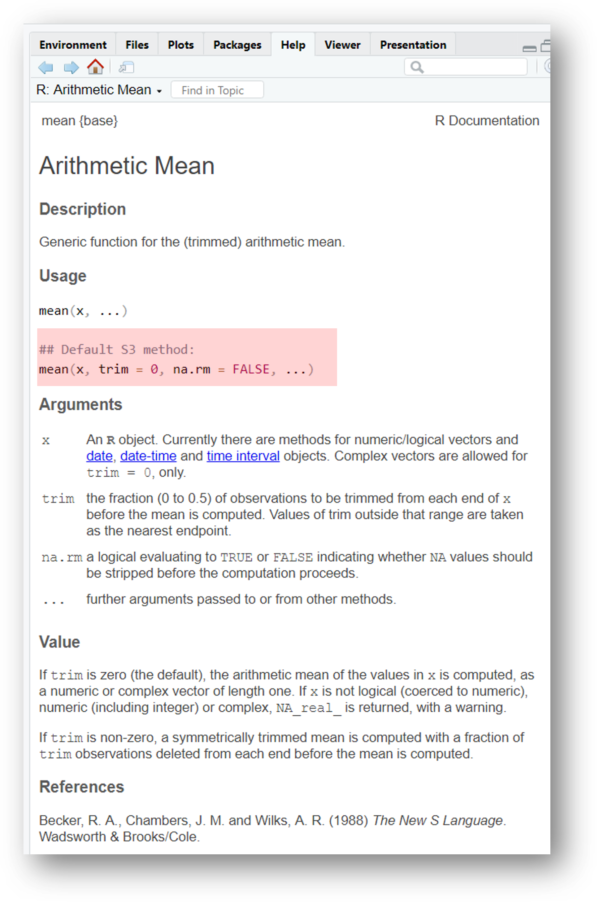

<script>
$(document).ready(function() {
  $("#tutorial-topic").prepend(`<div class="img-right">
  <a href="https://meikesteinhilber.github.io/otter/"> <i class="fa-solid fa-house" aria-label="Link zur otter Homepage" aria-hidden="true"></i>
  </a>
  </div>`);
  
  $(document).ready(function() {
  $('.menu-button').click(function() {
    $('.topicsContainer').toggleClass('menu-open');
    $(this).toggleClass('menu-open');
  });
  });
  
  $("#learnr-tutorial-content.topics").prepend(
  `<div class="logo">
  
  </div>`);

  $("a[href^='#']").on("click", function(event) {
    const currentSection = $(".section.current");
    var href = $(this).attr("href");

    if(!$(href, currentSection).length) {
      return;
    }
    var href = href.substr(1);
    event.preventDefault();

    const el = document.getElementById(href);
    if(!el) {
      return;
    }
    window.scrollTo({
      top: el.offsetTop,
      left: 0,
      behavior: "smooth",
    });
  });
});
</script>

<!-- <div class="menu-button">Menu</div> -->


```{r setup, include=FALSE}
library(learnr)
library(gradethis)
library(scales)
library(sprtt)
library(psych)
# devtools::load_all()
# remotes::install_github("MeikeSteinhilber/otter")
# remotes::install_github("rstudio/gradethis")
# library(otter)
knitr::opts_chunk$set(echo = FALSE)
gradethis::gradethis_setup(
  pass.praise = FALSE,
  fail.encourage = FALSE,
  pass = "Richtig!",
  fail = "Das ist leider falsch."
  )
tutorial_options(exercise.reveal_solution = TRUE,
                 exercise.blanks = "___",
                 exercise.eval = TRUE)
blue <- "#00c4e6"
```

## R und RStudio Installation

{right="100%" width="10%"}

**1. R Installation**

  -   allgemein unter: https://cran.rstudio.com/

  -   für Windows: https://cran.rstudio.org/bin/windows/base/

  -   für macOS: https://cran.r-project.org/bin/macosx/


<br>
{right="100%" width="20%"}

**2. RStudio Installation**

  -   unter: https://posit.co/download/rstudio-desktop/


## RStudio Einstieg

### Kapitel


<a href="#section-console"> <i class="fa-solid fa-arrow-down"></i> Console</a><br>
<a href="#section-environment"><i class="fa-solid fa-arrow-down"></i> Environment</a><br>
<a href="#section-files"><i class="fa-solid fa-arrow-down"></i> Files</a><br>
<a href="#section-r-skripte"><i class="fa-solid fa-arrow-down"></i> R Skripte</a><br>


RStudio ist eine sogenannte *integrated development environment* (IDE), also eine Entwicklungsumgebung für die Programmiersprache R.
Grundsätzlich sind auch andere IDEs möglich, wir werden in diesem Tutorial jedoch immer davon ausgehen, dass RStudio verwendet wird.

Nach dem RStudio geöffnet wird, sieht es so aus:

{.absolute .images-shadow left="100%" width="80%"}

Aktuell haben wir noch kein Dokument geöffnet.
Wir sehen aktuell 3 separierte Bereiche bzw. Fenster.

### Console <a href="#section-rstudio-einstieg"> <i class="fa-solid fa-arrow-up"></i></a>


{.absolute .images-shadow left="100%" width="80%"}

In der *Console* können R Befehle direkt ausgeführt werden.
Dies ist praktisch für kleine Taschenrechner Befehle oder kleine Tests.
Der Nachteil ist jedoch, dass die R Befehle nicht gespeichert werden können.
Dafür wird ein R Skript benötigt.

{.absolute .images-shadow left="100%" width="60%"}


### Environment <a href="#section-rstudio-einstieg"> <i class="fa-solid fa-arrow-up"></i></a>

{.absolute .images-shadow left="100%" width="80%"}

Das Environment ist zu Beginn einer R Session leer.
Wenn wir jedoch Variablen speichern oder Datensätze einladen, werden diese Objekte hier angezeigt.

{.absolute .images-shadow left="100%" width="80%"}

### Files <a href="#section-rstudio-einstieg"> <i class="fa-solid fa-arrow-up"></i></a>

{.absolute .images-shadow left="100%" width="80%"}

Je nachdem wo die *working directory* gesetzt ist, werden hier unterschiedliche Dokumente und Ordner angezeigt.

### R Skripte <a href="#section-rstudio-einstieg"> <i class="fa-solid fa-arrow-up"></i></a>


Wenn ein R Skript geöffnet wird, wird ein weiteres Fenster für das Skript angezeigt.
In einem R Skript kann Code abgespeichert werden.


## R Skript

### Kapitel

<a href="#section-kommentare"><i class="fa-solid fa-arrow-down"></i> Kommentare</a><br>
<a href="#section-neues-r-skript-öffnen"><i class="fa-solid fa-arrow-down"></i> Neues R Skript öffnen</a><br>


In einem R Skript kann Code abgespeichert werden.

{.absolute .images-shadow left="100%" width="80%"}


### Kommentare <a href="#section-r-skript"> <i class="fa-solid fa-arrow-up"></i></a>


Grundsätzlich wird jeder Befehl und jedes Zeichen als R Code verstanden.
Wenn man einen Kommentar schreiben möchte, muss man in jeder Zeile eine `#` davor setzen.

{.absolute .images-shadow left="100%" width="80%"}

Code wird ausgeführt in dem der gewünschte Bereich markiert wird und dann auf den *Run*-Button geklickt wird. Es kann hier der gesamte Code markiert werden, aber auch einzelne Zeilen oder sogar nur einzelne Befehle.

{.absolute .images-shadow left="100%" width="80%"}

Die Tastenkombination für *Run* ist unter Windows `Str + Enter` und unter macOS `Cmd + Enter`.

### Neues R Skript öffnen <a href="#section-r-skript"> <i class="fa-solid fa-arrow-up"></i></a>


Ein neues leeres R Skript wir über diesen Button geöffnet:

{.absolute .images-shadow left="100%" width="80%"}

Man erhält eine große Anzahl an möglichen Formaten, unter anderem auch ein R Skript.

{.absolute .images-shadow left="100%" width="20%"}

Das neu geöffnete R Skript sieht nun so aus und kann direkt abgespeichert werden  mit dem Disketten-Symbol.

{.absolute .images-shadow left="100%" width="80%"}


## RStudio vs `otter`

Die `otter` Tutorials sind alle interaktiv gestaltet.
Damit wir dir Feedback geben können und du nicht immer zwischen RStudio und unserer Website wechseln musst, sind R-Bausteine eingebaut.
Siehe dir die folgenden Bilder und Aufgaben an, um zu verstehen wie in unseren Tutorials R eingebaut ist.

{.absolute left="100%" width="80%"}


#### Übungen
So sieht derselbe R Code in unserem Tutorial Format aus:

<div class="uebungen">

`r otter::colorize("Aufgabe", "var(--blue)")`
 *Klicke auf den Button "Run Code" und vergleiche die Ausgabe mit den obrigen Bildern*.
```{r r-vs-tutorial, exercise=TRUE, results = "hold", exercise.eval=FALSE}
5*5

# Dies ist ein Kommentar

print("Hallo Welt!")
```

Versuche Dich nun selbst!

`r otter::colorize("Aufgabe", "var(--blue)")`
*Berechne 84 \* 15.
Gebe dazu die Berechnung in den R Code Bereich ein und klicke auf "Code ausführen"*
```{r ex-r-vs-tutorial, exercise=TRUE, results = "hold", exercise.eval=FALSE}

```

```{r ex-r-vs-tutorial-check, results = "hold", exercise.eval=FALSE}
grade_result(
  pass_if(~identical(.result, 84 * 15)),
  glue_correct = "Richtig!"
)
```

</div> 

## Datentypen

### Kapitel

<a href="#section-kurze-zusammenfasssung"> <i class="fa-solid fa-arrow-down"></i> Kurze Zusammenfasssung</a><br>
<a href="#section-logical"> <i class="fa-solid fa-arrow-down"></i> Logical</a><br>
<a href="#section-integer"> <i class="fa-solid fa-arrow-down"></i> Integer</a><br>
<a href="#section-double"> <i class="fa-solid fa-arrow-down"></i> Double</a><br>
<a href="#section-character"> <i class="fa-solid fa-arrow-down"></i> Character</a><br>
<a href="#section-viel-nichts-in-r"> <i class="fa-solid fa-arrow-down"></i> Viel Nichts in R</a><br>
<a href="#section-infektiöse-fehlende-werte"> <i class="fa-solid fa-arrow-down"></i> Infektiöse fehelende Werte</a><br>
<a href="#section-hilfreiche-funktionen"> <i class="fa-solid fa-arrow-down"></i> Hilfreiche Funktionen</a><br>

### Kurze Zusammenfasssung <a href="#section-datentypen"> <i class="fa-solid fa-arrow-up"></i></a>

-   Logical: TRUE, FALSE
-   Integer: Ganze Zahlen (Platz speichernd)
-   Double: Kommazahlen
-   Character: Buchstaben

### Logical <a href="#section-datentypen"> <i class="fa-solid fa-arrow-up"></i></a>


Werte:   `TRUE` (entwpricht 1) und `FALSE` (entspricht 0)

Kann aufsummiert werden:

```{r logicals-1, exercise=TRUE, results = "hold"}
TRUE + TRUE 
FALSE + FALSE
TRUE + FALSE 
```

Logische Operatoren können angewandt werden

```{r logicals-2, exercise=TRUE, results = "hold"}
FALSE & TRUE
FALSE | TRUE
5 < 10
```

__Logische Operatoren__

| Symbol | Bedeutung   |
|--------|-------------|
| `<`    | kleiner als |
| `>`    | größer als  |
| `==`   | gleich      |
| `!=`   | ungleich    |
| `|`    | oder        |
| `&`    | und         |
| `!`    | Negierung   |

<!-- : Logische Operatoren -->

Mit Logischen Operatoren können auf Objekte (Variablen, Vektoren, Datensätze, ...) angewandt werden.
Als Ergebnis wird immer der Datentyp `logical` ausgegeben.

```{r logical-3, exercise=TRUE, results = "hold"}
buchstaben <- c("A", "B", "C", "D", "C")
zahlen <- c(18, 22, 16, 20)

# Welche Buchstaben sind C?
buchstaben == "C"

# Welche Zahl ist größer als 20?
zahlen > 20
```


#### Übungen
<div class="uebungen">

`r otter::colorize("Vorbereitung", "var(--blue)")`
```{r setup-logical, exercise.eval=FALSE}
namen <- c("Lisa Müller", "Peter Bauer", "Hannah Schmidt")
angemeldet <- c(TRUE, FALSE, TRUE)
alter <- c(18, 22, 16)
```

```{r, ref.label=I('setup-logical'), eval=TRUE, echo=TRUE, exercise.eval=FALSE}

```

`r otter::colorize("Aufgabe:", "var(--blue)")` *Beantworte die gestellte Frage mit R Code.*

```{r ex-logical-1, exercise=TRUE, results = "hold", exercise.setup = "setup-logical", exercise.eval=FALSE}
# Wer von den Personen heißt NICHT Lisa Müller?

```
```{r ex-logical-1-hint-1, exercise.eval=FALSE}
namen ___ "Lisa Müller"
```
```{r ex-logical-1-hint-2, exercise.eval=FALSE}
!=
```
```{r ex-logical-1-solution, exercise.eval=FALSE}
# Wer von den Personen heißt NICHT Lisa Müller?
namen != "Lisa Müller"
```

```{r ex-logical-1-check}
grade_this({
  pass_if_equal()
  fail()
})
```


`r otter::colorize("Aufgabe:", "var(--blue)")` *Beantworte die gestellte Frage mit R Code.*
```{r ex-logical-2, exercise=TRUE, results = "hold", exercise.setup = "setup-logical", exercise.eval=FALSE}
# Wer von den Personen ist jünger als 18 Jahre?

```

```{r ex-logical-2-solution, exercise.eval=FALSE}
# Wer von den Personen heißt NICHT Lisa Müller?
alter < 18
```

```{r ex-logical-2-check, exercise.eval=FALSE}
grade_this({
  pass_if_equal()
  fail()
})
```

</div>
### Integer <a href="#section-datentypen"> <i class="fa-solid fa-arrow-up"></i></a>


`integer`-zahlen sind Ganzezahlen in R.
Sie sind platzsparender als `double` Zahlen, da Kommas ausgeschlossen sind.
R geht zuerst immer davon aus, dass es sich um `double` Zahlen handelt, somit müssen `integer`-Zahlen explizit definiert werden.

Hier gibt es zwei Möglichkeiten:

-   L muss direkt dahinter gesetzt werden, z.B. `2L`
-   `:` ermöglich schnell eine Folge an `integer` Zahlen zu generieren, z.B. `1:3` erzeugt die Zahlen von 1 bis 3 in einzer Schritten

```{r integers-1, exercise=TRUE, results = "hold"}
1L
1:10
10:1
```

Mit der Funktion `is.integer()` können wir prüfen, ob es sich um `integer`-Zahlen handelt oder nicht.

```{r integers-2, exercise=TRUE, results = "hold"}
is.integer(1)
is.integer(1L)
```

### Double <a href="#section-datentypen"> <i class="fa-solid fa-arrow-up"></i></a>


`double`-zahlen sind sogenannte Gleitkommazahlen.
Diese Zahlentypen werden für normale Berechnungen verwendet

-   Kommazahlen
-   Sonderfälle
    -   `Inf` Positive Unendlichkeit
    -   `-Inf` Negative Unendlichkeit
    -   `NaN` Not a Number (Fehlender Wert im Datensatz)
    
```{r doubles-1, exercise=TRUE, results = "hold"}
8/5
4.44 + 2.1
```

Mit der Funktion `typeof()` können wir abfragen, um welchen Datentyp es sich handelt.

```{r doubles-2, exercise=TRUE, results = "hold"}
typeof(5)
```

### Character <a href="#section-datentypen"> <i class="fa-solid fa-arrow-up"></i></a>


Text oder Symbole oder auch Farben, werden in Datentyp `character` gespeichert.

Text muss in `""` gesetzt werden.

Dies ist ein Beispiel für Text.
```{r character-1, exercise=TRUE, results = "hold"}
"Hallo Welt"
```

Text wird häufig als Funktionsargument verwendet, z.B. um Symbole anzuzeigen.
(Die Icons stammen von [fontawesome](https://fontawesome.com/search?o=r&m=free).)
```{r character-2, exercise=TRUE, results = "hold"}
shiny::icon("rocket")
shiny::icon("star")
```

Oder auch für Hexcode, um Farben zu definieren.

```{r character-3, exercise=TRUE, results = "hold"}
scales::show_col(c("#044a85", "#e28743", "#1F98B44D", "#1F98BC"))
```

### Viel Nichts in R <a href="#section-datentypen"> <i class="fa-solid fa-arrow-up"></i></a>

In R gibt es viele Möglichkeit, um auszudrücken, dass etwas nicht vorhanden ist.
Alle Formen von "Nichts" haben eine leicht andere Bedeutung und werden in unterschiedlichen Fällen verwendet oder produziert.

Hier eine (nicht vollständige) Übersicht:

- `NaN`: *Not a Number* (Länge ist 1). Wir verwendet bei invaliden Rechenoperationen.

- `NA`: *Not Available* (Länge ist 1). Wird klassisch für fehlende Werte verwendet.

- `NULL`: Repräsentiert das Null-Objekt in R (Länge ist Null). Wird z.B. in Funktionen verwendet für default Argumente.

- `logical(0)`: Ein `logical`-Wert der Länge Null.

- `integer(0)`: Eine `integer`-Zahl der Länge Null.

- `double(0)`: Eine `double`-Zahl der Länge Null.

All diese Werte stellen „nichts" oder „fehlend" dar.

Die Länge dieser Werte unterscheidet sich, so sind manche 0 und andere 1.

```{r na-2, exercise=TRUE, results = "hold"}
length(NaN)
length(NA)
length(NULL)
length(integer(0))
length(double(0))
```

Beispiele für die Erzeugung von `NA`
```{r na-3, exercise=TRUE, results = "hold"}
NA == "test"
NA == 5
NaN == 5
```

Beispiele für die Erzeugung von `NaN`
```{r na-5, exercise=TRUE, results = "hold"}
0/0
Inf/1
```

Beispiele für die Erzeugung von `logical(0)`
```{r na-4, exercise=TRUE, results = "hold"}
NULL == "test"
NULL == 5
integer(0) == 5
```

### Infektiöse fehlende Werte <a href="#section-datentypen"> <i class="fa-solid fa-arrow-up"></i></a>


Fehlende Werte wie `NaN` sind manchmal infektiös!

Bei Rechenoperationen führt z.B. ein `NaN` dazu, das das Ergebnis auch ein fehlender Wert ist.

Dies gilt jedoch nicht für `|` Operationen.

`NaN` kann NICHT mit `==` geprüft werden! Es muss mit `is.na()` geprüft werden.

```{r na-1, exercise=TRUE, results = "hold"}
NaN == NaN
NaN < 5
10 * NaN
NaN & TRUE

NaN | TRUE
is.na(NaN)
```

### Hilfreiche Funktionen <a href="#section-datentypen"> <i class="fa-solid fa-arrow-up"></i></a>


Erstellen Dummy Variablen eines bestimmten Datentyps:

```{r data-functions1, exercise=TRUE, results = "hold"}
integer(5)
double(5)
character(5)
logical(5)
```


Prüfungen, welcher Datentyp vorliegt:

```{r data-functions2, exercise=TRUE, results = "hold"}
# Erzeugung einer Variable
number = 5
# Prüfung der Variable
is.integer(number)
is.double(number)
is.character(number)
is.logical(number)
is.numeric(number)

# Prüfung von Spezialfällen
is.na(number)
is.finite(number)
is.infinite(number)
```

## Datenstrukturen

### Kapitel

<a href="#section-variablen"> <i class="fa-solid fa-arrow-down"></i> Variablen</a><br>
<a href="#section-atomare-vektoren"> <i class="fa-solid fa-arrow-down"></i> Atomare Vektoren</a><br>
<a href="#section-vektorisierte-berechnungen"> <i class="fa-solid fa-arrow-down"></i> Vektorisierte Berechnungen</a><br>
<a href="#section-faktoren"> <i class="fa-solid fa-arrow-down"></i> Faktoren</a><br>
<a href="#section-matrizen"> <i class="fa-solid fa-arrow-down"></i> Matrizen</a><br>
<a href="#section-data.frame"> <i class="fa-solid fa-arrow-down"></i> data.frame</a><br>
<a href="#section-listen"> <i class="fa-solid fa-arrow-down"></i> Listen</a><br>

### Variablen <a href="#section-datenstrukturen"> <i class="fa-solid fa-arrow-up"></i></a>


Variablen sind Kontainer für Daten.
Sie zeigen auf ein Objekt im Speicher.
Sie müssen *ausgeführt* werden, um erstellt und genutzt werden zu können.
Nach Erstellung taucht die Variable im *Environment* auf.

Eine Variable kann verschiedene Inhalte enthalten, z.B eine Zahl, Buchstaben, Matrizen oder Listen.

Der Inhalt einer Variable kann auf die *Konsole* geschrieben werden, wenn der Variablenname ausgeführt wird.

```{r variable-1, exercise=TRUE, results = "hold"}
name <- "Lara"
weiblich <- TRUE
lieblingszahl <- 3
alter <- NULL
name
weiblich
lieblingszahl
```

In RStudio ist nach dem Ausführen dieses Codes im *Environment* folgendes zu sehen:

{.absolute width="500"}

Variablen können mit Operatoren Inhalte zugewiesen werden. In R gibt es hierfür zwei Zuweisungsoperatoren: `<-` und `=`.
Wobei es als guter Stil gilt einheitlich `<-` zu verwenden.


```{r variable-2, exercise=TRUE, results = "hold"}
pfeil_beispiel <- "Pfeil"
gleich_beispiel = "Gleich"
pfeil_beispiel
gleich_beispiel
```

Der Inhalt von einer Variable kann jederzeit geändert werden.
Neue Daten können mit dem Zuweisungsoperator zugewiesen werden.
Dadurch werden die alten Daten überschrieben.

```{r variable-3, exercise=TRUE, results = "hold"}
# Alte Daten
freunde <- 1:5
freunde
# Neue Daten Variante 1 (anderer Datentyp)
freunde <- c("Lisa", "Thorben", "Mara")
freunde
# Neue Daten Variante 2 (einzelne Daten ändern)
freunde[2] <- "XXXX"
freunde
# Neue Daten Variante 3 (einzelne Daten ändern)
freunde[c(FALSE, TRUE, TRUE)] <- ""
freunde
```

### Atomare Vektoren <a href="#section-datenstrukturen"> <i class="fa-solid fa-arrow-up"></i></a>


Atomare Vektoren können mehrere Informationen desselben Datentyps enthalten.

-   Werden mit `c()` erstellt (c = combine)
-   *Skalare*: Vektoren mit nur einer Position
-   „klassische Vektoren": Vektoren mit mehr als einer Position
-   Zugriff erfolgt mit Klammern `[]` und Nummer der Position oder einem Vektor mit `TRUE` und `FALSE` Werten.

`r otter::colorize("Beispiel:", "var(--red)")`
 Zugriff mit `[]`
```{r vektoren-1, exercise=TRUE, results = "hold"}
name = "Lara"
namen_freunde = c("Lisa", "Thorben", "Mara")
lieblingszahlen_freunde = c(1, 7, 8)
weiblich_freunde = c(TRUE, FALSE, TRUE)

# Zugriff erfolgt mit []
namen_freunde[2]
lieblingszahlen_freunde[2]
weiblich_freunde[c(2, 3)]
```

`r otter::colorize("Beispiel:", "var(--red)")`
Zugriff mit `TRUE` und `FALSE`

```{r vektoren-2, exercise=TRUE, results = "hold"}
namen_freunde = c("Lisa", "Thorben", "Mara")
namen_freunde[c(TRUE, TRUE, TRUE)]
namen_freunde[c(TRUE, FALSE, FALSE)]
```

### Vektorisierte Berechnungen <a href="#section-datenstrukturen"> <i class="fa-solid fa-arrow-up"></i></a>


Die Berechnungen in R erfolgen *vektorisiert*.
Dies erlaubt effizienteres und leichteres Programmieren bei Rechenoperationen.

`r otter::colorize("Beispiel:", "var(--red)")`
Multiplikation eines Vektors mit einem Skalar

```{r vektoren-4, exercise=TRUE, results = "hold"}
# Jede Zahl im Vektor wird hier automatisch mit 5 multipliziert
c(1, 2, 3, 4) * 5
```

`r otter::colorize("Beispiel:", "var(--red)")`
Addition zweier Vektoren

```{r vektoren-5, exercise=TRUE, results = "hold"}
# Die Zahlen auf denselben Positionen werden mit einender addiert
zahlen_1 <- c(0, 0, 1, 1)
zahlen_2 <- c(1, 2, 3, 4)
zahlen_1 + zahlen_2
```

`r otter::colorize("Beispiel:", "var(--red)")`
Logische Operatoren

```{r vektoren-6, exercise=TRUE, results = "hold"}
# Alle Zahlen werden mit dem logischen Operator geprüft
zahlen <- c(0, 1, 2, 3)
zahlen < 2
```


### Faktoren <a href="#section-datenstrukturen"> <i class="fa-solid fa-arrow-up"></i></a>


Faktoren repräsentieren kategoriale Daten mit endlichen Ausprägungen, z.B. Tage, Monate im Jahr oder Geschlecht.
Damit mit diesen Daten gut gerechnet werden kann in R, werden sie mit Faktoren abgebildet.

Dadurch können kategoriale Daten geordnet werden (hilfreich bei Tagen oder Monaten) oder auch in Zahlen kodierte Daten können inhaltlich sinnvoll abgebildet werden (hilfreich für statistische Auswertungen und Grafiken).

`r otter::colorize("Beispiel:", "var(--red)")`
Geschlecht (Daten sind als Zahlen kodiert):

```{r factors-1, exercise=TRUE, results = "hold"}
# Die Daten sind hier kodiert mit Zahlen
daten <- c(1,2,3,1,2,1,1,1,1)

# Erstellung eines Faktors
geschlecht <- factor(
  daten,
  # alle möglichen Kategorien (müssen nicht alle vorhanden sein in den Daten)
  levels = c(1, 2, 3, 4), 
  # Namen zugeordnet zu den levels - > für was steht die Zahl 1?
  labels = c("weiblich", "männlich", "divers", "unbekannt")
)
geschlecht
```

`r otter::colorize("Beispiel:", "var(--red)")`
Tage (Daten sind als Text kodiert):

```{r factors-2, exercise=TRUE, results = "hold"}
# Die Daten sind hier kodiert als Text
daten <- c("Sonntag", "Montag", "Freitag")

# Erstellung eines Faktors
tage <- factor(
  daten,
  # alle möglichen Kategorien (müssen nicht alle vorhanden sein in den Daten)
  levels = c("Montag", "Dienstag", "Mittwoch", "Donnerstag", "Freitag", "Samstag", "Sonntag")
)
# Daten ungeordnet
tage
```

`r otter::colorize("Beispiel:", "var(--red)")`
Faktor vs character Vektor

```{r factors-3, exercise=TRUE, results = "hold"}
daten <- c("Sonntag", "Montag", "Freitag")
# Daten werden nach dem Alphabet geordnet
sort(daten)

tage <- factor(
  daten,
  levels = c("Montag", "Dienstag", "Mittwoch", "Donnerstag", "Freitag", "Samstag", "Sonntag")
)
# Daten werden nach der Reihenfolge der angegebenen levels geordnet
sort(tage)
```


### Matrizen <a href="#section-datenstrukturen"> <i class="fa-solid fa-arrow-up"></i></a>


Sind Tabellen, die aus Vektoren gleicher Länge bestehen.
-   Können nur **einen Datentyp** enthalten, z.B. `numeric`
-   R Befehl: `matrix()`
-   Zugriff erfolgt mit `[,]` wobei die Positionen für `[Zeile,Spalte]` stehen als erst Zeile, dann Spalte.

`r otter::colorize("Beispiel:", "var(--red)")`
Matrix Erstellung und Zugriff
```{r matrix-1, exercise=TRUE, results = "hold"}
matrix <- matrix(1:12, nrow=3, ncol=4)
matrix

matrix[1,2] # Zeile 1 und Spalte 2
matrix[1, ] # Gesamte Zeile 1
matrix[ ,2] # Gesamte Spalte
```

### data.frame <a href="#section-datenstrukturen"> <i class="fa-solid fa-arrow-up"></i></a>


Ist das Format für den klassischen Datensatz.

-   Besteht aus Spalten gleicher Länge
-   Spalten können **verschiedene Datentypen** haben.
-   Auf Spalte wird mit `$` zugegriffen

{width="300"}

`r otter::colorize("Beispiel:", "var(--red)")`
`data.frame` Erstellung und Zugriff
```{r matrix-2, exercise=TRUE, results = "hold", exercise.lines = 13}
namen = c("Lisa", "Thorben", "Mara")
lieblingszahlen = c(1, 7, 8)
weiblich = c(TRUE, FALSE, TRUE)

freunde <- data.frame(namen,
                      lieblingszahlen,
                      weiblich)
freunde # gesamter Datensatz anzeigen lassen

freunde[2, 3] # zweite Zeile, dritte Spalte im Datensatz
freunde$namen # Im Datensatz die Spalte namen 
freunde$lieblingszahlen[2] # Im Datensatz die Spalte lieblingszahlen, die zweite Position
```

### Listen <a href="#section-datenstrukturen"> <i class="fa-solid fa-arrow-up"></i></a>


Listen ermöglichen das Speichern von allen möglichen Datentypen und Datenstrukturen im selben Objekt.
Dadurch können sehr flexible und komplexe Strukturen erschaffen werden.

-   Jedes Element kann jeden Datentyp annehmen
-   Eine Liste kann also auch andere Listen enthalten!
-   Listen sind sehr mächtig! Sind aber auch schwerer zu bedienen als Matrizen oder `data.frame`


```{r setup-liste}
variable <- 5

matrix <- matrix(1:12, nrow=3, ncol=4)

datensatz <- data.frame(namen = c("Lisa", "Thorben", "Mara"),
                      lieblingszahlen = c(1, 7, 8),
                      weiblich = c(TRUE, FALSE, TRUE))

liste <- list(matrix, datensatz, variable)
```

`r otter::colorize("Beispiel:", "var(--red)")`
Liste Erstellung
```{r liste-1, exercise=TRUE, results = "hold"}
variable <- 5

matrix <- matrix(1:12, nrow=3, ncol=4)

datensatz <- data.frame(namen = c("Lisa", "Thorben", "Mara"),
                      lieblingszahlen = c(1, 7, 8),
                      weiblich = c(TRUE, FALSE, TRUE))

liste <- list(matrix, datensatz, variable)

liste
```


`r otter::colorize("Beispiel:", "var(--red)")`
Listen Zugriff

Bei Listen verwendet man im Allgemeinen `[[]]`, um ein einzelnes Element auszuwählen, während `[]` eine Liste der ausgewählten Elemente zurückgibt.
Je nachdem um was für ein Objekt es sich handelt in der Liste und wie darauf zugegriffen werden soll, müssen somit einfache oder doppelte eckige Klammern verwendet werden.

```{r liste-2, exercise=TRUE, results = "hold", exercise.setup = "setup-liste"}
liste[[1]] # erstes Element der Liste
```

```{r liste-3, exercise=TRUE, results = "hold", exercise.setup = "setup-liste"}
liste[[2]][1,2] # im ersten Element (Datensatz) die erste Ziele und zweite Spalte
```

```{r liste-4, exercise=TRUE, results = "hold", exercise.setup = "setup-liste"}
liste[[2]][1,] # im ersten Element (Datensatz) die erste Ziele
```

## Funktionen

### Kapitel
<a href="#section-funktionen-erstellen"> <i class="fa-solid fa-arrow-down"></i> Funktionen erstellen</a><br>
<a href="#section-hilfe-seiten"> <i class="fa-solid fa-arrow-down"></i> Hilfe Seiten</a><br>
<a href="#section-reihenfolge-von-argumenten"> <i class="fa-solid fa-arrow-down"></i> Reihenfolge von Argumenten</a><br>
<a href="#section-hilfreiche-funktionen"> <i class="fa-solid fa-arrow-down"></i> Hilfreiche Funktionen</a><br>

### Funktionen erstellen <a href="#section-funktionen"> <i class="fa-solid fa-arrow-up"></i></a>

Funktionen sind elegante Möglichkeiten Code Abschnitte zu bündeln, zu strukturieren und wiederzuverwenden.
Eine Funktion tun irgendetwas mit Daten, Dokumenten, Argumenten etc.
Sie können sehr klein, aber auch sehr groß und komplex sein.

`double()` oder `length()` sind z.B. Funktion, die in base R vorkommen.

-   Eine Funktion ist in 3 Teile strukturiert:
    -   Argumente
    -   Körper der Funktion
    -   Environment (Umgebung)

`r otter::colorize("Beispiel:", "var(--red)")`
Erstellung einer Funktion

```{r funktionen-1, exercise=TRUE, results = "hold"}
function_name <- function(argument) {
  # Körper der Funktion
  # hier passiert nun etwas mit den Argumenten
  return("Output") # Ausgabe des Outputs
}

function_name(argument = "test")
```

Es gilt als guter Stil `return()` zu nutzen.

`r otter::colorize("Beispiel:", "var(--red)")`
Verwendung von `return()`
```{r funktionen-2, exercise=TRUE, results = "hold"}
add_numbers <- function(number1, number2) {
  result = number1 + number2
  return(result)
}
add_numbers(5,80)
```

Es ist aber nicht zwingend erforderlich

`r otter::colorize("Beispiel:", "var(--red)")`
ohne `return()`
```{r funktionen-3, exercise=TRUE, results = "hold"}
add_numbers <- function(number1, number2) {
  number1 + number2
}
add_numbers(5,80)
```

`r otter::colorize("Beispiel:", "var(--red)")`
Mehrere Argumente

```{r funktionen-4, exercise=TRUE, results = "hold"}
namen = c("Lisa", "Thorben", "Mara", "Sophie", "Lara", "Tanja", "Lorenz", "Lena")

read_vector <- function(number, vector) {
  vector[number]
}

read_vector(2, namen)
```

`r otter::colorize("Beispiel:", "var(--red)")`
Default Werte

Optionale Argumente werden mit argument = NULL angegeben
```{r funktionen-5, exercise=TRUE, results = "hold"}
add_numbers <- function(number1 = 1, number2 = 1, argument3 = NULL) {
  number1 + number2
}
add_numbers(5,80)
add_numbers()
```


### Hilfe Seiten <a href="#section-funktionen"> <i class="fa-solid fa-arrow-up"></i></a>

Die Hilfe Seite öffnet sich mit einem `?` vor dem Funktionsnamen, z.B. `?mean`.
<div class="uebungen">

`r otter::colorize("Aufgabe:", "var(--blue)")`
*Gebe `?mean` ein und führe den Code aus.*

```{r funktionen-5-1, exercise=TRUE, results = "hold", excercise.eval = FALSE, message=FALSE, eval=FALSE}

```
```{r funktionen-5-1-solution}
?mean
```
</div>

Die Hilfe sollte immer verwendet werden bevor man eine neue Funktion verwendet, um sich die Argumente und Funktionsweise anzuschauen.
Häufig werden am Ende auch Beispiele angegeben, die zeigen wie die Funktion angewandt werden kann.

Die wichtigsten Inhalte in der Hilfe-Seite sind:

-   **Description**: Eine kurze Beschreibung was die Funktion tut.

-   **Usage**: Hier ist die Funktion mit den Pflicht-Argumenten und Default-Werten abgebildet (farbig markiert im Screenshot).

-   **Arguments**: Eine Liste mit Erklärung der Funktions-Argumente

-   **Value**: Gibt an was die Funktion ausgibt

Übersicht über Argumente

-   **Pflicht-Argumente** werden unter *Usage* angegeben und keine Default-Werte sind hinterlegt. Im Screenshot ist `x` ein Pflicht-Argument, welches angegeben werden muss.

-   **Optionale-Argumente** werden unter *Usage* angegeben und enden mit `= NULL`. Diese Argumente sind optional und es ist kein Default-Wert hinterlegt.

-   **Default-Werte**: alle Argumente die ein ein `=` mit Inhalt dahinter angezeigt haben unter *Usage*, z.B. `trim = 0`.

{height="600"}


### Reihenfolge von Argumenten <a href="#section-funktionen"> <i class="fa-solid fa-arrow-up"></i></a>

Die Hilfe-Seite einer Funktion zeigt unter *Usage* in welcher Reihenfolge die Argumente angegeben werden müssen.

Bei der `mean` Funktion muss diese Reihenfolge angegeben werden: `x, trim, na.rm`. 

Diese Reihenfolge kann nur geändert werden, wenn die Argumente benannt werden z.B. `trim = 0.1, x = 1:20, na.rm = TRUE`.

Wenn die Argumente nicht benannt werden, muss die Reihenfolge zwingend eingehalten werden!

`r otter::colorize("Beispiel:", "var(--red)")`
Nicht benannte Argumente

```{r argumente-1, exercise=TRUE, results = "hold"}
data <- 1:20

# Reihenfolge wie in Hilfe angegeben, aber ohne Argumentname
mean(data, 0, FALSE)

```

`r otter::colorize("Beispiel:", "var(--red)")`
Benannte Argumente
```{r argumente-2, exercise=TRUE, results = "hold"}
data <- 1:20

# andere Reihenfolge (mit Argumentname)
mean(na.rm = FALSE, trim = 0, x = data)

# andere Reihenfolge und Defaultwerte werden genutzt
mean(na.rm = FALSE, x = data)
```

Es gehen auch Mischformen, hier muss jedoch die Position der unbenannten Argumente korrekt sein!

`r otter::colorize("Beispiel:", "var(--red)")`
Mischformen

```{r argumente-3, exercise=TRUE, results = "hold"}
data <- c(1:20, NA)

# das Argument "trim" wurde hier ausgelassen, "na.rm" muss deswegen benannt sein
mean(data, na.rm = TRUE)
```


### Hilfreiche Funktionen <a href="#section-funktionen"> <i class="fa-solid fa-arrow-up"></i></a>

Zahlen:

```{r funktionen-6, exercise=TRUE, results = "hold"}
x <- c(1:12,12,12,NA)

length(x)
mean(x, na.rm = TRUE)
sum(x, na.rm = TRUE)
sqrt(x)
is.na(x)
unique(x)
round(5.0487)
```

Daten simulieren:

```{r funktionen-7, exercise=TRUE, results = "hold"}
# wiederhole einen Vektor
rep(c(1,2,3), 5)
rep(c(1,2,3), each = 5)
rep("lala", 3)

# ziehe zufällige Daten mit zurücklegen aus einem Vektor
sample(1:100, size = 10, replace = TRUE)

# ziehe zufällige Daten aus einer Normal-Verteilung
rnorm(n = 10, mean = 0, sd = 2)

# ziehe zufällige Daten aus einer Uniform-Verteilung
runif(n = 10, min = 0, max = 2)
```

Text:

```{r funktionen-8, exercise=TRUE, results = "hold"}
variable = "Lisa"

print(variable)
paste("Hello", variable, "! How are you?")
paste0("Hello ", variable, "! How are you?")
glue::glue("Hello {variable}! How are you?")
cat("Hello", variable, "! How are you?")
```

## R Pakete

Base R bietet grundlegende Funktionen z.B. `mean()`.
R Pakete erweitern dieses Angebot.
R Pakete sind damit Sammlungen an Funktionen.

Damit Pakete verwendet werden können, müssen sie zuerst installiert sein.
Dies muss auf einem Gerät nur einmal gemacht werden.

Wir verwenden hier nun das `sprtt` Paket als Beispiel.

`r otter::colorize("Beispiel:", "var(--red)")` 
Installation

```{r pakete-1, exercise=TRUE, results = "hold", eval=FALSE, exercice.eval=FALSE}
# Der Code ist auskommentiert, da es innerhalb von otter nicht möglich ist ein R Paket zu installieren

# install.packages(sprtt)
```

Nachdem das Paket installiert wurde, können die darin enthaltenen Funktionen verwendet werden mit dem Prefix: `paketname::funktions_name()`.

`r otter::colorize("Beispiel:", "var(--red)")`
Verwendung des Paketes nach der Installation

```{r pakete-2, exercise=TRUE, results = "hold"}
# Daten werden simuliert
data <- sprtt::draw_sample_normal(3, f = 0.4, max_n = 20)
# Eine sequentielle ANOVA (statistischer Test) wird gerechnet
sprtt::seq_anova(y ~ x, f = 0.4, data = data, verbose = FALSE)
```

Noch angenehmer ist jedoch die Nutzung, wenn das Paket geladen wird.
Dadurch werden alle Funktionen in den aktuellen Namensraum geladen und Funktionen können ohne den Prefix genutzt werden.

`r otter::colorize("Beispiel:", "var(--red)")`
Paket laden und nutzen

```{r pakete-3, exercise=TRUE, results = "hold"}
# Das Paket wird geladen
library(sprtt)

# Funktionen können nun auch ohne Prefix verwendet werden
data <- draw_sample_normal(3, f = 0.4, max_n = 20)
seq_anova(y ~ x, f = 0.4, data = data, verbose = FALSE)
```

### Übersicht wichtiger R Pakete

Allgemein:

-   glue: Formatiert strings (Text)
-   dplyr: Hilft Daten zu bearbeiten (<https://dplyr.tidyverse.org/>)
-   ggplot2: Hilft Grafiken zu erstellen (<https://r-graph-gallery.com/index.html>)
-   ...

Statistische Auswertungen:

-   psych: Enthält viele Standardanalysen (für die Psychologie)
-   lavaan: Für Strukturgleichungsmodelle
-   ...

Tidyverse:

-   bietet eine Sammlung von Alternativen zu base R Funktionen.
-   Dazu gehören auch dplyr und ggplot2.
-   Wird nicht weiter in diesem Tutorial behandelt.
-    <https://www.tidyverse.org/>

## Datenverarbeitung

### Kapitel
<a href="#section-daten-anschauen"> <i class="fa-solid fa-arrow-down"></i> Daten anschauen</a><br>
<a href="#section-daten-beschreiben"> <i class="fa-solid fa-arrow-down"></i> Daten beschreiben</a><br>
<a href="#section-fehlende-werte-anzeigen"> <i class="fa-solid fa-arrow-down"></i> Fehlende Werte anzeigen</a><br>
<a href="#section-fehlende-werte-entfernen"> <i class="fa-solid fa-arrow-down"></i> Fehlende Werte entfernen</a><br>
<a href="#section-einzelne-daten-auswählen"> <i class="fa-solid fa-arrow-down"></i> Einzelne Daten auswählen</a><br>
<a href="#section-daten-ändern"> <i class="fa-solid fa-arrow-down"></i> Daten ändern</a><br>
<a href="#section-daten-export"> <i class="fa-solid fa-arrow-down"></i> Daten export</a><br>
<a href="#section-daten-import"> <i class="fa-solid fa-arrow-down"></i> Daten import</a><br>

```{r setup-data, exercise=FALSE, eval=FALSE, exercise.eval=FALSE, echo=FALSE}
set.seed(333) # fixiere alle Zufallsprozesse
N <- 100 # Anzahl der Personen im Datensatz
df <- data.frame(
  sex = factor(sample(c("weiblich", "männlich", "divers", NA), N, TRUE, prob = c(0.40, 0.40, 0.10, .1))),
  age = sample(16:60, N, TRUE),
  treatment_group = sample(c("treatment", "control group"), N, TRUE),
  health_rating_mental = sample(c(1:10, NA), N, TRUE),
  health_rating_body = sample(1:10, N, TRUE)
)
```

Hier ist der Einblick in einen klinischen Datensatz `df` (die Daten wurden simuliert).

<details><summary>
    <p class="solution-button"><i class="fa-solid fa-arrow-down"></i> Zeige den Code der Simulation <i class="fa-solid fa-arrow-down"></i> </p>
  </summary> <div class="solution-body"> <div class="uebungen">

So wurde der Datensatz `df` simuliert:
```{r, ref.label=I('setup-data'), eval=FALSE, echo=TRUE, exercise.eval=FALSE}

```
</div> </div> </details>

```{r data-1, exercise=TRUE, exercise.eval=TRUE, results='hold', exercise.setup = "setup-data"}
df # so können wir den Datensatz in der Console ausgeben lassen.
# Dies ist oft aber unpraktisch, wenn es große Datensätze sind.
```

### Daten anschauen <a href="#section-datenverarbeitung"> <i class="fa-solid fa-arrow-up"></i></a>

Teile der Daten anzeigen:

```{r data-2, exercise=TRUE, exercise.eval=TRUE, results='hold', exercise.setup = "setup-data"}
head(df, n = 10) # zeigt die ersten 10 Zeilen im Datensatz
```

```{r data-3, exercise=TRUE, exercise.eval=TRUE, results='hold', exercise.setup = "setup-data"}
tail(df, n = 10) # zeigt die letzten 10 Zeilen im Datensatz
```

### Daten beschreiben <a href="#section-datenverarbeitung"> <i class="fa-solid fa-arrow-up"></i></a>

Deskriptive Statistiken ausgeben:
```{r data-4, exercise=TRUE, exercise.eval=TRUE, results='hold', exercise.setup = "setup-data"}
summary(df)
```

```{r data-5, exercise=TRUE, exercise.eval=TRUE, results='hold', exercise.setup = "setup-data"}
psych::describe(df)
```

### Fehlende Werte anzeigen <a href="#section-datenverarbeitung"> <i class="fa-solid fa-arrow-up"></i></a>

```{r data-6, exercise=TRUE, exercise.eval=TRUE, results='hold', exercise.setup = "setup-data"}
rowSums(is.na(df)) # Anzahl von fehlenden Werten pro Zeile (eine Zeile ist eine Person)
```

```{r data-7, exercise=TRUE, exercise.eval=TRUE, results='hold', exercise.setup = "setup-data"}
colSums(is.na(df)) # Anzahl der fehlenden Werte pro Spalte
```

### Fehlende Werte entfernen <a href="#section-datenverarbeitung"> <i class="fa-solid fa-arrow-up"></i></a>

Verwendung von `complete.cases()`:

```{r data-8, exercise=TRUE, exercise.eval=TRUE, results='hold', exercise.setup = "setup-data"}
complete.cases(df) # Prüft, ob alle Spalten ausgefüllt wurden pro Zeile
```

```{r data-9, exercise=TRUE, exercise.eval=TRUE, results='hold', exercise.setup = "setup-data"}
df[!complete.cases(df), ] # Zeigt die Daten, die fehlende Werte enthalten
```

```{r data-10, exercise=TRUE, exercise.eval=TRUE, results='hold', exercise.setup = "setup-data"}
df[complete.cases(df), ] # Zeigt die Daten, die keine fehlenden Werte enthalten
```

Verwendung von `na.omit()`

```{r data-11, exercise=TRUE, exercise.eval=TRUE, results='hold', exercise.setup = "setup-data"}
df <- na.omit(df) # Entfernt alle Zeiloen mit fehlenden Werten
df
```

### Einzelne Daten auswählen <a href="#section-datenverarbeitung"> <i class="fa-solid fa-arrow-up"></i></a>

Im Datensatz eine Spalte Filtern
```{r data-12, exercise=TRUE, exercise.eval=TRUE, results='hold', exercise.setup = "setup-data"}
# im Datensatz df alle Personen die jünger sind als 18 Jahre
df[df$age < 18, ] # Achtung: das Komma ist zwingend erforderlich!
```

Im Datensatz nach zwei verschiedenen Spalten filtern
```{r data-13, exercise=TRUE, exercise.eval=TRUE, results='hold', exercise.setup = "setup-data"}
# Im Datensatz df alle Personen die jünger sind als 18 Jahre
# und sich in der Treatment-Gruppe befinden
df[df$age < 18 & df$treatment_group == "treatment", ]
```

Im Datensatz innerhalb einer Spalte filtern
```{r data-14, exercise=TRUE, exercise.eval=TRUE, results='hold', exercise.setup = "setup-data"}
# Im Datensatz df in der Spalte sex,
# alle Personen die sich in der Treatment-Gruppe befinden.
df$sex[df$treatment_group == "treatment"]
```

### Daten ändern <a href="#section-datenverarbeitung"> <i class="fa-solid fa-arrow-up"></i></a>

Nachdem man auf die richtigen Daten im Datensatz zeigt, können mit dem Zuweisungsoperator neue Daten zugewiesen werden.
Damit werden die alten Daten überschrieben.

In einer Spalte im Datensatz bestimmte Werte ändern
```{r data-15, exercise=TRUE, exercise.eval=TRUE, results='hold', exercise.setup = "setup-data"}
# ersetze alle fehlenden Geschlechter durch "weiblich"
df$sex[is.na(df$sex)] <- "weiblich" 
df
```

Neue Spalten erstellen

```{r data-16, exercise=TRUE, exercise.eval=TRUE, results='hold', exercise.setup = "setup-data"}
# addiere alle Werte der health_ratings miteinander
# und erzeguge eine neue Spalte namens health_rating_sum
df$health_rating_sum <- df$health_rating_mental + df$health_rating_body

df$health_rating_sum
```

### Daten Export <a href="#section-datenverarbeitung"> <i class="fa-solid fa-arrow-up"></i></a>

Jeder Datensatz (auch jede Variable) kann in verschiedene Dateiformate exportiert werden.

Wenn Dateien für andere zugänglich gemacht werden sollen ist `.csv` zu empfehlen, da es ein allgemeingängiges Format ist und von verschiedenen anderen Programmen auch gut eingelesen werden kann.

R hat auch zwei R spezifische Formate `.rda` bzw `.RData` und `.rds`.
Diese Formate sind zu empfehlen, wenn nur innerhalb von R die Daten benötigt werden.
Die R Formate sind deutlich effizienter und platzsparender als `.csv`.

R kann auch die besonderen Formate von anderen Programmen einlesen, oft existieren extra R Pakete dafür.

Eine Übersicht über die wichtigsten Infos:

| Funktionen                       | .csv                                                        | .rda oder .RData                        | .rds                                 |
|----------------------------------|-------------------------------------------------------------|-----------------------------------------|--------------------------------------|
| Speichern                        | write.csv() (international)<br>write.csv2() (deutsch & Excel)  | save()                                  | saveRDS()                            |
| Laden                            | read.csv() (international)<br>read.csv2() (deutsch & Excel)    | load()                                  | readRDS()                            |
| Anzahl an gespeicherten Objekten | eins                                                        | mehrere                                 | eins                                 |
| Verhalten mein Laden             | werden einem neuen Objekt zugewiesen                        | werden im Environment wiederhergestellt | werden einem neuen Objekt zugewiesen |
|                                  |                                                             |                                         |                                      |
|                                  |                                                             |                                         |                                      |
|                                  |                                                             |                                         |                                      |
`.csv`
```{r data-20, exercise=FALSE, exercise.eval=FALSE, results='hold', echo=TRUE}
# Komma als Seperator und . für Zahlen
write.csv(df, file = "data/df.csv") 
# Semikolon als Seperator und Kommas für Zahlen
write.csv2(df, file = "data/df.csv") 
```

`.rds`
```{r data-22, exercise=FALSE, exercise.eval=FALSE, results='hold', echo=TRUE}
save(df, file = "data/df.rda") # Speichert nur den Datensatz df
save(df, N, file = "data/df.rda") # Speichert den Datensatz df und die Variable N
save(df, file = "data/df.RData") 
```

`.rda`
```{r data-21, exercise=FALSE, exercise.eval=FALSE, results='hold', echo=TRUE}
save(df, file = "data/df.rda") 
save(df, file = "data/df.RData") 
```

Die hier behandelten Formate sind besonders empfohlen, aber natürlich können auch andere Formate gespeichert werden.

### Daten Import <a href="#section-datenverarbeitung"> <i class="fa-solid fa-arrow-up"></i></a>

`.csv`

```{r data-17, exercise=FALSE, exercise.eval=FALSE, eval=FALSE, echo=TRUE}
# Komma als Seperator und . für Zahlen
df <- read.csv("data/df.csv")
# Semikolon als Seperator und Kommas für Zahlen
df <- read.csv2("data/df.csv")
```

`.rda`

```{r data-18, exercise=FALSE, exercise.eval=FALSE, eval=FALSE, echo=TRUE}
load("data/df.rda") # Dies kann auch mehrere Objekte in das Environment laden
```

`.rds`

```{r data-19, eval=FALSE, echo=TRUE}
# Hier handelt es sich immer nur um ein einziges Objekt
df <- readRDS("data/df.rds")
```

Für weitere Datenformate bietet sich z.B. diese Quelle an: <https://r4ds.hadley.nz/spreadsheets.html>

## R Projekte und Working Directory

### Kapitel
<a href="#section-pfade-im-projekt"> <i class="fa-solid fa-arrow-down"></i> Pfade im Projekt</a><br>
<a href="#section-r-projekt-erstellen"> <i class="fa-solid fa-arrow-down"></i> R projekt erstellen</a><br>
<a href="#section-r-projekt-verwenden"> <i class="fa-solid fa-arrow-down"></i> R projekt verwenden</a><br>

In R befindet man sich immer in einem *working directory* (Arbeitsverzeichnis).

An diesen Ort werden Dateien abgespeichert, Datensätze geladen etc.

```{r projekt-1, exercise=FALSE, eval=FALSE, exercise.eval=FALSE, echo=TRUE}
# gebe das aktuelle Arbeitsverzeichnis aus
getwd()

# ändere das aktuelle Arbeitsverzeichnis
setwd()
```

Dieses Pfadsystem kann einen schnell nerven! 😉
Zudem sind die Skripte nicht reproduzierbar für andere Personen, da sich die Pfade meist unterscheiden.

Eine bessere Lösung sind *R Projekte*!

R Projekte erlauben es alle Pfade nur in Bezug zum Projekt zu definieren.
R weiß bereits automatisch, wo sich das Projekt auf dem aktuellen Rechner befindet.
Damit erspart man sich selbst unnötige Arbeit mit `setwd()` und Co.
Zudem kann man auch deutlich leichter mit anderen Personen am selben Projekt zusammenarbeiten.

### Pfade im Projekt <a href="#section-r-projekte-und-working-directory"> <i class="fa-solid fa-arrow-up"></i></a>

Pfade werden nun immer innerhalb eines Projektes referenziert. Egal wo sich das Projekt befindet,
die Pfade sind immer gleich.

<br/>
**Ein Pfad innerhalb eines Projektes:**

`R/script.R` (Innerhalb des Projektes im Ordner R, die Datei script.R)

<br/>
**Ganzer Pfad (notwenidg, wenn kein R Projekt genutzt wird):**

`D:/Laura/RKurse/r_programming_course/R/script.R` (Dieser Pfad funktioniert nicht auf einem anderen PC)

### R Projekt erstellen <a href="#section-r-projekte-und-working-directory"> <i class="fa-solid fa-arrow-up"></i></a>

Rechts oben in RStudio kann man ein neues Projekt erstellen.<br>
{ width="400"} <br>

Hier wählt man aus, ob man eunen neuen Ordner anlegen möchte, oder ein bereits existierendes Verzeichnis nutzen möchte.<br>
{ width="450"} <br>

Hier können Vorlagen für Projekte ausgewählt werden.
In den meisten Fällen werdet ihr diese jedoch nicht benötigen.<br>
{ width="450"} <br>

Hier könnt ihr nun den Namen vergeben und den Pfad auswählen.<br>
{ width="450"} <br>

Nachdem ein Projekt erstellt wurde, befindet sich die `projektname.Rproj` Datei in eurem Projektordner.
Von nun an, muss diese Datei zuerst geöffnet werden, wenn man an dem Projekt arbeiten möchte.<br>
{ width="450"} <br>


### R Projekt verwenden <a href="#section-r-projekte-und-working-directory"> <i class="fa-solid fa-arrow-up"></i></a>

Zuerst muss immer die Projektdatei geöffnet werden!

{ width="300"}

Danach können andere Skripte geöffnet werden.
Das Projekt speichert, welche Skripte letztes Mal offen waren

Verwendet eine klare und einheitliche Ordnerstruktur in euren Projekten.
Empfohlen ist z.B. diese hier:

{ width="300"}

Im Ordner `data` werden alle Datensätze gespeichert.
Im Ordner `images` werden alle Grafiken gespeichert.
Im Ordner `R` werden alle R Skripte gespeichert.

#### Übungen <a href="#section-r-projekte-und-working-directory"> <i class="fa-solid fa-arrow-up"></i></a>
<div class="uebungen">

`r otter::colorize("Aufagbe", "var(--blue)")`
*Öffne RStudio auf deinem rechner und gehe die folgenden Schritte durch:*

1. Erstelle ein R Projekt mit dem Namen `otter` in RStudio.

2. Erstelle einen Unterordner und lege dort ein R Skript `test.R` ab.

3. Schließe RStudio.

4. Öffnet das R Projekt und öffne das `test.R` Skript.


</div>

## Code Flow

### Kapitel

<a href="#section-warum-ist-code-flow-notwendig"> <i class="fa-solid fa-arrow-down"></i> Warum ist Code Flow notwendig</a><br>
<a href="#section-übersicht"> <i class="fa-solid fa-arrow-down"></i> Übersicht</a><br>
<a href="#section-if-else"> <i class="fa-solid fa-arrow-down"></i> if-else</a><br>
<a href="#section-for-loop"> <i class="fa-solid fa-arrow-down"></i> for-loop</a><br>
<a href="#section-while-loop"> <i class="fa-solid fa-arrow-down"></i> while-loop</a><br>

### Warum ist Code Flow notwendig? <a href="#section-code-flow"> <i class="fa-solid fa-arrow-up"></i></a>

**Beispiel: Partyplanung**

Ihr wollt eine E-Mail automatisch an alle eure Freunde schicken. Ihr habt einen Datensatz mit allen Kontakten. Die E-Mail soll nur gesendet werden, wenn ihr befreundet seid.

*Code soll nur ausgeführt werden, wenn eine bestimmte Bedingung erfüllt ist.*

[Lösung: if Statements]{style="color:var(--blue);"}

*Ihr habt über 30 Freunde. Der Code soll sich mehrfach selbst ausführen, ohne ihn zu copy-pasten*

[Lösung: for oder while Loop]{style="color:var(--blue);"}


### Übersicht <a href="#section-code-flow"> <i class="fa-solid fa-arrow-up"></i></a>

`if()`

-   Logik: if (Prüfung == TRUE) {Code wo etwas passiert}
-   Code wird nur ausgeführt, wenn eine Bedingung erfüllt ist
-   Damit können komplexe Wenn-Dann-Sonst-Bedingungen abgebildet werden
-   Der Code wird nur einmal ausgeführt (im Gegensatz zu den Loops)

`for()`

-   Logik: for (jedes Element in einem Vektor) {passiert etwas}, stoppe am Ende des Vektors
-   Werden sehr häufig angewandt
-   Können, aber nicht immer verwendet werden

`while()`

-   Logik: while(Statement == TRUE) {wiederhole etwas}, stoppt nur, wenn das Statement == FALSE wird
-   Jede for Loop kann in eine while Loop umgewandelt werden!
-   **Achtung: kann in eine Endlosschleife laufen, wenn das Statement nie unwahr wird!**

### if-else <a href="#section-code-flow"> <i class="fa-solid fa-arrow-up"></i></a>

If-else-Statements folgen der **Wenn-Dann-Logik**.
Der Code ist nach folgendem Muster aufgebaut: if (Prüfung == TRUE) {Code wo etwas passiert}

```{r ifelse-1, exercise=TRUE, results = "hold"}
name <- "Lara"
# Übersetzung wenn der Name gleich Lara ist, wird der Code ausgegeben: "Lara is here today."
if (name == "Lara") {"Lara is here today."}

name <- "XXX"
# Übersetzung wenn der Name ungleich Lara ist, wird der Code ausgegeben: "Lara is NOT here today."
if (name != "Lara") {"Lara is NOT here today."}
```

Eine komplexere Möglichkeit ist die **Wenn-Dann-Sonst-Logik**.
Hier gibt es eine Restkategorie (Sonst).
Wenn alle anderen if Statements davor nicht wahr sind, wird die `else` Kategorie ausgegeben.

```{r ifelse-2, exercise=TRUE, results = "hold"}
name <- "Hans"
if (name == "Lara") {
  "Lara is here today."
} else{
  "Lara is NOT here today."
}
```


Es können auch mehrere If-Statements miteinander verbunden werden: **Wenn-Dann-Wenn-Dann-Sonst-Logik**
Dazu werden `else if` Statements verwendet.

```{r ifelse-3, exercise=TRUE, results = "hold"}
name <- "X"
if (name == "Lara") {
  "Lara is here today."
} else if (name == "X") {
  "We are closed."
} else{
  "Lara is NOT here today."
}
```

if-Statements können auch miteinander verschachtelt werden.
Zuerst wird von oben nach unten und immer von der höchsten zur niedrigsten Ebene ausgewertet.
Die Reihenfolge kann unten eingesehen werden mit `# -> Zahl`.

```{r ifelse-4, exercise=TRUE, results = "hold", exercise.lines = 20}
condition_1 <- FALSE
condition_1_1 <- FALSE
condition_2 <-TRUE
condition_2_1 <- FALSE

if (condition_1) {# -> 1
  if (condition_1_1) {
    "Code 1"
  } else{
    "Code 2"
  }
} else if (condition_2) { # -> 2
    if (condition_2_1) { # -> 3
    "Code 3"
  } else{ # -> 4
    "Code 4"
  }
} else{
  "Code 5"
}
```

**Erklärung**

-   `# -> 1`: `condition_1` ist falsch und somit wird der nächste Fall geprüft.
(`condition_1_1` wird nicht geprüft, da der äußere Fall nicht wahr ist.)

-   `# -> 2`: `condition_2` ist richtig und somit wird nun der Körper dieses Falls ausgewertet.

-   `# -> 3`: `condition_2_1` ist falsch und somit wird der nächste Fall geprüft.

-   `# -> 4`: `else` hier ist das Ende erreicht der Prüfungen und der "Code 4" wird ausgegeben.

#### Übungen
<div class="uebungen">

`r otter::colorize("Aufgabe", "var(--blue)")`
 *Was ist der Output diese Codes? (Führe den Code erst aus, wenn du eine Lösung hast.)*
```{r ex-ifelse-1, exercise=TRUE, results = "hold", exercise.eval=FALSE}
name <- "Meike"
vacation <- FALSE

if (name == "Meike") {
  if (vacation == TRUE) {
    "Meike is on vacation."
  } else{
    "Meike is here today."
  }
} else if (name == "X") {
  "We are closed."
} else{
  "Meike is NOT here today."
}
```
</div>

### for-loop <a href="#section-code-flow"> <i class="fa-solid fa-arrow-up"></i></a>

**Anmerkung:** in einer for Loop muss `print()` genutzt werden, um auf die Console zu printen.

```{r for-1, exercise=TRUE, results = "hold"}
vector = 1:3
for (element in vector) {
  print(element + 10)
}
```

```{r for-2, exercise=TRUE, results = "hold"}
number = 3
for (i in 1:number) {
  print(i + 10)
}
```

```{r for-3, exercise=TRUE, results = "hold"}
friends = c("Lisa", "Thorben", "Mara", "Sophie")
for (person in friends) {
  print(person)
}
```

*Was passiert, wenn wir eine Person zu unserer Freundesliste hinzufügen?*

```{r for-4, exercise=TRUE, results = "hold"}
friends = c("Lisa", "Thorben", "Mara", "Sophie")

friends_status = logical(4) # Variable Initialisieren / Deklarieren

for (position in 1:4) {
  friends_status[position] <- TRUE
}
friends_status
```

<details> <summary>
    <p class="solution-button"><i class="fa-solid fa-arrow-down"></i> Zeige die Lösung <i class="fa-solid fa-arrow-down"></i> </p>
  </summary> <div class="solution-body"> <div class="uebungen">

Antwort: Wir müssten überall im Code die Zahl 4 ändern!

</div></div></details>

Bessere Alternative (weil flexibler): `length()`

```{r for-5, exercise=TRUE, results = "hold"}
friends_status = logical(length(friends)) # Variable Initialisieren / Deklarieren
for (position in 1:length(friends)) {
  friends_status[position] <- TRUE
}
friends_status
```

### while-loop <a href="#section-code-flow"> <i class="fa-solid fa-arrow-up"></i></a>

`r otter::colorize("Negativ-Beispiel:", "var(--red)")`
*Was ist das Problem mit diesem Code?*

```{r while-1, exercise=FALSE, eval=FALSE, exercise.eval=FALSE, echo=TRUE}
condition = TRUE
while (condition) {
  print("Hallo Welt!")
}
```

<details><summary>
    <p class="solution-button"><i class="fa-solid fa-arrow-down"></i> Zeige die Lösung <i class="fa-solid fa-arrow-down"></i> </p>
  </summary> <div class="solution-body"> <div class="uebungen">

Es fehlt ein Abbruchkriterium in der while-loop.
Damit läuft sie unendlich lange.

</div> </div> </details>

Wenn das Abbruch-Kriterium vergessen wird, läuft die while-loop in eine Endlosschleife.
Wenn dies passiert, muss die Ausführung gestoppt werden.

{.absolute width="500"}


`r otter::colorize("Positiv-Beispiel:", "var(--red)")`
Abbruchkriterium ist vorhanden

```{r while-2, exercise=TRUE, results = "hold"}
counter = 1
stop_criteria = 3
while (counter <= stop_criteria) {
  print("Hallo Welt!")
  counter = counter + 1
}
```

## Debugging (Fehlerbehebung)

### Kapitel

<a href="#section-warnungen-und-fehler"> <i class="fa-solid fa-arrow-down"></i> Warnungen und Fehler</a><br>
<a href="#section-tipps"> <i class="fa-solid fa-arrow-down"></i> Tipps</a><br>

Lasst euch nicht davon verunsichern, dass euer Code häufig nicht sofort funktioniert sondern erst Mal *debugged* werden muss!


### Warnungen und Fehler <a href="#section-debugging-fehlerbehebung"> <i class="fa-solid fa-arrow-up"></i></a>

Warnungen und Fehler sind da, um euch zu helfen! Auch, wenn es sich nicht immer so anfühlt 😉

-   Sollen unerwartetes Verhalten verhindern.

-   Sollen erklären, warum etwas nicht geht oder zumindest darauf hinweisen, dass etwas nicht geht.

-   Sollten auch in eigenen Funktionen genutzt werden!

-   Warnungen und Fehler werden mit *If-Statements* verbunden. Nur wennn der bestimmte Fall vorhanden ist, werden sie dann ausgegeben.

-   **Warnungen** geben eine Meldung aus, aber das Programm läuft weiter. Sie werden erstellt mit `warning()`.

-   **Fehler** geben eine Meldung aus und brechen das Programm ab! Sie werden erstellt mit `stop()`.


`r otter::colorize("Beispiel:", "var(--red)")`
eine Warnung selbst schreiben mit `warning()`

```{r error-1, exercise=TRUE, results = "hold"}
add_numbers <- function(number1 = 0, number2 = 0) {
  # Hier wird eine Warnung ausgegeben, wenn mit Unendlichkeit gerechnet wird.
  if (number1 == Inf | number2 == Inf) {warning("One Number is Infinity.")}
  if (number1 == -Inf | number2 == -Inf) {warning("One Number is - Infinity.")}
  number1 + number2
}
add_numbers(2, -Inf)
```


`r otter::colorize("Beispiel:", "var(--red)")`
eine Fehlermeldung selbst schreiben mit `stop()`

```{r error-2, exercise=TRUE, results = "hold", error=TRUE}
# Hier soll eine Fehlermeldung ausgegeben werden, wenn versucht wird durch 0 zu teilen.
divide_numbers <- function(number1, number2) {
  if (number2 == 0) {stop("number2 is zero.")}
  number1 / number2
}
divide_numbers(8, 0)
```

### Tipps <a href="#section-debugging-fehlerbehebung"> <i class="fa-solid fa-arrow-up"></i></a>

-   Fehlermeldungen lesen bzw. übersetzen lassen (häufig sagen diese relativ genau was das Problem ist, manchmal sogar wie eine Lösung aussehen kann.)

-   Fehlermeldungen googeln (Klingt banal, ist aber eine der wichtigsten Fähigkeiten beim Programmieren)

-   chatGPT oder andere KIs fragen, warum der Code nicht funktioniert

-   RStudio neu starten und Code Zeilen Stück für Stück einlesen (verhindert Reihenfolge-Fehler)

-   Coden -> Testen -> Coden -> Testen -> …. In kleinen Schritten arbeiten (testet euren Code in so kleinen Schritten wie möglich und nicht erst ganz am Ende)

-   Einzelne Zeilen ausführen, oder auch nur Ausschnitte von Zeilen markieren und Ausführen

-   Help Seite von Funktionen lesen
    -   Welche Argumente gibt es? Was sind die Defaults?
    -   Beispiele in der Doku ansehen
    
-   RStudio Debugger verwenden (<https://support.posit.co/hc/en-us/articles/205612627-Debugging-with-the-RStudio-IDE>)


## Environments

### Kapitel

<a href="#section-funktionen"> <i class="fa-solid fa-arrow-down"></i> Funktionen</a><br>
<a href="#section-loops"> <i class="fa-solid fa-arrow-down"></i> Loops</a><br>

Variablen und Funktionen sind `Environments` (Umgebungen) zugeordnet.
Diese Zuordnung entscheidet, wo eine Variable oder eine Funktion existieren.

### Funktionen <a href="#section-environments"> <i class="fa-solid fa-arrow-up"></i></a>
`r otter::colorize("Vorbereitung:", "var(--red)")`
Wir erzeugen hier eine Globale-Variable `global_variable` und eine Variable, die innerhalb dem Körper einer Funktion erzeugt wird `function_variable`.
```{r setup-environment, exercise.eval=TRUE, results='hide'}
global_variable = "global_variable"

# Definition der Funktion
test_function <- function() {
  function_variable = "function_variable"
  return(function_variable)
}
test_function() # Funktion wird ausgeführt
```
```{r, ref.label=I('setup-environment'), eval=TRUE, echo=TRUE, exercise.eval=FALSE}

```

Auf welche Variablen kann nun zugegriffen werden?

`r otter::colorize("Beispiel:", "var(--red)")`
Funktionsvariablen existieren nur innerhalb der Funktion und nicht außerhalb
```{r environment-2, exercise=TRUE, results = "hold", error=TRUE, exercise.setup = "setup-environment"}
function_variable # nur innerhalb der Funktion zugänglich -> Fehler
```

`r otter::colorize("Beispiel:", "var(--red)")`
Globale Variablen existieren quasi immer
```{r environment-1, exercise=TRUE, results = "hold", exercise.setup = "setup-environment"}
global_variable # immer zugänglich -> kein Fehler
```


Globale Variablen funktionieren sogar innerhalb der Umgebung einer Funktion, ohne als Argument übergeben worden zu sein!
Dies sollte jedoch nicht so programmiert werden.

`r otter::colorize("Negativ-Beispiel:", "var(--red)")`
Globale Variable in Funktionen
```{r environment-3, exercise=TRUE, results = "hold"}
global_variable = "global_variable"

test_function <- function() {
  return(global_variable)
}
test_function()
```
Obwohl die `global_variable` nicht als Argument übergeben wurde, kann die Funktion auf die Variable zugreifen.
Das funktioniert NUR, weil die Funktion im selben Skript wie die `global_variable` definiert wurde.

**Achtung**: Auch wenn es funktioniert, sollte man so etwas NIEMALS programmieren.
Funktionen sollten immer nur auf ihre Argumente zugreifen.

`r otter::colorize("Positiv-Beispiel:", "var(--red)")`
Globale Variable in Funktionen 
```{r environment-4, exercise=TRUE, results = "hold"}
global_variable = "global_variable"
test_function <- function(function_variable) {
  return(function_variable)
}
test_function(global_variable)
```

### Loops <a href="#section-environments"> <i class="fa-solid fa-arrow-up"></i></a>

Alle Variablen die innerhalb von Loops verwendet werden, befinden sich in der Global Umgebung (sofern die Loops sich in der Globalen Umgebung befinden).

Damit kann auch außerhalb der Loop noch auf die Variablen zugegriffen werden und die Loops haben immer Zugriff auf Globale Variablen.

`r otter::colorize("Beispiel:", "var(--red)")`
Globale Variablen in for-Loops

```{r environment-5, exercise=TRUE, results = "hold"}
for (counter in 1:77) {
  test = "for"
}
counter # enthält nun die Information der letzten for-loop-Iteration
test # enthält nun die Information der letzten for-loop-Iteration
```

`r otter::colorize("Beispiel:", "var(--red)")`
Globale Variablen in while-Loops

```{r environment-6, exercise=TRUE, results = "hold"}
j = 0
while (j <= 10) {
  j = j + 1
  test = "while"
}
j # enthält nun die Information der letzten while-loop-Iteration
test # enthält nun die Information der letzten while-loop-Iteration
```
