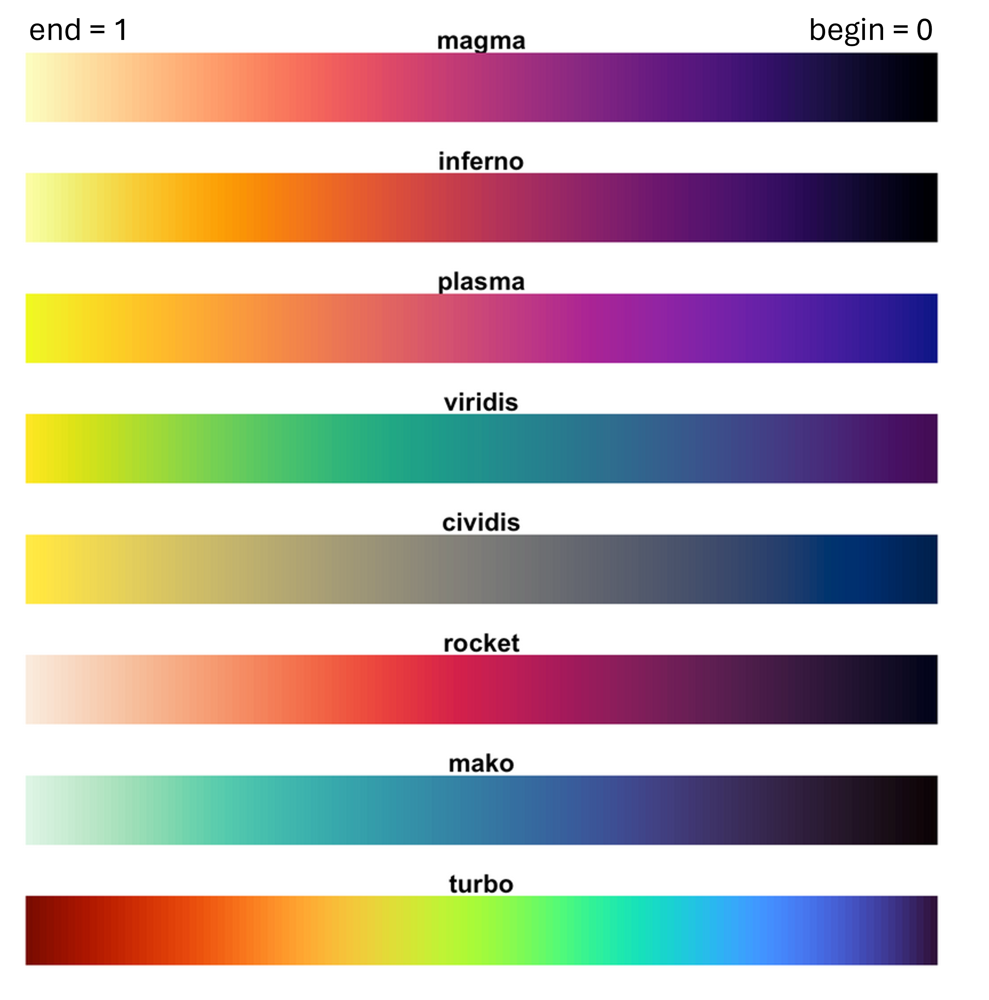

<svg xmlns="http://www.w3.org/2000/svg" width="508.977" height="29.723" viewBox="0 0 134.667 7.864" class="followcursor"><path d="m96 117.136-3.889 3.315-2.208 1.882H30.167c-.831 0-1.5.595-1.5 1.334 0 .739.669 1.333 1.5 1.333h131.667c.83 0 1.5-.594 1.5-1.333s-.67-1.334-1.5-1.334h-59.736l-2.209-1.882z" style="fill:#000;stroke-width:.264583" transform="translate(-28.666 -117.136)"/></svg>
<div class="accessibility"></div>
<div class="offcanvas"><div class="title">Einstellungen für Barrierefreiheit</div><div class="button-container"><button data-setting="contrast"><span>Kontrast</span></button><button data-setting="links"><span>Links <wbr>hervorheben</span></button><button data-setting="letterspacing"><div>Schriftabstand</div><div class="indicators"><div data-num="1"></div><div data-num="2"></div><div data-num="3"></div></div></button><button data-setting="dyslexia"><span>Legasthenie&shy;freundlich</span></button><button data-setting="cursor"><span>Cursor</span></button><button data-setting="lineheight"><div>Zeilenhöhe</div><div class="indicators"><div data-num="1"></div><div data-num="2"></div><div data-num="3"></div></div></button><button data-setting="fontsize"><div>Schriftgröße</div><div class="indicators"><div data-num="1"></div><div data-num="2"></div><div data-num="3"></div><div data-num="4"></div><div data-num="5"></div><div data-num="6"></div></div></button></div>
</div>
<script>
$(document).ready(function() {
  $("#tutorial-topic").prepend(`<div class="img-right">
  <a href="https://otter.uni-mainz.de/"> <i class="fa-solid fa-bars" aria-label="Link zur otter Homepage" aria-hidden="false"></i>
  </a>
  </div>`);
  
  $(".accessibility").on("click", function() {
    $(".offcanvas").toggleClass("show");
  });
  $(".offcanvas button").on("click", function() {
    
    const setting = $(this).attr("data-setting");
    const numIndicators = $(".indicators > div", this).length || 0;
    var currentIndicator = 0;
    if(numIndicators > 0) {
      currentIndicator = $(".indicators > div.dark", this).length || 0;
      currentIndicator = ((currentIndicator + 1) % (numIndicators + 1));

      $(".indicators > div.dark", this).removeClass("dark");
      $(".indicators > div", this).slice(0, currentIndicator).addClass("dark");

      $(this).toggleClass("pressed", currentIndicator > 0);

    } else {
      $(this).toggleClass("pressed");
    }

    if(setting == "contrast") {
      $("html").toggleClass("invert");
      
    } else if(setting == "links") {
      $("html").toggleClass("highlightlinks");
      
    } else if(setting == "dyslexia") {
      $("html").toggleClass("dyslexic");
      
    } else if(setting == "fontsize" || setting == "lineheight" || setting == "letterspacing") {
      if(currentIndicator != 0) {
        $("html").addClass(setting + currentIndicator.toString());
      } else {
        [1,2,3,4,5,6].map(function(i) {
          $("html").removeClass(setting + i.toString());
        });
      }
    } else if(setting == "cursor") {
      const hasCursor = $("html").hasClass("cursor");
      $("html").toggleClass("cursor");
      
      if(hasCursor) {
        $("html").off("mousemove");
      } else {
        $("html").on("mousemove", function(e) {
          const ev = e.originalEvent;
          var x = ev.clientX;
          var y = ev.clientY;
          
          $(".followcursor").css({top: y, left: x});
        });      
      }
    }
    
  });
  
  $(document).ready(function() {
  $('.menu-button').click(function() {
    $('.topicsContainer').toggleClass('menu-open');
    $(this).toggleClass('menu-open');
  });
  });
  
  $("#learnr-tutorial-content.topics").prepend(
  `<div class="logo">
  
    
  </div>`);
  

  $("a[href^='#']").on("click", function(event) {
    
  	var target = event.currentTarget.href.toString();
  	if(!!~target.indexOf("#")) {
  	  target = target.split("#")[1];
      _paq.push(['trackEvent', 'Click', 'Jump', target]);
    }
    console.log(target);
    	
    const currentSection = $(".section.current");
    var href = $(this).attr("href");

    if(!$(href, currentSection).length) {
      return;
    }
    var href = href.substr(1);
    event.preventDefault();

    const el = document.getElementById(href);
    if(!el) {
      return;
    }
    window.scrollTo({
      top: el.offsetTop,
      left: 0,
      behavior: "smooth",
    });
  });
  
  $("button[data-i18n-attr-title='button.submitanswertitle']").on("click", function(event) {
    _paq.push(['trackGoal', 2]);
  });
  
  $("button[data-i18n-attr-title='button.runcodetitle']").on("click", function(event) {
    _paq.push(['trackGoal', 1]);
  });
  
  $("button[data-i18n-attr-title='button.solutiontitle']").on("click", function(event) {
    _paq.push(['trackGoal', 3]);
  });
  
  $("button[data-i18n-attr-title='button.hinttitle']").on("click", function(event) {
    _paq.push(['trackGoal', 4]);
  });
  
  $(".tutorial-question-container button").on("click", function(event) {
    _paq.push(['trackGoal', 5]);
  });

  $(".tip summary").on("click", function(event) {
    _paq.push(['trackGoal', 6]);
  });
  
  $(".hiddendetails-container summary").on("click", function(event) {
    _paq.push(['trackGoal', 7]);
  });
  
});


/*! js-cookie v3.0.1 | MIT */
;
(function (global, factory) {
  typeof exports === 'object' && typeof module !== 'undefined' ? module.exports = factory() :
  typeof define === 'function' && define.amd ? define(factory) :
  (global = global || self, (function () {
    var current = global.Cookies;
    var exports = global.Cookies = factory();
    exports.noConflict = function () { global.Cookies = current; return exports; };
  }()));
}(this, (function () { 'use strict';

  /* eslint-disable no-var */
  function assign (target) {
    for (var i = 1; i < arguments.length; i++) {
      var source = arguments[i];
      for (var key in source) {
        target[key] = source[key];
      }
    }
    return target
  }
  /* eslint-enable no-var */

  /* eslint-disable no-var */
  var defaultConverter = {
    read: function (value) {
      if (value[0] === '"') {
        value = value.slice(1, -1);
      }
      return value.replace(/(%[\dA-F]{2})+/gi, decodeURIComponent)
    },
    write: function (value) {
      return encodeURIComponent(value).replace(
        /%(2[346BF]|3[AC-F]|40|5[BDE]|60|7[BCD])/g,
        decodeURIComponent
      )
    }
  };
  /* eslint-enable no-var */

  /* eslint-disable no-var */

  function init (converter, defaultAttributes) {
    function set (key, value, attributes) {
      if (typeof document === 'undefined') {
        return
      }

      attributes = assign({}, defaultAttributes, attributes);

      if (typeof attributes.expires === 'number') {
        attributes.expires = new Date(Date.now() + attributes.expires * 864e5);
      }
      if (attributes.expires) {
        attributes.expires = attributes.expires.toUTCString();
      }

      key = encodeURIComponent(key)
        .replace(/%(2[346B]|5E|60|7C)/g, decodeURIComponent)
        .replace(/[()]/g, escape);

      var stringifiedAttributes = '';
      for (var attributeName in attributes) {
        if (!attributes[attributeName]) {
          continue
        }

        stringifiedAttributes += '; ' + attributeName;

        if (attributes[attributeName] === true) {
          continue
        }

        // Considers RFC 6265 section 5.2:
        // ...
        // 3.  If the remaining unparsed-attributes contains a %x3B (";")
        //     character:
        // Consume the characters of the unparsed-attributes up to,
        // not including, the first %x3B (";") character.
        // ...
        stringifiedAttributes += '=' + attributes[attributeName].split(';')[0];
      }

      return (document.cookie =
        key + '=' + converter.write(value, key) + stringifiedAttributes)
    }

    function get (key) {
      if (typeof document === 'undefined' || (arguments.length && !key)) {
        return
      }

      // To prevent the for loop in the first place assign an empty array
      // in case there are no cookies at all.
      var cookies = document.cookie ? document.cookie.split('; ') : [];
      var jar = {};
      for (var i = 0; i < cookies.length; i++) {
        var parts = cookies[i].split('=');
        var value = parts.slice(1).join('=');

        try {
          var foundKey = decodeURIComponent(parts[0]);
          jar[foundKey] = converter.read(value, foundKey);

          if (key === foundKey) {
            break
          }
        } catch (e) {}
      }

      return key ? jar[key] : jar
    }

    return Object.create(
      {
        set: set,
        get: get,
        remove: function (key, attributes) {
          set(
            key,
            '',
            assign({}, attributes, {
              expires: -1
            })
          );
        },
        withAttributes: function (attributes) {
          return init(this.converter, assign({}, this.attributes, attributes))
        },
        withConverter: function (converter) {
          return init(assign({}, this.converter, converter), this.attributes)
        }
      },
      {
        attributes: { value: Object.freeze(defaultAttributes) },
        converter: { value: Object.freeze(converter) }
      }
    )
  }

  var api = init(defaultConverter, { path: '/' });
  /* eslint-enable no-var */

  return api;

})));

var _paq = window._paq = window._paq || [];
jQuery(document).ready(function() {
   const cookiebanner = `<div class="modal modal-dialog-scrollable modal-dialog-centered modal-dialog-scrollable fade" id="staticBackdrop" data-backdrop="static" data-keyboard="false" tabindex="-1" aria-labelledby="staticBackdropLabel" aria-hidden="true" style="justify-content: end; margin: unset !important;">
    <div class="modal-dialog" style="display: flex; align-self: end; margin: unset !important;">
        <div class="modal-content">
        <div class="modal-body">
            <p>Wir ben&ouml;tigen Ihre Zustimmung, bevor Sie unsere Website weiter besuchen k&ouml;nnen.</p>
            <p>Wir verwenden Cookies und andere Technologien auf unserer Webseite. Einige von ihnen sind technisch essenziell, w&auml;hrend andere uns helfen Nutzerstatistiken zu erstellen, um das Otter Produkt weiterzuentwickeln. Weitere Informationen &uuml;ber die Verwendung Ihrer Daten finden Sie in unserer Datenschutzerkl&auml;rung auf der Otter Homepage.</p>
        </div>
        <div class="modal-footer">
            <a type="button" class="btn btn-light" href="https://meikesteinhilber.github.io/otter/">Ich m&ouml;chte Otter nicht nutzen.</a>
            <button type="button" class="btn btn-success" id="cookie-okay">Ich bin einverstanden.</button>
        </div>
        </div>  
    </div>
    </div>`;

    const loadScripts = function() {
        /* tracker methods like "setCustomDimension" should be called before "trackPageView" */
        _paq.push(["setRequestMethod", "POST"]);
        _paq.push(['enableHeartBeatTimer', 5]);
        _paq.push(['disableAlwaysUseSendBeacon']);
        _paq.push(["setDoNotTrack", false]);
        _paq.push(["setDomains", ["*.otter.uni-frankfurt.de", "*.otter-test.uni-frankfurt.de", "127.0.0.1"]]);
        //_paq.push(["setCookieDomain", "*.otter.uni-frankfurt.de"]);
        _paq.push(['trackPageView']);
        _paq.push(['enableLinkTracking']);
        (function() {
        var u="https://otter.uni-frankfurt.de/otterusers/";
        _paq.push(['setTrackerUrl', u+'m.php']);
        _paq.push(['setSiteId', '1']);
        var d=document, g=d.createElement('script'), s=d.getElementsByTagName('script')[0];
        g.async=true; g.src=u+'m.js'; s.parentNode.insertBefore(g,s);
        })();
    };

    const consent = Cookies.get('cnsnt');
    if(consent == undefined || consent == "0") {
        jQuery("body").append(jQuery(cookiebanner));
        jQuery('#cookie-okay').on("click", function() {
            Cookies.set('cnsnt', '1', { expires: 180, sameSite: 'strict' });
            loadScripts();

            jQuery('#staticBackdrop').modal("hide");
        });

        jQuery('#cookie-nokay').on("click", function() {
            Cookies.set('cnsnt', '0', { expires: 30, sameSite: 'strict' });
        });

        jQuery('#staticBackdrop').on('hidden.bs.show', function (event) {
            jQuery(this).css('display', 'flex');
        });

        jQuery('#staticBackdrop').modal({backdrop: false, show: true, keyboard: false});
    } else if(consent == "1" || consent === 1) {
        loadScripts();
    }
});


document.addEventListener("DOMContentLoaded", function() {
  const carousels = document.querySelectorAll(".tip-carousel");
  carousels.forEach(function(carousel) {
    const tips = carousel.querySelectorAll(".tip-content");
    const prevBtn = carousel.querySelector(".prev-tip");
    const nextBtn = carousel.querySelector(".next-tip");
    let currentTip = 0;

    function updateCarousel() {
      tips.forEach((tip, index) => {
        tip.style.display = index === currentTip ? "block" : "none";
      });
      if(prevBtn) {
        prevBtn.disabled = currentTip === 0;
      }
      if(nextBtn) {
        nextBtn.disabled = currentTip === tips.length - 1;
      }
    }

    if(prevBtn) {
      prevBtn.addEventListener("click", function() {
        if (currentTip > 0) {
          currentTip--;
          updateCarousel();
        }
      });
    }

    if(nextBtn) {
      nextBtn.addEventListener("click", function() {
        if (currentTip < tips.length - 1) {
          currentTip++;
          updateCarousel();
        }
      });
    }

    updateCarousel();
  });
});

</script>

<!-- <div class="menu-button">Menu</div> -->

```{r setup, echo=FALSE, message=FALSE, warning=FALSE}
library(scales)
library(tidyverse)
library(sprtt)
library(psych)
library(testthat)
library(learnr)
library(gradethis)
library(glue)
# devtools::load_all()
# remotes::install_github("MeikeSteinhilber/otter")
# remotes::install_github("rstudio/gradethis")
# library(otter)

set.seed(3)

knitr::opts_chunk$set(echo = FALSE)
feedback_message_wrong <- "Der Output stimmt nicht mit der Lösung überein. Eventuell hilft dir der Hinweis: {code_feedback()}"
feedback_message_correct <- 'Richtig. {sample(c("Sehr gut gemacht!", "Perfekte Arbeit!", "Weiter so!", "Wunderbar gemacht!", "Klasse!", "Toller Job!",
"Echt gut gemacht!", "Mega Arbeit, echt stark!",
  "Du wirst immer besser!", "Hammer, echt klasse!",
  "Das hast du super hinbekommen!", "Boah, richtig nice!",
  "Das läuft bei dir!", "Respekt, echt cool gemacht!",
  "Ey, das ist mal richtig stark!"),1)}'

gradethis::gradethis_setup(
  pass.praise = FALSE,
  # fail.encourage = FALSE,
  pass = "Richtig!",
  code_correct = glue('Richtig! {sample(c("Sehr gut gemacht!", "Perfekte Arbeit!", "Du wirst immer besser!", "Wunderbar gemacht!", "Klasse!", "Toller Job!"),1)}'),
  fail = "Das ist leider falsch.",
  code_incorrect = "Noch nicht ganz. Hinweis: {code_feedback()} Probiere es noch einmal!"
  )
tutorial_options(exercise.reveal_solution = TRUE,
                 exercise.blanks = "___",
                 exercise.eval = FALSE)
options(
  # gradethis.pass = 'Richtig! {gradethis::random_praise(language="de")}',
  gradethis.grading_problem.message = "Es ist leider ein Problem mit dem Bewertungscode für diese Übung aufgetreten.",
  gradethis_glue_correct = '{sample(c("Sehr gut gemacht!", "Perfekte Arbeit!", "Weiter so!", "Wunderbar gemacht!", "Klasse!", "Toller Job!"),1)} { .message } { .correct }',
  # gradethis_glue_correct = "{ .message } { .correct }",
  # gradethis_glue_incorrect = "{ .message } { .incorrect } { random_encourage() }"
  gradethis_glue_incorrect = "{ .message } { .incorrect }"
)
blue <- "#00c4e6"
```

## Start

### Ziele dieses Tutorials

  - Hier werden die Grundlagen der Datentranformation mit `dplyr` und `tidyr` gelehrt, sowie die Visualisierung von Daten mit `ggplot2`.
  
  - Hier werden keine allgemeine Grundlagen der R-Programmierung gelehrt! Bitte schaue dir das R & RStudio Grundlagen Tutorial an.
  
  <!-- - Wenn du dir nicht sicher bist, ob du die Grundlagen kannst - schaue doch im Kapitel XXX vorbei! -->

### Tidyverse

Das [*tidyverse*](https://www.tidyverse.org/) ist eine Sammlung von open-source R-Paketen, die speziell für die Datenaufbereitung und -visualisierung entwickelt wurde.
Alle Pakete basieren auf einer konsistenten Design-Philosophie, Grammatik und auch Datenstruktur, welche innerhalb des tidyverse-Universums einheitlich ist, aber z.T auch sehr stark von *base*-R abweicht.
Zu den Paketen im tidyverse gehören:

  - `dplyr` (Datenmanipulation),
  
  - `tidyr` (Datenbereinigung),
  
  - `ggplot2` (Datenvisualisierung),
  
  - `readr` (Datenimport),
  
  - `stringr` (Umgang mit Strings/Text),
  
  - `forcats` (Umgang mit kategorialen daten),
  
  - `purrr` (funktionales Programmieren) und
  
  - `tibble` (Alternative zu `data.frames`).


**Warum ist das tidyverse sinnvoll als Ergänzung zu base R?**

*Benutzerfreundlichkeit und Lesbarkeit:* Der tidyverse bietet eine intuitive Syntax, die mit Pipes (%>%) arbeitet. Dies ermöglicht eine klare und lesbare Darstellung von Datenmanipulationsprozessen, wodurch auch komplexe Analysen nachvollziehbar bleiben.

*Konsistenz:* Alle Pakete im tidyverse folgen gemeinsamen Designprinzipien und Funktionen, was den Lernaufwand reduziert und eine nahtlose Integration zwischen den Paketen ermöglicht.

*Effizienz:* Viele tidyverse-Funktionen sind im Vergleich zu *base*-R einheitlicher und damit auch leichter anzuwenden, wenn man sich innerhalb der Syntax gut auskennt.

*Erweiterte Funktionalität:* Das tidyverse bietet moderne Werkzeuge, die in *base*-R fehlen oder umständlicher umzusetzen sind, wie z. B. das einfache Pivotieren von Tabellen, die Gruppierung von Daten oder das Erstellen aussagekräftiger Visualisierungen.

*Community und Dokumentation:* Das tidyverse hat eine große Community, hervorragende Dokumentationen und Tutorials, die den Einstieg und die Weiterentwicklung erleichtern.

**Kritische Punkte und Herausforderungen**

*Häufige Änderungen:* Der tidyverse entwickelt sich kontinuierlich weiter, und Funktionen werden mitunter angepasst oder durch neue ersetzt. Dies kann dazu führen, dass älterer Code schnell veraltet und nachträglich angepasst werden muss. Viele Pakete enthalten daher einen [Lifecycle-Status](https://lifecycle.r-lib.org/articles/stages.html), der angibt, ob eine Funktion stabil ist oder zukünftig durch andere ersetzt wird.

*Lernaufwand:* Wer an die Arbeitsweise von *base*-R gewöhnt ist, muss sich zunächst an die andere Syntax und Denkweise des tidyverse gewöhnen.

*Performance in spezifischen Fällen:* Während der tidyverse in vielen Bereichen performant ist, kann es in sehr spezialisierten Anwendungsfällen oder bei extrem großen Datensätzen weniger effizient sein als optimierte Alternativen.

*Abhängigkeiten:* Das tidyverse umfasst eine Vielzahl von Paketen, was die Abhängigkeiten und den Overhead im Vergleich zu reinem *base*-R erhöht.

Insgesamt bietet das tidyverse eine kohärente, mächtige und weit verbreitete Ergänzung zu *base*-R.


<!-- ## Grundlagen Quiz -->

<!-- Dieses Tutorial behandelt bereits Fortgeschrittene R-Inhalte und basiert auf dem Hintergrundwissen von XXX. -->
<!-- Falls du dir nicht sicher bist, ob du diese gut beherrschst probiere dich an dem Quiz! -->

<!-- ```{r quiz-basic} -->
<!-- quiz(caption = "", -->
<!--   question("Was bedeutet das `#` Symbol überlicherweise in R-ode?", -->
<!--     answer("0"), -->
<!--     answer("Es handelt sich um eine"), -->
<!--     answer("Es handelt sich um eine kommentierte Zeile. Der Code wird nicht ausgeführt.", correct = TRUE), -->
<!--     answer("Es gibt keine sinnvolle Antwort auf diese Frage."), -->
<!--      random_answer_order = TRUE, -->
<!--      allow_retry = TRUE, -->
<!--      try_again = "Leider falsch!", -->
<!--      correct = "Richtig!", -->
<!--      incorrect = "Leider falsch!", -->
<!--      submit_button = "Antwort einreichen" -->
<!--   ), -->
<!--   question("Was passiert, wenn dieser Befehl ausgeführt wird: `NaN < 0`?", -->
<!--     answer("Es gibt eine Fehlermeldung."), -->
<!--     answer("FALSE"), -->
<!--     answer("TRUE"), -->
<!--     answer("Es gibt einen fehlenden Wert aus.", correct = TRUE), -->
<!--      random_answer_order = TRUE, -->
<!--      allow_retry = TRUE, -->
<!--      try_again = "Leider falsch!", -->
<!--      correct = "Richtig!", -->
<!--      incorrect = "Leider falsch!", -->
<!--      submit_button = "Antwort einreichen" -->
<!--   ) -->
<!-- ) -->
<!-- ``` -->

## dplyr-- Grundlagen

### Kapitel
<a href="#section-übersicht-über-die-wichtigsten-funktionen"> <i class="fa-solid fa-arrow-down"></i> Übersicht über die wichtigsten Funktionen </a><br>
<a href="#section-beispieldatensatz"> <i class="fa-solid fa-arrow-down"></i> Beispieldatensatz </a><br>
<a href="#section-piping-mit"> <i class="fa-solid fa-arrow-down"></i> Piping mit `%>%` </a><br>
<a href="#section-select"> <i class="fa-solid fa-arrow-down"></i> select() </a><br>
<a href="#section-filter"> <i class="fa-solid fa-arrow-down"></i> filter() </a><br>
<a href="#section-arrange"> <i class="fa-solid fa-arrow-down"></i> arrange() </a><br>
<a href="#section-rename"> <i class="fa-solid fa-arrow-down"></i> rename() </a><br>
<a href="#section-mutate"> <i class="fa-solid fa-arrow-down"></i> mutate() </a><br>
<a href="#section-summarize"> <i class="fa-solid fa-arrow-down"></i> summarize() </a><br>
<a href="#section-group_by"> <i class="fa-solid fa-arrow-down"></i> group_by() </a><br>

### Übersicht über die wichtigsten Funktionen <a href="#section-dplyr-grundlagen"> <i class="fa-solid fa-arrow-up"></i></a>

All diese Funktionen werden in diesem Kapitel näher erklärt:

- `select()`: Auswahl von Spalten
- `filter()`: Auswahl von Zeilen basierend auf Bedingungen
- `arrange()`: Sortieren von Zeilen
- `rename()`: Umbenennen von Spalten
- `mutate()`: Hinzufügen oder Verändern von Spalten
- `summarize()`: Aggregation von Daten, z. B. Berechnung von Mittelwerten
- `group_by()`: Gruppieren von Daten für Aggregationen

### Beispieldatensatz <a href="#section-dplyr-grundlagen"> <i class="fa-solid fa-arrow-up"></i></a>

Der Datensatz `df` wird nachfolgend im Kapitel genutzt und ist in den jeweiligen R-Umgebungen hinterlegt.

<details class="hiddendetails-container"> <summary>
    <p class="hiddendetails-button"><i class="fa-solid fa-arrow-down"></i> Zeige die Erstellung der Daten <i class="fa-solid fa-arrow-down"></i> </p>
  </summary> <div class="hiddendetails-body"> <div class="uebungen">

```{r setup-base-df, exercise=FALSE, eval=TRUE, echo=TRUE}
set.seed(3)

df <- data.frame(
  id = 1:6,
  sex = c("M", "F", "M", "F", "M", "F"),
  age = c(25, 35, 45, 20, 30, 40),
  intelligence = c(110, 120, 130, 115, 125, 135),
  school_years = c(10, 7, 8, 12, 10, 8),
  income = sample(2000:5000, 6),
  student = c(FALSE, TRUE, FALSE,TRUE, TRUE, FALSE),
  x_1 = rnorm(6),
  x_2 = rnorm(6),
  x_3 = rnorm(6),
  x_4 = rnorm(6),
  life1 = rnorm(6),
  life2 = rnorm(6),
  life3 = rnorm(6),
  life4 = rnorm(6),
  x1_study = rnorm(6),
  x2_study = rnorm(6),
  x3_study = rnorm(6),
  x_study_na = rnorm(6)
)
```
```{r, ref.label=I('setup-base-df'), eval=TRUE, echo=TRUE, exercise.eval=TRUE, exercise.lines = 25}

```
</div></div></details>

```{r setup-base-df-00, exercise.setup = "setup-base-df", exercise=TRUE, results = "hold"}
df 
```

### Piping mit `%>%` <a href="#section-dplyr-grundlagen"> <i class="fa-solid fa-arrow-up"></i></a>

Der Pipe-Operator (`%>%`) ist ein zentrales Werkzeug im *tidyverse* und hilft dabei, Datenmanipulationen in einer klaren und lesbaren Weise zu verketten.
Er ermöglicht es, mehrere Funktionen nacheinander auf einen Datensatz anzuwenden, ohne dabei den Datensatz-Objekt in jedem Funktionsaufruf explizit wiederholen zu müssen.
Der Shortcut für ein schnelles Erstellen des Operators ist `Strg + Shift + M ` für Windows und `Cmd + Shift + M` für MacOS.

Betrachten wir folgendes Beispiel, in dem wir Daten mit vier Funktionen manipulieren.
Was die einzelnen Funktionen machen, werden wir uns später im Detail anschauen.

```{r dplyr-pipe-1, exercise.setup = "setup-base-df", exercise=FALSE, eval=FALSE, echo=TRUE}
# Option 1
# Zergliederung der Schritte und Speicherung der Zwischenschritte
df <- select(df, X, sex, age, intelligence)
df <- filter(df, age <= 40)
df <- arrange(df, sex)
df <- rename(df, subjects = X)
```

Die erste Optione ist zwar gut leserlich, aber sehr umständlich gecoded, da sie einige Wiederholungen enthält.
So wird der einzelne Bearbeitungsschritt jedes Mal zwischen gespeichert und der Datensatz muss jedes Mal neu übergeben werden.

```{r dplyr-pipe-2, exercise.setup = "setup-base-df", exercise=FALSE, eval=FALSE, echo=TRUE}
# Option 2
# Verschachtelung der Funktionen ineinander
df <- rename(
  arrange(
    filter(
      select(df, X, sex, age, intelligence), 
      age <= 40
    ), 
    sex
  ), 
  subjects = X
)
```
Die zweite Option ist deutlich effizienter geschrieben, jedoch schwer zum Lesen und Debuggen.

Der Pipe-Operator `%>%` hilft nun, genaus diese Verarbeitungs-Ketten besser darzustellen im Code.
Anstatt den Datensatz in jeder Funktion explizit zu nennen, wird der Datensatz implizit an die nachfolgende Funktionen weitergegeben.
So sieht der Code mit Pipe-Operator aus:

```{r dplyr-pipe-3, exercise.setup = "setup-base-df", exercise=FALSE, eval=FALSE, echo=TRUE}
# Option 3
# empfohlene Variante
df %>% 
  # der Originaldatensatz wird nun weitergeleitet an die select Funktion
  select(id, sex, age, intelligence) %>%  
  # der veränderte Datensatz wird weitergeleitet nach filter()
  filter(age <= 40) %>%
  arrange(sex) %>%
  rename(subjects = id)
```

Die Funktionsweise bleibt gleich, aber der Code wird übersichtlicher und leichter lesbar.
Die Pipe-Schreibweise verbindet die Übersichtlichkeit von Option 1 und die Effizienz von Option 2.

**Vorteile des Pipe-Operators**

1. *Lesbarkeit*: Der Code zeigt die Verarbeitungsschritte klar und in einer logischen Reihenfolge.
2. *Weniger Wiederholungen*: Der Datensatz-Objekt muss nicht bei jeder Funktion neu referenziert werden.
3. *Effizienz bei komplexen Prozessen*: Die Verkettung macht besonders bei vielen Verarbeitungsschritten Sinn.


Hier ist ein Beispiel mit dem Beispieldatensatz:

```{r dplyr-pipe-4, exercise.setup = "setup-base-df", exercise=TRUE, results = "hold", exercise.lines = 7}
# Datenmanipulation mit Pipe-Operator
df %>% 
  select(id, sex, age, intelligence) %>% 
  filter(age <= 40) %>% 
  arrange(sex) %>% 
  rename(subjects = id)
```

Der Pipe-Operator (`%>%`) ist ein mächtiges Werkzeug, das den Code übersichtlicher macht und oft näher am menschlichen Denken dran ist.
Diese Art zu Programmieren ist so beliebt geworden, dass es inzwischen auch einen Pipe-Operator in *base*-R gibt, welcher so aussieht: `|>`.
Die Operatoren sind sich in vielen Funktionalitäten ähnlich.
Wir werden innerhalb dieses Tutorials wegen der Einfachheit immer den `%>%` Operator verwenden.


<div class="uebungen">

#### Übungen

`r otter::colorize("Aufgabe:", "var(--blue)")`
 *Schreibe den Code um und verwende hier den Pipe Operator `%>%`. Ändere ansonsten so wenig, wie möglich*.
```{r ex-piping-01, exercise.setup = "setup-base-df", exercise=TRUE, results = "hold", exercise.eval=FALSE}
df <- group_by(df, sex)
df <- select(df, id, sex, age, intelligence)
df <- filter(df, age <= 40)
df <- rename(df, subjects = id)
df 
```
```{r ex-piping-01-solution, results = "hold", exercise.eval=FALSE}
df <- df %>%
  group_by(sex) %>% 
  select(id, sex, age, intelligence) %>% 
  filter(age <= 40) %>% 
  rename(subjects = id)
df
```
```{r ex-piping-01-check, ref.label=I('setup-base-df'), results = "hold", exercise.eval=FALSE}
# grade_this({
#   pass_if_equal(.solution, message = feedback_message_correct)
#   fail_if_not_equal(.solution, message = feedback_message_wrong)
# })
grade_this_code()
```

</div>

### select() <a href="#section-dplyr-grundlagen"> <i class="fa-solid fa-arrow-up"></i></a>

Mit der Funktion `select()` können spezifische Spalten eines Dataframes ausgewählt werden.
Die Funktionen bietet viele Möglichkeiten, die Spalten-Auswahl zu gestalten.

Die wichtigsten Funktionen und Operatoren sind:

-   `:` um einen Bereich von Spalten auszuwählen
-   `!` um Spalten auszuschließen
-   `&` (*und*) sowie `|` (*oder*) um Bedingungen zu kombinieren
-   `starts_with("")` um Spalten auszuwählen, die mit einem bestimmten Präfix beginnen
-   `ends_with("")` um Spalten auszuwählen, die mit einem bestimmten Suffix enden
-   `contains("")` um Spalten auszuwählen, die einen bestimmten Text enthalten
-   `everything()` um alle Spalten auszuwählen (z. B. nach vorheriger Modifikation der Reihenfolge)
-   `num_range("prefix", range)` um nummerierte Spalten auszuwählen, z. B. `x1`, `x2`, ...
-   `matches("")` um Spalten basierend auf regulären Ausdrücken ["Regex"](https://r4ds.hadley.nz/regexps) auszuwählen


**Spalten auflisten**

Das Komma `,` wir verwendet, um alle gewünschten Spaltennamen aufzulisten.
```{r select-0, exercise.setup = "setup-base-df", exercise=TRUE, results = "hold"}
df %>% 
  select(sex, age, intelligence)
```

**Spaltenbereich auswählen**

Der Doppelpunkt `:` wird verwendet, um eine Spaltensequenz auszuwählen.
Es bedeutet: "Wähle alle Spalten zwischen (einschließlich) `sex` und `intelligence`".
Die Reihenfolge basiert auf der tatsächlichen Anordnung der Spalten im Datensatz `df`.
```{r select-1, exercise.setup = "setup-base-df", exercise=TRUE, results = "hold"}
df %>% 
  select(sex:intelligence)
```

**Spalten ausschließen**

Negiere die ausgewählten Spalten mit `!`.
Es werden alle Spalten ausgewählt, außer den negierten Spalten.
```{r select-2, exercise.setup = "setup-base-df", exercise=TRUE, results = "hold"}
df %>% 
  select(!sex:intelligence)
```

**Spalten auswählen, welche einen bestimmten character String enthalten**

Der gesuchte String kann Text, aber auch Zahlen oder Symbole enthalten.

```{r select-4, exercise.setup = "setup-base-df", exercise=TRUE, results = "hold"}
df %>% 
  select(contains("x_"))
```

**Spalten auswählen, welche mit einem bestimmten character String beginnen**
```{r select-5, exercise.setup = "setup-base-df", exercise=TRUE, results = "hold"}
df %>% 
  select(starts_with("life"))
```

**Alles oder den übrigen Rest auswählen**

```{r select-6, exercise.setup = "setup-base-df", exercise=TRUE, results = "hold"}
# Wähle age an erster Stelle und füge dann den Rest aller Spalten dazu
df %>% 
  select(age, everything())
```

**Nummerierte Spalten auswählen**

Es gibt oft Spaltennamen, welche dem Muster folgen [Textname + aufsteigende Zahl].
Solch ein Muster kann auch leicht ausgewählt werden mit `num_range`.

```{r select-7, exercise.setup = "setup-base-df", exercise=TRUE, results = "hold"}
df %>% 
  select(num_range("x_", 1:3))
```

**Komplexe Mustererkennung**

Es können auch nach sehr komplexen Mustern Spaltennamen ausgewählt werden.
Dafür werden jedoch reguläre Ausdrücke, sogenannte *Regex* verwendet, was eine eigene Sprache darstellt.
Weitere Informationen dazu gibt es [hier](https://r4ds.hadley.nz/regexps).

Eine kleine Übersicht über wichtige *Regex*-Symbole:

| Symbol | Beschreibung                                | Beispiel                          |
|--------|--------------------------------------------|-----------------------------------|
| `.`    | Beliebiges Zeichen (außer Zeilenumbruch)   | `a.c` erkennt `abc`, `a1c`, etc. |
| `^`    | Start des Textes oder einer Zeile          | `^Hello` erkennt `Hello world`.  |
| `$`    | Ende des Textes oder einer Zeile           | `world$` erkennt `Hello world`.  |
| `*`    | Null oder mehr Wiederholungen              | `ab*` erkennt `a`, `ab`, `abb`.  |
| `+`    | Eine oder mehr Wiederholungen              | `ab+` erkennt `ab`, `abb`, etc.  |
| `?`    | Null oder eine Wiederholung                | `ab?` erkennt `a`, `ab`.         |
| `{n}`  | Genau n Wiederholungen                     | `a{3}` erkennt `aaa`.            |
| `{n,}` | Mindestens n Wiederholungen                | `a{2,}` erkennt `aa`, `aaa`, ... |
| `{n,m}`| Zwischen n und m Wiederholungen            | `a{2,4}` erkennt `aa`, `aaa`.    |
| `[0-9]`| Ziffern zwischen 0 bis 9                   | `a[0-9]` erkennt `a5`, `a0`.     |
| `[a-z]`| nur kleine Buchstaben                      | `_[a-z]` erkennt `_a`, `_b`.     |
| `[A-Z]`| nur große Buchstaben                       | `_[A-Z]` erkennt `_A`, `_B`.     |
| `[A-Za-z]`| große und kleine Buchstaben             | `_[A-Za-z]` erkennt `_A`, `_b`.  |
| `[A-Za-zÄÖÜäöüß]`| alle Buchstaben mit Umlauten oder Sonderzeichen (wie ä, ö, ü, ß) )        | `_[A-Za-zÄÖÜäöüß]` erkennt `_A`, `_ä`.     |

```{r select-8, exercise.setup = "setup-base-df", exercise=TRUE, results = "hold"}
# suche nach Spaltennamen, welche das _ Symbol und nachfolgend 
# eine oder mehrere Ziffern enthält
df %>% 
  select(matches("_[0-9]+"))
```

<div class="uebungen">

#### Übungen

`r otter::colorize("Aufgabe:", "var(--blue)")`
 *Wähle die Spalten "income", "id" und "school_years" aus*.
```{r ex-select-01, exercise.setup = "setup-base-df", exercise=TRUE, results = "hold", exercise.eval=FALSE}

```
```{r ex-select-01-solution, results = "hold", exercise.eval=FALSE}
df %>% select(income, id, school_years)
```
```{r ex-select-01-check, ref.label=I('setup-base-df'), results = "hold", exercise.eval=FALSE}
grade_this({
  pass_if_equal(.solution, message = feedback_message_correct)
  fail_if_not_equal(.solution, message = feedback_message_wrong)
})

# grade_this_code()
```

`r otter::colorize("Aufgabe:", "var(--blue)")`
 *Wähle alle Spalten aus, die mit "_study" enden*.
```{r ex-select-02, exercise.setup = "setup-base-df", exercise=TRUE, results = "hold", exercise.eval=FALSE}

```
```{r ex-select-02-solution, results = "hold", exercise.eval=FALSE}
df %>% 
  select(ends_with("_study"))
```
```{r ex-select-02-check, ref.label=I('setup-base-df'), results = "hold", exercise.eval=FALSE}
grade_this({
  pass_if_equal(.solution, message = feedback_message_correct)
  fail_if_not_equal(.solution, message = feedback_message_wrong)
})

# grade_this_code()
```
`r otter::colorize("Aufgabe:", "var(--blue)")`
 *Wähle alle Spalten aus, welche eine Ziffer enthalten*.
```{r ex-select-03, exercise.setup = "setup-base-df", exercise=TRUE, results = "hold", exercise.eval=FALSE}

```
```{r ex-select-03-solution, results = "hold", exercise.eval=FALSE}
df %>% select(matches(".*[0-9]+.*"))
```
```{r ex-select-03-check, ref.label=I('setup-base-df'), results = "hold", exercise.eval=FALSE}
grade_this({
  pass_if_equal(.solution, message = feedback_message_correct)
  fail_if_not_equal(.solution, message = feedback_message_wrong)
})

# grade_this_code()
```

</div>

### filter() <a href="#section-dplyr-grundlagen"> <i class="fa-solid fa-arrow-up"></i></a>

Mit `filter()` kannst du Zeilen basierend auf einer oder mehreren Bedingungen auswählen.
Diese Bedingungen können mit:

  - Vergleichsoperatoren (`==`, `!=`, `<`, `>`, `<=`, `>=`) definiert werden,
  
  - Logischen Operatoren (`& `für "und", `|` für "oder"), und
  
  - Zeichenfolgen in Anführungszeichen für Textwerte.
  
  
**Beispiele mit logischen Operatoren**  
```{r filter-1, exercise.setup = "setup-base-df", exercise=TRUE, results = "hold"}
# Wähle Zeilen aus, in denen die Variable sex
# den Inhalt F enthält
df %>% 
  filter(sex == "F")
```

**Mehrere Bedingungen**
```{r filter-2, exercise.setup = "setup-base-df", exercise=TRUE, results = "hold"}
# Das Geschlecht muss weiblich sein und das
# Alter muss über 40 Jahre sein
df %>% 
  filter(sex == "F" & age < 40)
```

<div class="uebungen">

#### Übungen

`r otter::colorize("Aufgabe:", "var(--blue)")`
 *Wähle alle Studenten aus*.
```{r ex-filter-01, exercise.setup = "setup-base-df", exercise=TRUE, results = "hold", exercise.eval=FALSE}

```
```{r ex-filter-01-solution, results = "hold", exercise.eval=FALSE}
df %>% filter(student == TRUE)
```
```{r ex-filter-01-check, ref.label=I('setup-base-df'), results = "hold", exercise.eval=FALSE}
grade_this({
  pass_if_equal(.solution, message = feedback_message_correct)
  fail_if_not_equal(.solution, message = feedback_message_wrong)
})

# grade_this_code()
```

`r otter::colorize("Aufgabe:", "var(--blue)")`
 *Wähle alle Studenten aus, die 30 Jahre oder älter sind*.
```{r ex-filter-02, exercise.setup = "setup-base-df", exercise=TRUE, results = "hold", exercise.eval=FALSE}

```
```{r ex-filter-02-solution, results = "hold", exercise.eval=FALSE}
df %>% filter(student == TRUE & age >= 30)
```
```{r ex-filter-02-check, ref.label=I('setup-base-df'), results = "hold", exercise.eval=FALSE}
grade_this({
  pass_if_equal(.solution, message = feedback_message_correct)
  fail_if_not_equal(.solution, message = feedback_message_wrong)
})

# grade_this_code()
```

`r otter::colorize("Aufgabe:", "var(--blue)")`
 *Wähle Personen aus, die älter als 40 Jahre sind oder ein Einkommen über 4000€ haben*.
```{r ex-filter-03, exercise.setup = "setup-base-df", exercise=TRUE, results = "hold", exercise.eval=FALSE}

```
```{r ex-filter-03-solution, results = "hold", exercise.eval=FALSE}
df %>% filter(age > 40 | income > 4000)
```
```{r ex-filter-03-check, ref.label=I('setup-base-df'), results = "hold", exercise.eval=FALSE}
grade_this({
  pass_if_equal(.solution, message = feedback_message_correct)
  fail_if_not_equal(.solution, message = feedback_message_wrong)
})

# grade_this_code()
```

</div>

### arrange() <a href="#section-dplyr-grundlagen"> <i class="fa-solid fa-arrow-up"></i></a>

Die Funktion `arrange()` verändert die Zeilen eines Datensatzes basierend auf einer oder mehreren Variablen.
Standardmäßig erfolgt die Sortierung aufsteigend, aber mit der Funktion `desc()` kann auch absteigend sortiert werden.

```{r arrange-1, exercise.setup = "setup-base-df", exercise=TRUE, results = "hold"}
# Die Zeilen werden zuerst sotiert nach dem
# Geschlecht und danach nach dem Alter
df %>% 
  arrange(sex, age)
```

```{r arrange-2, exercise.setup = "setup-base-df", exercise=TRUE, results = "hold"}
# Das Alter wird nun aufsteigend sortiert
df %>% 
  arrange(desc(age))
```

<div class="uebungen">

#### Übungen

`r otter::colorize("Aufgabe:", "var(--blue)")`
 *Sortiere die Daten nach der Intelligenz*.
```{r ex-arrrange-01, exercise.setup = "setup-base-df", exercise=TRUE, results = "hold", exercise.eval=FALSE}

```
```{r ex-arrrange-01-solution, results = "hold", exercise.eval=FALSE}
df %>% arrange(intelligence)
```
```{r ex-arrrange-01-check, ref.label=I('setup-base-df'), results = "hold", exercise.eval=FALSE}
grade_this({
  pass_if_equal(.solution, message = feedback_message_correct)
  fail_if_not_equal(.solution, message = feedback_message_wrong)
})

# grade_this_code()
```

`r otter::colorize("Aufgabe:", "var(--blue)")`
 *Sortiere die Daten nach dem Einkommen. Das höchste Einkommen soll in der ersten Zeile erscheinen *.
```{r ex-arrrange-02, exercise.setup = "setup-base-df", exercise=TRUE, results = "hold", exercise.eval=FALSE}

```
```{r ex-arrrange-02-solution, results = "hold", exercise.eval=FALSE}
df %>% arrange(desc(income))
```
```{r ex-arrrange-02-check, ref.label=I('setup-base-df'), results = "hold", exercise.eval=FALSE}
grade_this({
  pass_if_equal(.solution, message = feedback_message_correct)
  fail_if_not_equal(.solution, message = feedback_message_wrong)
})

# grade_this_code()
```
</div>

### rename() <a href="#section-dplyr-grundlagen"> <i class="fa-solid fa-arrow-up"></i></a>

Die `rename()`-Funktion hilft dabei Spalten eines Datensatzes umzubenennen.
Sie unterstützt sowohl die Umbenennung einzelner Spalten als auch mehrere Umbenennungen auf einmal.

Die Syntaxlogik ist: `rename(neuer_name = alter_name)`

```{r rename-1, exercise.setup = "setup-base-df", exercise=TRUE, results = "hold"}
df %>% 
  rename(person_id = id,
         experience_1 = x_1)
```

<div class="uebungen">

#### Übungen

`r otter::colorize("Aufgabe:", "var(--blue)")`
 *Benenne die Spalte "intelligence" in "iq_score" um*.
```{r ex-rename-01, exercise.setup = "setup-base-df", exercise=TRUE, results = "hold", exercise.eval=FALSE}

```
```{r ex-rename-01-solution, results = "hold", exercise.eval=FALSE}
df %>% 
  rename(iq_score = intelligence)
```
```{r ex-rename-01-check, ref.label=I('setup-base-df'), results = "hold", exercise.eval=FALSE}
grade_this({
  pass_if_equal(.solution, message = feedback_message_correct)
  fail_if_not_equal(.solution, message = feedback_message_wrong)
})

# grade_this_code()
```
</div>

### mutate() <a href="#section-dplyr-grundlagen"> <i class="fa-solid fa-arrow-up"></i></a>

Die Funktion wird verwendet, um neue Spalten zu erstellen oder bestehende Spalten in einem Datensatz zu überschreiben.
Sie ist vielseitig einsetzbar und erlaubt mathematische Berechnungen, logische Operationen sowie die Anwendung von Funktionen auf Spalten.

Besonderheiten von `mutate()`:

  - *Existierende Spalten überschreiben* : Wenn die Spalte bereits existiert, wird sie mit den neuen Werten überschrieben.

  - *Neue Spalten erstellen* : Wenn die Spalte noch nicht existiert, wird sie neu erstellt.

  - *Mathematische Operationen* : Du kannst einfache mathematische Berechnungen wie Addition `+`, Subtraktion `-`, Multiplikation `*` und Division `/` verwenden.

  - *Vektorisierung* : Die Operationen werden auf jede Zeile des Datensatzes angewendet.

  - *Funktionen verwenden* : Du kannst R-Funktionen wie `mean()`, `if_else()`, `n()` und benutzerdefinierte Funktionen verwenden.
  
  - *Position*: Du kannst bestimmen, wo die neuen Splaten plaziert werden sollen mit den Funktionsargumenten `.before = Spaltenname` und `.after = Spaltenname`.
  
  
**Neue Spalte erstellen**

```{r mutate-1, exercise.setup = "setup-base-df", exercise=TRUE, results = "hold"}
# Erstellt eine neue Spalte age_months,
# die das Alter in Monaten darstellt
df %>% 
  mutate(age_months = age * 12, .before = age)
```

**Mehrere Spalten gleichzeitig erstellen oder berechnen**

```{r mutate-2, exercise.setup = "setup-base-df", exercise=TRUE, results = "hold"}
# Berechnet den Unterschied des Alters und des
# IQ im Vergleich zum Mittelwert:
df %>% 
  mutate(age_diff = age - mean(age),
         iq_diff = intelligence - mean(intelligence),
         .after = age)
```

**Spalte mit logischer Bedingung erstellen**

Erstellt eine Spalte `age_general`, die Menschen in die Kategorien "jung" (≤ 37 Jahre) und "alt" (> 37 Jahre) einteilt:
```{r mutate-3, exercise.setup = "setup-base-df", exercise=TRUE, results = "hold"}
df %>% 
  mutate(age_general = if_else(age <= 37, "young", "old"),
         .after = age)
```

**Existierende Spalte überschreiben**

Achtung: wenn ein Spaltenname gewählt wird, der bereits im Datensatz existiert, wird der bestehende Inhalt überschrieben. 

```{r mutate-4, exercise.setup = "setup-base-df", exercise=TRUE, results = "hold"}
# das Einkommen wird um 10% erhöht
df %>% 
  mutate(income = income * 1.10,
         .after = age)
```

<div class="uebungen">

#### Übungen

`r otter::colorize("Aufgabe:", "var(--blue)")`
 *Erstelle eine neue Spalte namens "name" und setze "unbekannt" als Wert*.
```{r ex-mutate-01, exercise.setup = "setup-base-df", exercise=TRUE, results = "hold", exercise.eval=FALSE}

```
```{r ex-mutate-01-solution, results = "hold", exercise.eval=FALSE}
df %>% 
  mutate(name = "unbekannt", .after = id)
```
```{r ex-mutate-01-check, ref.label=I('setup-base-df'), results = "hold", exercise.eval=FALSE}
grade_this({
  pass_if_equal(.solution, message = feedback_message_correct)
  fail_if_not_equal(.solution, message = feedback_message_wrong)
})

# grade_this_code()
```

`r otter::colorize("Aufgabe:", "var(--blue)")`
 *Überschreibe die Werte von "income", sodass R den Wert als fehlend ("not available") begreift*.
```{r ex-mutate-02, exercise.setup = "setup-base-df", exercise=TRUE, results = "hold", exercise.eval=FALSE}

```
```{r ex-mutate-02-solution, results = "hold", exercise.eval=FALSE}
df %>% 
  mutate(income = NA)
```
```{r ex-mutate-02-check, ref.label=I('setup-base-df'), results = "hold", exercise.eval=FALSE}
grade_this({
  pass_if_equal(.solution, message = feedback_message_correct)
  fail_if_not_equal(.solution, message = feedback_message_wrong)
})

# grade_this_code()
```

`r otter::colorize("Aufgabe:", "var(--blue)")`
 *Erstelle eine neue Spalte namens "mean_income" und berechne dort den Durchschnitt des Einkommens aller Personen*.
```{r ex-mutate-03, exercise.setup = "setup-base-df", exercise=TRUE, results = "hold", exercise.eval=FALSE}

```
```{r ex-mutate-03-solution, results = "hold", exercise.eval=FALSE}
df %>% 
  mutate(mean_income = mean(income), .after = id)
```
```{r ex-mutate-03-check, ref.label=I('setup-base-df'), results = "hold", exercise.eval=FALSE}
grade_this({
  pass_if_equal(.solution, message = feedback_message_correct)
  fail_if_not_equal(.solution, message = feedback_message_wrong)
})

# grade_this_code()
```

</div>

### summarize() <a href="#section-dplyr-grundlagen"> <i class="fa-solid fa-arrow-up"></i></a>

Die Funktion `summarize()` (auch `summarise()`geschrieben) ermöglicht es, Datensätze durch Aggregation von Werten zu kondensieren.
Dabei werden neue Spalten erstellt, die zusammenfassende Statistiken (wie `mean()`, `sum()`, `max()`, etc.) enthalten.
Das Ergebnis ist ein neuer Datensatz mit weniger Zeilen als der Originaldatensatz.

Die Syntaxlogik ist: `summarize(neue_spalte = Funktion(spaltenname))`

```{r summarize-1, exercise.setup = "setup-base-df", exercise=TRUE, results = "hold"}
df %>%
  summarize(
    total_age = sum(age),
    average_age = mean(age),
    max_age = max(age)
  )
```

In diesem Beispiel:

  - Berechnet `total_age` die Summe der Werte in der Spalte "age."

  - Ermittelt `average_age` den Durchschnittswert der Spalte "age."

  - Findet `max_age` den höchsten Wert in der Spalte "age."

Jede neue Spalte im Ergebnis enthält den Output der entsprechenden Funktion.
Da alle Werte zu einer einzigen Zusammenfassung aggregiert werden, reduziert sich die Anzahl der Zeilen deutlich.

<div class="uebungen">

#### Übungen

`r otter::colorize("Aufgabe:", "var(--blue)")`
 *Aggregiere die Tabelle: Erstelle dabei eine neue Spalte namens "mean_income" und berechne dort den Durchschnitt des Einkommens aller Personen*.
```{r ex-summarize-01, exercise.setup = "setup-base-df", exercise=TRUE, results = "hold", exercise.eval=FALSE}

```
```{r ex-summarize-01-solution, results = "hold", exercise.eval=FALSE}
df %>%
  summarize(
    mean_income = mean(income)
  )
```
```{r ex-summarize-01-check, ref.label=I('setup-base-df'), results = "hold", exercise.eval=FALSE}
grade_this({
  pass_if_equal(.solution, message = feedback_message_correct)
  fail_if_not_equal(.solution, message = feedback_message_wrong)
})

# grade_this_code()
```

`r otter::colorize("Aufgabe:", "var(--blue)")`
 *Aggregiere die Tabelle: Erstelle dabei eine neue Spalte namens "mean_income" und berechne dort den Durchschnitt des Einkommens aller Personen. Berechne auch den Median der Schuljahre und benenne die Spalte "median_school"*.
```{r ex-summarize-02, exercise.setup = "setup-base-df", exercise=TRUE, results = "hold", exercise.eval=FALSE}

```
```{r ex-summarize-02-solution, results = "hold", exercise.eval=FALSE}
df %>%
  summarize(
    mean_income = mean(income),
    median_school = median(school_years)
  )
```
```{r ex-summarize-02-check, ref.label=I('setup-base-df'), results = "hold", exercise.eval=FALSE}
grade_this({
  pass_if_equal(.solution, message = feedback_message_correct)
  fail_if_not_equal(.solution, message = feedback_message_wrong)
})

# grade_this_code()
```

</div>

### group_by() <a href="#section-dplyr-grundlagen"> <i class="fa-solid fa-arrow-up"></i></a>

Mit der Funktion `group_by()` kannst du deinen Datensatz in verschiedene Gruppen aufteilen, um dann für jede Gruppe getrennte Operationen auszuführen.
Dies ist besonders nützlich, wenn du gruppenspezifische Statistiken oder Filter anwenden möchtest.
Zum Beenden einer Gruppierung innerhalb einer Pipe kannst du `ungroup()` verwenden.

Die Syntaxlogik ist: `group_by(gruppe1)` oder auch `group_by(gruppe1, gruppe2)` 

**Kurze Übersicht:**

  - `group_by()`: Teilt den Datensatz in Gruppen auf.
  
  - `ungroup()`: Hebt die Gruppierung wieder auf, sodass nachfolgende Operationen wieder auf den gesamten Datensatz angewendet werden.

Diese Funktionen lassen sich hervorragend mit folgenden Funktionen kombinieren:

  - `summarize()`: Erzeugt zusammenfassende Statistiken für jede Gruppe.
  
  - `filter()`: Filtert Zeilen innerhalb jeder Gruppe basierend auf gruppenspezifischen Bedingungen.
  
  - `mutate()`: Fügt gruppenbezogene Berechnungen als neue Spalten hinzu.

**Beispiel 1: Zusammenfassen nach Geschlecht**

Im folgenden Beispiel werden Daten nach der Variable "sex" gruppiert und für jede Gruppe werden der Gesamtwert, der Durchschnitt und der Maximalwert des Alters berechnet:

```{r group-1, exercise.setup = "setup-base-df", exercise=TRUE, results = "hold"}
df %>%
  group_by(sex) %>%
  summarize(
    total_age = sum(age),
    average_age = mean(age),
    max_age = max(age)
  )
```

In diesem Fall wird für jede Geschlecht eine eigene Zusammenfassung erstellt.

**Beispiel 2: Filter() und mutate() in Gruppen**

In diesem Beispiel wird der Datensatz nach "sex" gruppiert, dann werden nur Zeilen beibehalten, bei denen das Alter über dem jeweiligen Gruppenmittelwert liegt.
Anschließend wird eine neue Spalte "age_diff" erstellt, die den Unterschied zwischen dem individuellen Alter und dem Gruppenmittelwert angibt:

```{r group-2, exercise.setup = "setup-base-df", exercise=TRUE, results = "hold"}
df %>%
  group_by(sex) %>%
  filter(age > mean(age)) %>%
  mutate(age_diff = age - mean(age), .after = age) %>%
  ungroup()
```

In diesem Beispiel:

 - `group_by(sex)`: Teilt den Datensatz in Gruppen basierend auf dem Geschlecht.
 
  - `filter(age > mean(age))`: Behalte nur die Zeilen, in denen das Alter größer als der Durchschnitt der jeweiligen Gruppe (hier das Geschlecht) ist.
  
  - `mutate(age_diff = age - mean(age))`: Fügt eine neue Spalte hinzu, die die Differenz zwischen dem individuellen Alter und dem Gruppenmittelwert berechnet.
  
  - `ungroup()`: Hebt die Gruppierung auf, damit nachfolgende Operationen wieder auf den gesamten Datensatz angewendet werden können.


<div class="uebungen">

#### Übungen

`r otter::colorize("Aufgabe:", "var(--blue)")`
 *Berechne in Abhängigkeit des Geschlechts das durchschnittliche Einkommen (aggregiere die Daten). Benenne die neue Spalte "mean_income"*.
```{r ex-groupby-01, exercise.setup = "setup-base-df", exercise=TRUE, results = "hold", exercise.eval=FALSE}

```
```{r ex-groupby-01-solution, results = "hold", exercise.eval=FALSE}
df %>% 
  group_by(sex) %>% 
  summarize(mean_income = mean(income))
```
```{r ex-groupby-01-check, ref.label=I('setup-base-df'), results = "hold", exercise.eval=FALSE}
grade_this({
  pass_if_equal(.solution, message = feedback_message_correct)
  fail_if_not_equal(.solution, message = feedback_message_wrong)
})

# grade_this_code()
```

`r otter::colorize("Aufgabe:", "var(--blue)")`
 *Berechne in Abhängigkeit des Geschlechts das durchschnittliche Einkommen (aggregiere die Daten). Benenne die neue Spalte "mean_income". Berechne danach noch das durchschnittliche Alter pro Geschlecht (speichere das Ergebnis in "mean_age") ab. Löse danach die Gruppenstruktur auf*.
```{r ex-groupby-02, exercise.setup = "setup-base-df", exercise=TRUE, results = "hold", exercise.eval=FALSE}

```
```{r ex-groupby-02-solution, results = "hold", exercise.eval=FALSE}
df %>% 
  group_by(sex) %>% 
  summarize(mean_income = mean(income),
            mean_age = mean(age)) %>% 
  ungroup()
```
```{r ex-groupby-02-check, ref.label=I('setup-base-df'), results = "hold", exercise.eval=FALSE}
# grade_this({
#   pass_if_equal(.solution, message = feedback_message_correct)
#   fail_if_not_equal(.solution, message = feedback_message_wrong)
# })

grade_this_code()
```

</div>

## dplyr -- Daten zusammenführen

### Kapitel
<a href="#section-join-funktionen"> <i class="fa-solid fa-arrow-down"></i> join Funktionen </a><br>
<div style="padding-left: 2em;">
<a href="#section-full_join"> <i class="fa-solid fa-arrow-down"></i> full_join </a><br>
<a href="#section-inner_join"> <i class="fa-solid fa-arrow-down"></i> inner_join </a><br>
<a href="#section-left_join"> <i class="fa-solid fa-arrow-down"></i> left_join </a><br>
<a href="#section-semi_join"> <i class="fa-solid fa-arrow-down"></i> semi_join </a><br>
<a href="#section-anti_join"> <i class="fa-solid fa-arrow-down"></i> anti_join </a><br>
</div>
<a href="#section-bind-funktionen"> <i class="fa-solid fa-arrow-down"></i> bind Funktionen </a><br>
<div style="padding-left: 2em;">
<a href="#section-zeilen-zusammenfügen-mit-bind_rows"> <i class="fa-solid fa-arrow-down"></i> Zeilen zusammenfügen mit bind_rows </a><br>
<a href="#section-spalten-zusammenfügen-mit-bind_cols"> <i class="fa-solid fa-arrow-down"></i> Spalten zusammenfügen mit bin_cols </a><br>
</div><br>

Wir stellen hier zwei verschiedene Varianten vor Daten zusammenzuführen.

Die `join`-Funktionen sind dazu geeignet Datensätze anhand von verknüpften IDs miteinander zu verbinden.
`bin_col` ermöglicht es auch Spalten zusammen zu "kleben" - hier findet jedoch keine Zuordnung oder logische Prüfung der Zeilen statt.

### join Funktionen <a href="#section-dplyr-daten-zusammenführen"> <i class="fa-solid fa-arrow-up"></i></a>

In vielen Datenanalysen hast du es mit mehreren Datensätzen zu tun, die zusammengehören, aber unterschiedliche Informationen enthalten.
Mit den join-Funktionen kann man die Daten zueinander zuordnen und dabei zusammenführen.

In unserem Beispiel gibt es zwei Tabellen:

  - **students**: Enthält alle immatrikulierten Studenten, ihren Namen und die Anzahl der bereits absolvierten Semester.

  - **enrollments**: Enthält die Kursanmeldungen. Hierzu gehören neben der Kurs-ID und dem Kursnamen auch die Studenten ID und der Name, wie er in der Anmeldung erscheint.

Dabei kann es vorkommen, dass:

  - Ein Student in beiden Tabellen vorkommt (z. B. Max oder Sophie).
  
  - Ein Student nur in "students" vorhanden ist (z. B. Lukas oder Mia, falls keine Anmeldung erfolgt).
  
  - Anmeldungen von Studenten existieren, die nicht im aktuellen "students"-Datensatz aufgeführt sind (z. B. student_id 5).
  
Mit den `join`-Funktionen in `dplyr` kann man die Informationen der Datensätze zusammenführen.

Hier ist eine grafische Übersicht über die einzelnen Funktionen und was sie bedeuten:

{.absolute .images-shadow  width="35%"}

```{r setup-join-df, exercise=FALSE, eval=TRUE, echo=FALSE}
# Datensatz: immatrikulierte Studenten
students <- data.frame(
  student_id = c(1, 2, 3, 4),
  name = c("Max, S.", "Sophie, K.", "Lukas, L.", "Mia, N."),
  semester = c(3, 5, 2, 7)
)

# Datensatz: Kursanmeldungen
enrollments <- data.frame(
  student_id = c(1, 2, 2, 5),
  course_id = c("MAT101", "PHY102", "CHE103", "BIO104"),
  course_name = c("Mathematik", "Physik", "Chemie", "Biologie"),
  name = c("Max", "Sophie", NA, "Beatrice")
)

```
```{r, ref.label=I('setup-join-df'), eval=TRUE, echo=TRUE, exercise.eval=FALSE, exercise.lines = 16}
```

**Datensatz "students"**

```{r joyn-01, exercise.setup = "setup-join-df", exercise=FALSE, results ='hold', eval=TRUE, echo=FALSE}
students
```

**Datensatz "enrollments"**

```{r joyn-02, exercise.setup = "setup-join-df", exercise=FALSE, results = "hold", eval=TRUE, echo=FALSE}
enrollments
```

**Anmerkung:** In diesem Beispiel ist nur die Studierenden-ID eine eindeutige und fehlerfreie Art, die Personen (Zeilen) eindeutig zuzuordnen.
Der Datensatz "enrollments" enthält z.T. unvollständige Angaben zum Namen, deswegen wird nur die Studierenden-ID verwendet.

#### full_join() <a href="#section-dplyr-daten-zusammenführen"> <i class="fa-solid fa-arrow-up"></i></a>

Mit `full_join()` werden beide Datensätze anhand des gemeinsamen ID vollständig `student_id` kombiniert, ohne eine Person (oder Zeile) zu verlieren.
Es handelt sich somit um Studierende, welche entweder offiziell als immatrikuliert gelistet sind und/oder sich aktuell zu Prüfungen angemeldet haben (es handelt sich um eine logische **ODER** Verknüpfung).

```{r joyn-0, exercise.setup = "setup-join-df", exercise=TRUE, results = "hold"}
full_join(students, enrollments,
           # mit welcher ID werden die Daten zugeordnet
           by = "student_id",
           # wie werden doppelte Spaltennamen benannt
           suffix = c("_stud", "_enroll"))
```

Die Informationen werden sofern möglich zusammengeführt, wenn Werte fehlen werden `NA` Werte vergeben.


#### inner_join() <a href="#section-dplyr-daten-zusammenführen"> <i class="fa-solid fa-arrow-up"></i></a>

Mit `inner_join()` werden beide Datensätze anhand des gemeinsamen ID `student_id` kombiniert.
Es werden nur die Zeilen (Studierende) zurückgegeben, bei denen die ID in beiden Datensätzen vorhanden ist.
Es handelt sich somit um Studierende, welche offiziell als immatrikuliert gelistet sind und sich aktuell zu Prüfungen angemeldet haben (es handelt sich um eine logische **UND** Verknüpfung).

```{r joyn-3, exercise.setup = "setup-join-df", exercise=TRUE, results = "hold"}
inner_join(students, enrollments,
           # mit welcher ID werden die Daten zugeordnet
           by = "student_id",
           # wie werden doppelte Spaltennamen benannt
           suffix = c("_stud", "_enroll"))
```

Die ID 2 (Sophie) wird zwei Mal angezeigt, da sie sich zu zwei Klausuren angemeldet hat.


#### left_join() <a href="#section-dplyr-daten-zusammenführen"> <i class="fa-solid fa-arrow-up"></i></a>

`left_join()` liefert alle Zeilen aus dem linken Datensatz (hier: "students") und ergänzt, falls vorhanden, die zugehörigen Informationen aus dem rechten Datensatz (hier:"enrollments").
Falls ein Student keine Kursanmeldung hat (keinen Eintrag in "enrollments" existiert), erscheinen in den entsprechenden Spalten `NA`.

```{r joyn-4, exercise.setup = "setup-join-df", exercise=TRUE, results = "hold"}
right_join(students, enrollments, by = "student_id", suffix = c("_stud", "_enroll"))
```

Alle immatrikulierten Studenten werden angezeigt mit der Information der angemeldeten Klausuren.
Da Lukas und Mia keine Anmeldung in "enrollments" haben, werden die fehlenden Informationen durch `NA` definiert.
Studenten, die in mehreren Kursen angemeldet sind (wie Sophie), erscheinen mehrfach.
Beatrice wird nicht angezeigt, da sie nicht offiziell immatrikuliert ist.

#### semi_join() <a href="#section-dplyr-daten-zusammenführen"> <i class="fa-solid fa-arrow-up"></i></a>

Diese Funktionen behält alle Zeilen (Personen) des ersten Datensatzes ("students"), welche sich auch im zweiten Datensatz befinden ("enrollments") und es fügt zusätzliche Spalten des zweiten Datensatzes **nicht** hinzu.


Vorteile von `semi_join()`

  - *Datenfilterung*: Du erhältst einen klaren Überblick darüber, welche Einträge in beiden Datensätzen vorhanden sind, ohne die Daten durch zusätzliche Spalten zu erweitern.
  
  - *Einfachheit*: Da keine zusätzlichen Informationen aus dem rechten Datensatz übernommen werden, bleibt die Struktur des linken Datensatzes erhalten.
    
  - *Effizienz*: Perfekt geeignet, wenn du nur prüfen möchtest, ob ein Eintrag in einem zweiten Datensatz vorhanden ist.


```{r joyn-4-1, exercise.setup = "setup-join-df", exercise=TRUE, results = "hold"}
semi_join(students, enrollments, by = "student_id")
```

Es werden alle immatrikulierten Studierenden angezeigt, welche sich auch zu einem Kurs angemeldet haben.
Die Informationen des Kurses werden nicht zusätzlich mit angezeigt.


#### anti_join() <a href="#section-dplyr-daten-zusammenführen"> <i class="fa-solid fa-arrow-up"></i></a>

Gibt die Zeilen aus dem "enrollments"-Datensatz zurück, für die **kein** passender Eintrag im "students"-Datensatz gefunden wird.

```{r joyn-5, exercise.setup = "setup-join-df", exercise=TRUE, results = "hold"}
anti_join(enrollments, students, by = "student_id", suffix = c("_stud", "_enroll"))
```

Hier handelt es sich um alle Personen (Zeilen), die sich zu einer Klausur angemeldet haben, obwohl sie nicht offiziell immatrikuliert sind.

<div class="uebungen">

#### Übungen

In unserem Beispiel gibt es zwei Datensätze:

  - *df_id*: Die Übersicht über alle registrierten Proband*innen
  
  - *df_med*: Die erhobenen medizinischen Daten von fast allen registrierten Proband*innen

In echte Studien kann es passieren, dass Probanden obwohl sie bereits für die Studie registriert sind nicht an der Studie teilnehmen und somit keine Daten vorliegen.

```{r setup-join-ex, exercise=FALSE, eval=TRUE, echo=FALSE}
df_id <- data.frame(
  proband_id = 1:8,
  first_name = randomNames::randomNames(8, which.names = "first"),
  last_name = randomNames::randomNames(8, which.names = "last"),
  insurance = sample(c(TRUE,FALSE),8, replace = TRUE),
  age = sample(20:55, 8),
  sex = rep(c("male", "female"))
  
)

df_med <- data.frame(
  proband_id = 3:8,
  condition = rep(c("placebo", "medicine"), 3),
  pain = sample(1:10, 6)
)

```
```{r, ref.label=I('setup-join-ex'), eval=TRUE, echo=TRUE, exercise.eval=FALSE, exercise.lines = 16}
```

**Datensatz "df_id"**

```{r ex-joyn-0, exercise.setup = "setup-join-ex", exercise=FALSE, results ='hold', eval=TRUE, echo=FALSE}
df_id
```

**Datensatz "df_med"**

```{r ex-joyn-00, exercise.setup = "setup-join-ex", exercise=FALSE, results = "hold", eval=TRUE, echo=FALSE}
df_med
```


`r otter::colorize("Aufgabe:", "var(--blue)")`
 *Fülle den Datensatz "df_id" auf mit allen Infos aus "df_med"*.
```{r ex-joyn-01, exercise.setup = "setup-join-ex", exercise=TRUE, results = "hold", exercise.eval=FALSE}

```
```{r ex-joyn-01-solution, results = "hold", exercise.eval=FALSE}
left_join(df_id, df_med, by = "proband_id")
```
```{r ex-joyn-01-check, ref.label=I('setup-join-ex'), results = "hold", exercise.eval=FALSE}
grade_this({
  pass_if_equal(.solution, message = feedback_message_correct)
  fail_if_not_equal(.solution, message = feedback_message_wrong)
})

# grade_this_code()
```

`r otter::colorize("Aufgabe:", "var(--blue)")`
 *Zu welche Personen haben wir keine medizinischen Daten erhoben?*
```{r ex-joyn-02, exercise.setup = "setup-join-ex", exercise=TRUE, results = "hold", exercise.eval=FALSE}

```
```{r ex-joyn-02-solution, results = "hold", exercise.eval=FALSE}
anti_join(df_id, df_med, by = "proband_id")
```
```{r ex-joyn-02-check, ref.label=I('setup-join-ex'), results = "hold", exercise.eval=FALSE}
grade_this({
  pass_if_equal(.solution, message = feedback_message_correct)
  fail_if_not_equal(.solution, message = feedback_message_wrong)
})

# grade_this_code()
```

`r otter::colorize("Aufgabe:", "var(--blue)")`
 *Für die Analyse, erstelle einen Datensatz, welche alle vorhandenen Infos aus beiden Datensätzen enthält. Es sollen jedoch nur Personen erscheinen, für die auch medizinische Daten vorliegen.*
```{r ex-joyn-03, exercise.setup = "setup-join-ex", exercise=TRUE, results = "hold", exercise.eval=FALSE}

```
```{r ex-joyn-03-solution, results = "hold", exercise.eval=FALSE}
# Lösung 1 ----
inner_join(df_id, df_med, by = "proband_id")

# Lösung 2 ----
# In diesem Beispiel kann man auch das machen
right_join(df_id, df_med, by = "proband_id")
```
```{r ex-joyn-03-check, ref.label=I('setup-join-ex'), results = "hold", exercise.eval=FALSE}
grade_this({
  pass_if_equal(.solution, message = feedback_message_correct)
  fail_if_not_equal(.solution, message = feedback_message_wrong)
})

# grade_this_code()
```

`r otter::colorize("Aufgabe:", "var(--blue)")`
 *Wir möchten den Datensatz "df_id" reduzieren, sodass nur Personen enthalten sind, bei denen auch medizinische Daten vorliegen.*
```{r ex-joyn-04, exercise.setup = "setup-join-ex", exercise=TRUE, results = "hold", exercise.eval=FALSE}

```
```{r ex-joyn-04-solution, results = "hold", exercise.eval=FALSE}
semi_join(df_id, df_med, by = "proband_id")
```
```{r ex-joyn-04-check, ref.label=I('setup-join-ex'), results = "hold", exercise.eval=FALSE}
grade_this({
  pass_if_equal(.solution, message = feedback_message_correct)
  fail_if_not_equal(.solution, message = feedback_message_wrong)
})

# grade_this_code()
```

</div>

### bind Funktionen <a href="#section-dplyr-daten-zusammenführen"> <i class="fa-solid fa-arrow-up"></i></a>

Die bind-Funktionen ermöglichen es unkompliziert Datensätze miteinander zu verbinden.
Die Daten können anhand der Spalten oder der Zeilen zusammengefügt werden.

#### Zeilen zusammenfügen mit bind_rows() <a href="#section-dplyr-daten-zusammenführen"> <i class="fa-solid fa-arrow-up"></i></a>

Mit *bind_rows()* kannst du mehrere Datensätze vertikal (also zeilenweise) zusammenführen.
Dies ist nützlich, wenn du beispielsweise Daten aus verschiedenen Quellen hast, welche dieselbe Struktur haben (ähnliche oder identische Spalten) beinhalten, und diese in einen einzigen Datensatz integrieren möchtest.

```{r bind-1, exercise.setup = "setup-join-df", exercise=TRUE, results = "hold"}
# Datensatz 1
df1 <- data.frame(
  id = c(1, 2),
  name = c("Alice", "Bob"),
  hobby = c( "sport", "baking")
)
df1
# Datensatz 2
df2 <- data.frame(
  id = c(3, 4),
  name = c("Claudia", "Dieter"),
  allergy = c(TRUE, FALSE)
)
df2
# Zusammenführen der Zeilen
df <- bind_rows(df1, df2)
df
```

Alle Zeilen aus df1 und df2 werden untereinander angeordnet.
Alle Spalten werden übernommen.
Fehlende Werte werden mit `NA` aufgefüllt.


#### Spalten zusammenfügen mit bind_cols() <a href="#section-dplyr-daten-zusammenführen"> <i class="fa-solid fa-arrow-up"></i></a>

Mit `bind_cols()` kannst du Data Frames spaltenweise (also horizontal) zusammenführen.
Dabei werden die Datensätze nebeneinander angeordnet.
Wichtig ist, dass die Datensätze dieselbe Anzahl an Zeilen haben, da sonst die Zusammenführung nicht eindeutig erfolgt.
Im besten Fall gibt es auch keine Überlappung der Spaltennamen.


```{r bind-2, exercise.setup = "setup-join-df", exercise=TRUE, results = "hold"}
# Datensatz 1
df1 <- data.frame(
  id = c(3, 4),
  name = c("Claudia", "Dieter")
)
df1
# Datensatz 2
df2 <- data.frame(
  hobby = c( "sport", "baking"),
  allergy = c(TRUE, FALSE)
)
df2
# Zusammenführen der Spalten
df <- bind_cols(df1, df2)
df
```

<div class="uebungen">

#### Übungen

`r otter::colorize("Aufgabe:", "var(--blue)")`
 *Füge die zwei Datensätze zusammen mit einer bind-Funktion. Gebe den Datensatz aus.*
 <div class="tip">
  <details>
  <summary>Tipp</summary>
  <div class="tip-carousel">
  
  <div class="tip-content"> Stimmen die Spalten überein? Dann verwende `bind_rows()`. Oder möchtest du neue Spalten ergänzen? Dann nutze `bind_cols()`.</div>
  <div class="tip-content"> Denke daran, den fertigen Datensatz abzuspeichern und auszugeben.</div>
  
  <button class="prev-tip"><i class="fa-solid fa-arrow-left"></i></button>
  <button class="next-tip"><i class="fa-solid fa-arrow-right"></i></button>
</div> </details> </div>
```{r ex-bind-01, exercise.setup = "setup-base-df", exercise=TRUE, exercise.lines=19, results = "hold", exercise.eval=FALSE}
# Datensatz 1
df_A <- data.frame(
  id = c("x1", "x2"),
  name = c("Alice", "Bob"),
  hobby = c( "sport", "baking")
)
# Datensatz 2
df_B <- data.frame(
  id = c("x3", "x4"),
  name = c("Claudia", "Dieter"),
  hobby = c( "dancing", "singing")
)
# Schreibe ab hier deinen Code:

```
```{r ex-bind-01-solution, results = "hold", exercise.eval=FALSE}
# Datensatz 1
df_A <- data.frame(
  id = c("x1", "x2"),
  name = c("Alice", "Bob"),
  hobby = c( "sport", "baking")
)
# Datensatz 2
df_B <- data.frame(
  id = c("x3", "x4"),
  name = c("Claudia", "Dieter"),
  hobby = c( "dancing", "singing")
)
# Schreibe ab hier deinen Code:
df <- bind_rows(df_A, df_B)
df
```
```{r ex-bind-01-check, ref.label=I('setup-base-df'), results = "hold", exercise.eval=FALSE}
grade_this({
  pass_if_equal(.solution, message = feedback_message_correct)
  fail_if_not_equal(.solution, message = feedback_message_wrong)
})
# grade_this_code()
```


`r otter::colorize("Aufgabe:", "var(--blue)")`
 *Füge die zwei Datensätze zusammen mit einer bind-Funktion. Gebe den Datensatz aus.*
 <div class="tip">
  <details>
  <summary>Tipp</summary>
  <div class="tip-carousel">
  
  <div class="tip-content"> Stimmen die Spalten überein? Dann verwende `bind_rows()`. Oder möchtest du neue Spalten ergänzen? Dann nutze `bind_cols()`.</div>
  <div class="tip-content"> Denke daran, den fertigen Datensatz abzuspeichern und auszugeben.</div>
  
  <button class="prev-tip"><i class="fa-solid fa-arrow-left"></i></button>
  <button class="next-tip"><i class="fa-solid fa-arrow-right"></i></button>
</div> </details> </div>
```{r ex-bind-02, exercise=TRUE, exercise.lines=19, results = "hold", exercise.eval=FALSE}
# Datensatz 1
df_A <- data.frame(
  sport_types = c("tennis", "dancing", "football"),
  hobby_types = c( "sport", "cooking", "art")
)
# Datensatz 2
df_B <- data.frame(
  animals = c("tiger", "bird", "snake"),
  colors = c( "red", "green", "yellow")
)
# Schreibe ab hier deinen Code:

```
```{r ex-bind-02-solution, results = "hold", exercise.eval=FALSE}
# Datensatz 1
df_A <- data.frame(
  sport_types = c("tennis", "dancing", "football"),
  hobby_types = c( "sport", "cooking", "art")
)
# Datensatz 2
df_B <- data.frame(
  animals = c("tiger", "bird", "snake"),
  colors = c( "red", "green", "yellow")
)
# Schreibe ab hier deinen Code:
df <- bind_cols(df_A, df_B)
df
```
```{r ex-bind-02-check, results = "hold", exercise.eval=FALSE}
grade_this({
  pass_if_equal(.solution, message = feedback_message_correct)
  fail_if_not_equal(.solution, message = feedback_message_wrong)
})
# grade_this_code()
```

</div>


## tidyr -- Pivoting

### Kapitel

<a href="#section-pivot_longer-umwandeln-von-breiten-in-lange-datensätze"> <i class="fa-solid fa-arrow-down"></i> pivot_longer(): Umwandeln von breiten in lange Datensätze</a><br>
<a href="#section-pivot_wider-umwandeln-von-langen-in-breite-datensätze"> <i class="fa-solid fa-arrow-down"></i> pivot_wider(): Umwandeln von langen in breite Datensätze</a><br>

### pivot_longer(): Umwandeln von breiten in lange Datensätze <a href="#section-tidyr-pivoting"> <i class="fa-solid fa-arrow-up"></i></a>

In diesem Tutorial lernst du, wie du einen Datensatz zum Thema Säugetiere im Wide-Format mithilfe der Funktion `pivot_longer()` aus dem `tidyr`-Paket in das Long-Format überführst.
Im Wide-Format werden verschiedene Messgrößen in separaten Spalten dargestellt, während im long-Format jede Beobachtung in einer eigenen Zeile erscheint.
Das long-Format ist häufig vorteilhaft für Visualisierungen (insbesondere auch `ggplot2`).

#### Einfaches Beispiel

Zunächst erstellen wir einen Datensatz, in dem für jedes Tier das Gewicht in den Jahren 2010, 2020 und 2030 festgehalten wird.

<details class="hiddendetails-container"> <summary>
    <p class="hiddendetails-button"><i class="fa-solid fa-arrow-down"></i> Zeige die Erstellung der Daten <i class="fa-solid fa-arrow-down"></i> </p>
  </summary> <div class="hiddendetails-body"> <div class="uebungen">

```{r setup-pivot-longer, exercise=FALSE, eval=TRUE, echo=FALSE}
# Beispieldatensatz im Wide-Format erstellen
mammals <- data.frame(
  Animal = c("Elephant", "Lion", "Rhinoceros"),
  Weight_2010 = c(4800, 180, 2200),
  Weight_2020 = c(5000, 190, 2300),
  Weight_2030 = c(5200, 195, 2400),
  Weight_2040 = c(4900, 185, 2220)
)
```
```{r, ref.label=I('setup-pivot-longer'), eval=TRUE, echo=TRUE, exercise.eval=FALSE, exercise.lines = 16}
```
Hier können wir uns den Datensatz anschauen:

</div></div></details>

**Datensatz "mammals"**

```{r pivot-longer-01, exercise.setup = "setup-pivot-longer", exercise=FALSE, results ='hold', eval=TRUE, echo=FALSE}
mammals
```

**Umwandeln in das Long-Format mit `pivot_longer()`**

Wir transformieren nun den Datensatz, sodass die Spalten mit den Gewichtsangaben in zwei Spalten umgewandelt werden:

  - `Year`: Enthält das Jahr (z. B. "2010", "2020", "2030").

  - `Weight_kg`: Enthält das Gewicht des Tieres in Kilogramm.

```{r pivot-longer-02, exercise.setup = "setup-pivot-longer", exercise=FALSE, results ='hold', eval=TRUE, echo=TRUE}
mammals_long <- mammals %>%
  pivot_longer(
    cols = starts_with("Weight_"),
    names_to = "Year",
    values_to = "Weight_kg"
  ) %>%
  # Entferne den Präfix "Weight_" aus der Year-Spalte
  mutate(Year = sub("Weight_", "", Year))

mammals_long
```

**Erklärungen:**

  - `pivot_longer()`: Diese Funktion "schmilzt" die Spalten, die mit "Weight_" beginnen, in zwei neue Spalten um.

  - `cols = starts_with("Weight_")`: Wählt alle Spalten aus, die nun umgewandelt werden sollen.
  
  - `names_to = "Year"`: Speichert die ursprünglichen Spaltennamen (z. B. "Weight_2010") in der neuen Spalte Year.

  - `values_to = "Weight_kg"`: Legt den Namen der neuen Spalte fest, in der die Gewichtswerte abgelegt werden.

  - `mutate(Year = sub("Weight_", "", Year))`: Entfernt den Text "Weight_" aus den Werten in der Spalte Year, sodass nur noch das Jahr übrig bleibt.

Das Ergebnis ist ein Long-Format-Datensatz, in dem jede Zeile eine Gewichtsmessung eines Tieres in einem bestimmten Jahr darstellt.
Der Datensatz ist nun länger geworden (hat mehr Zeilen) und schmaler (hat wneiger Spalten).

#### Komplexeres Beispiel

Jetzt schauen wir uns noch einen komplexeren Datensatz an bei dem es zwei verschiedene inhaltliche Spalten gibt (die Größe und das Gewicht).

Die Komplexität des Pivoting hängt maßgeblich von der Konsistenz der Spaltennamen ab.
Es wird dringend empfohlen, eine einheitliche Benennung zu verwenden und klare Trennzeichen wie den Unterstrich `_` einzusetzen.
Falls die Spaltennamen inkonsistent sind, sollte dies vor dem Pivoting idealerweise mit Hilfe von `dplyr::rename()` bereinigt werden.


<details class="hiddendetails-container"> <summary>
    <p class="hiddendetails-button"><i class="fa-solid fa-arrow-down"></i> Zeige die Erstellung der Daten <i class="fa-solid fa-arrow-down"></i> </p>
  </summary> <div class="hiddendetails-body"> <div class="uebungen">
  
```{r setup-pivot-longer-2, exercise=FALSE, eval=TRUE, echo=FALSE}
mammals_2 <- data.frame(
  Animal = c("Elephant", "Lion", "Rhinoceros"),
  Region = c("Africa", "Africa", "Asia"),
  Weight_2010 = c(4800, 180, 2200),
  Height_2010 = c(300, 120, 170),
  Weight_2020 = c(5000, 190, 2300),
  Height_2020 = c(320, 130, 180),
  Weight_2030 = c(5200, 195, 2400),
  Height_2030 = c(340, 135, 190)
)
```
```{r, ref.label=I('setup-pivot-longer-2'), eval=TRUE, echo=TRUE, exercise.eval=FALSE, exercise.lines = 16}
```
</div></div></details>

**Datensatz "mammals_2"**

In diesem Beispiel enthält der Datensatz Informationen zu Gewicht und Höhe von Säugetieren in den Jahren 2010, 2020 und 2030 sowie Angaben zu Tierart und Region.

```{r pivot-longer-03, exercise.setup = "setup-pivot-longer-2", exercise=FALSE, results ='hold', eval=TRUE, echo=FALSE}
mammals_2
```

Wir fassen nun alle Spalten, außer Animal und Region, in zwei neue Spalten zusammen:

  - `Measurement`: Enthält den Typ der Messgröße, z. B. "Weight" oder "Height".

  - `Year`: Enthält das Jahr, das ursprünglich Teil des Spaltennamens war (z. B. "2030").

Die eigentlichen Werte aus den ursprünglichen Spalten werden in der neuen Spalte "Value" abgelegt.
Dadurch wird aus einer Vielzahl von Spalten (wie etwa "Height_2030", "Weight_2010" usw.) ein einheitlicher Datensatz, in dem jede Zeile eine einzelne Messung eines Tieres darstellt. 

```{r pivot-longer-04, exercise.setup = "setup-pivot-longer-2", exercise=FALSE, results ='hold', eval=TRUE, echo=TRUE}
mammals_long <- mammals_2 %>%
  pivot_longer(
    cols = -c(Animal, Region),
    names_to = c("Measurement", "Year"),
    names_sep = "_",
    values_to = "Value"
  )

mammals_long
```

**Erklärung:**

  - `pivot_longer()`: Diese Funktion wandelt mehrere Spalten in zwei Spalten um.

  - `cols = -c(Animal, Region)`: Alle Spalten außer Animal und Region werden transformiert.

  - `names_to = c("Measurement", "Year")`: Die ursprünglichen Spaltennamen werden in zwei Teile aufgespalten – den Messwert-Typ und das Jahr.

  - `names_sep = "_"`: Der Unterstrich ("_") dient als Trennzeichen für die Spaltennamen und deren Separierung.

  - `values_to = "Value"`: Die Messwerte werden in der neuen Spalte Value gespeichert.

<div class="uebungen">

#### Übungen

In diesem Beispiel hast du einen Datensatz über Früchte, der die Anzahl verkaufter Früchte in verschiedenen Monaten enthält.


<details class="hiddendetails-container"> <summary>
    <p class="hiddendetails-button"><i class="fa-solid fa-arrow-down"></i> Zeige die Erstellung der Daten <i class="fa-solid fa-arrow-down"></i> </p>
  </summary> <div class="hiddendetails-body"> <div class="uebungen">

```{r setup-ex-wide, eval=TRUE, echo=FALSE}
fruits_wide <- data.frame(
  fruit = c("appel", "banana", "orange"),
  sales_jan = c(120, 150, 100),
  sales_feb = c(140, 170, 110),
  sales_mar = c(130, 160, 105)
)
```
```{r, ref.label=I('setup-ex-wide'), eval=TRUE, echo=TRUE, exercise.eval=FALSE, exercise.lines = 10}
```
</div></div></details>

```{r ex-wide-00, exercise.setup = "setup-ex-wide", exercise=FALSE, results = "hold", eval=TRUE, echo=FALSE}
fruits_wide
```

`r otter::colorize("Aufgabe:", "var(--blue)")`
 *Verwandle diesen Datensatz ins Long-Format, sodass du eine Spalte `Monat` erhältst (mit den Werten "Jan", "Feb", "Mar") und eine Spalte `Verkauf` für die Verkaufszahlen.*
 
 <div class="tip">
  <details>
  <summary>Tipp</summary>
  <div class="tip-carousel">
  
  <div class="tip-content"> Nutze `pivot_longer()`.</div>
  <div class="tip-content"> Du kannst `names_to` und `values_to` verwenden, um passende Spaltennamen zu erzeugen.</div>
  <div class="tip-content"> Nutze `mutate(Monat = sub(___))` innerhalb von um den Präfix „Sales_“ aus den Monatsnamen zu entfernen.</div>
  
  <button class="prev-tip"><i class="fa-solid fa-arrow-left"></i></button>
  <button class="next-tip"><i class="fa-solid fa-arrow-right"></i></button>
</div> </details> </div>
```{r ex-wide-01, exercise.setup = "setup-ex-wide", exercise.lines=10, exercise=TRUE, results = "hold", exercise.eval=FALSE}

```
```{r ex-wide-01-solution, results = "hold", exercise.eval=FALSE}
fruits_long <- fruits_wide %>%
  pivot_longer(
    cols = starts_with("sales_"),
    names_to = "month",
    values_to = "sales"
  ) %>%
  mutate(month = sub("sales_", "", month))
fruits_long
```
```{r ex-wide-01-check, ref.label=I('setup-ex-wide'), results = "hold", exercise.eval=FALSE}
grade_this({
  pass_if_equal(.solution, message = feedback_message_correct)
  fail_if_not_equal(.solution, message = feedback_message_wrong)
})

# grade_this_code()
```

</div>

### pivot_wider(): Umwandeln von langen in breite Datensätze <a href="#section-tidyr-pivoting"> <i class="fa-solid fa-arrow-up"></i></a>

In diesem Tutorial lernst du, wie du einen Datensatz zum Thema Pflanzenwachstum im Long-Format mithilfe der Funktion `pivot_wider()` aus dem `tidyr`-Paket in das Wide-Format überführst.
Im Long-Format erscheinen Beobachtungen in einzelnen Zeilen, während das Wide-Format verschiedene Messgrößen oder Beobachtungszeitpunkte in separaten Spalten darstellt.
Dieses Format kann vorteilhaft für bestimmte Datenanalysen und Tabellenübersichten sein.

#### Einfaches Beispiel

Zunächst schauen wir uns den Datensatz `plants_long` an, der für verschiedene Pflanzenarten Höhenmessungen in verschiedenen Jahren enthält:

<details class="hiddendetails-container"> <summary>
    <p class="hiddendetails-button"><i class="fa-solid fa-arrow-down"></i> Zeige die Erstellung der Daten <i class="fa-solid fa-arrow-down"></i> </p>
  </summary> <div class="hiddendetails-body"> <div class="uebungen">

```{r setup-pivot-wider, exercise=FALSE, eval=TRUE, echo=FALSE}
plants_long <- data.frame(
  Species = rep(c("Oak", "Pine", "Birch"), each = 3),
  Year = rep(c("2010", "2020", "2030"), times = 3),
  Height_cm = c(150, 180, 210, 200, 250, 290, 170, 210, 240)
)
```

```{r, ref.label=I('setup-pivot-wider'), eval=TRUE, echo=TRUE, exercise.eval=FALSE, exercise.lines = 10}
```
</div></div></details>


**Datensatz "plants_long"**

```{r pivot-wider-01, exercise.setup = "setup-pivot-wider", exercise=FALSE, results ='hold', eval=TRUE, echo=FALSE}
plants_long
```

**Umwandeln in das Wide-Format mit pivot_wider()**

Wir transformieren nun den Datensatz, sodass jedes Jahr eine eigene Spalte bildet:

- `2010`, `2020`, `2030`: Enthalten die gemessenen Pflanzenhöhen je Jahr.

```{r pivot-wider-02, exercise.setup = "setup-pivot-wider", exercise=FALSE, results ='hold', eval=TRUE, echo=TRUE}
plants_wide <- plants_long %>%
  pivot_wider(
    names_from = Year,
    names_prefix = "height_cm_",
    values_from = Height_cm
  )

plants_wide
```

**Erklärungen:**

- `pivot_wider()`: Wandelt die Werte aus der Spalte Year in separate Spaltennamen um.
- `names_from = Year`: Definiert, welche Spalte als neue Spaltenüberschrift verwendet wird.
- `names_prefix = "height_cm_"`: Die Spaltennamen werden noch mit dem Prefix "height_cm_" ausgestattet.
- `values_from = Height_cm`: Definiert, welche Werte in den neuen Spalten erscheinen.

Der Datensatz ist nun im wide-Format: der Datensatz ist breiter geworden (mehr Spalten) und weniger lang (weniger Zeilen).

#### Komplexeres Beispiel

Wir betrachten nun einen Datensatz, der neben der Höhe auch die Blattgröße verschiedener Pflanzen in unterschiedlichen Jahren enthält:

<details class="hiddendetails-container"> <summary>
    <p class="hiddendetails-button"><i class="fa-solid fa-arrow-down"></i> Zeige die Erstellung der Daten <i class="fa-solid fa-arrow-down"></i> </p>
  </summary> <div class="hiddendetails-body"> <div class="uebungen">

```{r setup-pivot-wider-2, exercise=FALSE, eval=TRUE, echo=FALSE}
plants_long_2 <- data.frame(
  Species = rep(c("Oak", "Pine", "Birch"), each = 6),
  Year = rep(c("2010", "2020", "2030"), each = 2, times = 3),
  Measurement = rep(c("Height_cm", "Leaf_cm"), times = 9),
  Value = c(150, 10, 180, 12, 210, 14, 200, 8, 250, 9, 290, 11, 170, 7, 210, 8, 240, 9)
)
```

```{r, ref.label=I('setup-pivot-wider-2'), eval=TRUE, echo=TRUE, exercise.eval=FALSE, exercise.lines = 12}
```
</div></div></details>

**Datensatz "plants_long_2"**

Dieser Datensatz enthält zwei Messgrößen pro Pflanze und Jahr: Höhe (`Height_cm`) und Blattgröße (`Leaf_cm`).

```{r pivot-wider-03, exercise.setup = "setup-pivot-wider-2", exercise=FALSE, results ='hold', eval=TRUE, echo=FALSE}
plants_long_2
```

Jetzt wandeln wir diesen komplexeren Datensatz um, sodass jede Kombination aus Jahr und Messgröße eine eigene Spalte bildet:

```{r pivot-wider-04, exercise.setup = "setup-pivot-wider-2", exercise=FALSE, results ='hold', eval=TRUE, echo=TRUE}
plants_wide_2 <- plants_long_2 %>%
  pivot_wider(
    names_from = c(Measurement, Year),
    values_from = Value
  )

plants_wide_2
```

**Erklärung:**

- `names_from = c(Measurement, Year)`: Hier werden die neuen Spalten aus der Kombination von Messgrößen (Measurement) und Jahren (Year) gebildet.
- `values_from = Value`: Die Werte der neuen Spalten stammen aus der ursprünglichen Spalte "Value".

<div class="uebungen">

#### Übungen

In diesem Beispiel erhältst du einen Datensatz über Niederschlagsmengen, gemessen in zwei Städten (Berlin und Hamburg) über drei Monate.

<details class="hiddendetails-container"> <summary>
    <p class="hiddendetails-button"><i class="fa-solid fa-arrow-down"></i> Zeige die Erstellung der Daten <i class="fa-solid fa-arrow-down"></i> </p>
  </summary> <div class="hiddendetails-body"> <div class="uebungen">

```{r setup-ex-long, eval=TRUE, echo=FALSE}
rainfall_long <- data.frame(
  city = rep(c("Berlin", "Hamburg"), each = 3),
  month = rep(c("january", "february", "march"), times = 2),
  rainfall_mm = c(35, 30, 40, 50, 45, 55)
)
```
```{r, ref.label=I('setup-ex-long'), eval=TRUE, echo=TRUE, exercise.eval=FALSE, exercise.lines = 10}
```
</div></div></details>

```{r ex-long-00, exercise.setup = "setup-ex-long", exercise=FALSE, results = "hold", eval=TRUE, echo=FALSE}
rainfall_long
```

`r otter::colorize("Aufgabe:", "var(--blue)")`
 *Wandle diesen Datensatz ins Wide-Format um, sodass jeder Monat eine eigene Spalte bildet, welche die Niederschlagswerte enthält.*
 
 <div class="tip">
  <details>
  <summary>Tipp</summary>
  <div class="tip-carousel">
  
  <div class="tip-content"> Verwende `pivot_wider()`.</div>
  <div class="tip-content"> Die neuen Spaltennamen sollten die Namen der Monate sein.</div>
  <div class="tip-content"> Achte darauf, dass die Werte aus der Spalte `Niederschlag_mm` übernommen werden.</div>
  <div class="tip-content"> Nutze `names_to =` und `values_to =`.</div>
  
  <button class="prev-tip"><i class="fa-solid fa-arrow-left"></i></button>
  <button class="next-tip"><i class="fa-solid fa-arrow-right"></i></button>
</div> </details> </div>
```{r ex-long-01, exercise.setup = "setup-ex-long", exercise.lines=10, exercise=TRUE, results = "hold", exercise.eval=FALSE}

```
```{r ex-long-01-solution, results = "hold", exercise.eval=FALSE}
rainfall_wide <- rainfall_long %>%
  pivot_wider(
    names_from = month,
    values_from = rainfall_mm
  )
rainfall_wide
```
```{r ex-long-01-check, ref.label=I('setup-ex-long'), results = "hold", exercise.eval=FALSE}
grade_this({
  pass_if_equal(.solution, message = feedback_message_correct)
  fail_if_not_equal(.solution, message = feedback_message_wrong)
})
# grade_this_code()
```
</div>
  
## Datenaufbereitung -- Übungen
<div class="uebungen">

### Datensatz

Wir haben hier einen Datensatz, der Informationen über Studierende sowie ihre Testergebnisse aus verschiedenen Semestern enthält:

```{r setup-ex-wrangling-df, exercise=FALSE, eval=TRUE, echo=FALSE}
students_data <- data.frame(
  stud_id = c("101","102","103","104","105"),
  name = c("Alex", "Ben", "Clara", "Dana", "Chris"),
  course = c("Biology", "Biology", "Psychology", "Physics", "Medicine"),
  test_Sem1 = c(80, 70, 90, 85, 80),
  test_Sem2 = c(85, 78, 92, 88, 92),
  test_Sem3 = c(88, 82, 94, 91, 70),
  test_Sem4 = c(99, 83, 92, 81, 88),
  attendance_Sem1 = c(90, 88, 95, 93, 79),
  attendance_Sem2 = c(92, 89, 96, 94, 98),
  attendance_Sem3 = c(94, 90, 97, 95, 85)
)
```
```{r, ref.label=I('setup-ex-wrangling-df'), eval=TRUE, echo=FALSE, exercise.eval=FALSE}
```
Hier können wir uns den Datensatz anschauen, den wir bearbieten möchten:


```{r data-ex-wrangling,exercise.setup = "setup-ex-wrangling-df", exercise=TRUE, results = "hold"}
students_data
```

### Datenaufbereitung dplyr

`r otter::colorize("Aufgabe:", "var(--blue)")`
*Erstelle eine dplyr Pipe und speichere den Datensatz in einem neuen Objekt ab:*

*1. Wähle nur die ID, den Namen, den Kurs und die Testergebnisse aller Semester aus (aber keine Anwesenheitswerte).*

*2. Benenne die Spalte "stud_id" in "student_id" um.*

*4. Überschreibe die Inhalte in "student_id": die Spalte sollen den Datentyp "numeric" haben.*

*5. Danach filtere alle Studierenden heraus, die im Fach "Physics" sind.*

*Zeige dir den Datensatz am Ende an.*

```{r ex-wrangling-1-0, exercise=FALSE, echo=TRUE, exercise.setup = "setup-ex-wrangling-df", eval=TRUE, echo=FALSE}

```

<div class="tip">
  <details>
  <summary>Tipp</summary>
  <div class="tip-carousel">
  
  <div class="tip-content"> Nutze die Funktion `select()`.</div>
  <div class="tip-content"> Nutze die Funktion `rename()`.</div>
  <div class="tip-content"> Nutze die Funktion `mutate()`.</div>
  <div class="tip-content"> Nutze die Funktion `filter()`.</div>
  <div class="tip-content"> Nutze diesen Aufbau: 
  <pre>df <- students_data %>%
  select() %>% 
  rename() %>% 
  mutate() %>% 
  filter()
df</pre></div>
  
  <button class="prev-tip"><i class="fa-solid fa-arrow-left"></i></button>
  <button class="next-tip"><i class="fa-solid fa-arrow-right"></i></button>
</div> </details> </div>

```{r ex-wrangling-1-1, exercise=TRUE, exercise.eval = TRUE, echo=TRUE, exercise.setup = "setup-ex-wrangling-df", exercise.lines=10}

```
```{r ex-wrangling-1-1-solution, results = "hold", exercise.eval=FALSE}
df <- students_data %>%
  select(stud_id, name, course, starts_with("test_")) %>% 
  rename(student_id = stud_id) %>% 
  mutate(student_id) %>% 
  filter(course != "Physics")
df
```
```{r ex-wrangling-1-1-check, ref.label=I('setup-ex-wrangling2'), results = "hold", exercise.eval=FALSE}
grade_this({
  pass_if_equal(.solution, message = feedback_message_correct)
  fail_if_not_equal(.solution, message = feedback_message_wrong)
})
```

### Pivoting

```{r setup-ex-wrangling2-df, exercise=FALSE, eval=TRUE, echo=FALSE}
df <- students_data %>%
  select(stud_id, name, course, starts_with("test_")) %>% 
  rename(student_id = stud_id) %>% 
  mutate(student_id) %>% 
  filter(course != "Physics")
```

`r otter::colorize("Aufgabe:", "var(--blue)")`
*Verwandle den Datensatz so, dass eine Spalte "Semester" entsteht (mit Werten "Sem1", "Sem2", "Sem3") und eine Spalte "Test_Score", in der die Testergebnisse gespeichert sind.*


```{r ex-wrangling-2-0, exercise=FALSE, echo=TRUE, exercise.setup = "setup-ex-wrangling-df", eval=TRUE, echo=FALSE}

```

<div class="tip">
  <details>
  <summary>Tipp</summary>
  <div class="tip-carousel">
  
  <div class="tip-content"> Nutze die Funktion `pivot_longer()`.</div>
  <div class="tip-content"> Die Semester-Informationen stehen aktuell am Ende der Spaltennamen (z.B. "test_Sem1"), nutze das Trennzeichen `_` sinnvoll.</div>
  
  <button class="prev-tip"><i class="fa-solid fa-arrow-left"></i></button>
  <button class="next-tip"><i class="fa-solid fa-arrow-right"></i></button>
</div> </details> </div>

```{r ex-wrangling-2-1, exercise=TRUE, exercise.eval = TRUE, echo=TRUE, exercise.setup = "ex-wrangling-1-1-solution", exercise.lines=10}

```
```{r ex-wrangling-2-1-solution}
df <- df %>%
  pivot_longer(
    cols = starts_with("test_"),
    names_to = c(".value", "Semester"),
    names_sep = "_"
  )
```
```{r ex-wrangling-2-1-check, ref.label=I('setup-ex-wide'), results = "hold", exercise.eval=FALSE}
grade_this({
  pass_if_equal(.solution, message = feedback_message_correct)
  fail_if_not_equal(.solution, message = feedback_message_wrong)
})

# grade_this_code()
```


</div>

## ggplot2 -- Plot erstellen

### Kapitel
<a href="#section-ideen-literatur"> <i class="fa-solid fa-arrow-down"></i> Ideen & Literatur </a><br>
<a href="#section-beispieldatensatz-1"> <i class="fa-solid fa-arrow-down"></i> full_join </a><br>
<a href="#section-data-mapping"> <i class="fa-solid fa-arrow-down"></i> Data Mapping </a><br>
<div style="padding-left: 2em;">
<a href="#section-leere-plots-erstellen> <i class="fa-solid fa-arrow-down"></i> Leere Plots erstellen </a><br>
<a href="#section-aesthetics"> <i class="fa-solid fa-arrow-down"></i> Leere Plots erstellen </a><br>
</div>

<a href="#section-plot-erstellen"> <i class="fa-solid fa-arrow-down"></i> Plot erstellen </a><br>
<div style="padding-left: 2em;">
<a href="#section-entscheidungshilfe-für-plottypen"> <i class="fa-solid fa-arrow-down"></i> Entscheidungshilfe für Plottypen </a><br>
<a href="#section-geom_point()"> <i class="fa-solid fa-arrow-down"></i> geom_point() </a><br>
<a href="#section-geom_line()"> <i class="fa-solid fa-arrow-down"></i> geom_line() </a><br>
<a href="#section-geom_smooth()"> <i class="fa-solid fa-arrow-down"></i> geom_smooth() </a><br>
<a href="#section-geom_bar()"> <i class="fa-solid fa-arrow-down"></i> geom_bar() </a><br>
<a href="#section-geom_col()"> <i class="fa-solid fa-arrow-down"></i> geom_col() </a><br>
<a href="#section-geom_histogram()"> <i class="fa-solid fa-arrow-down"></i> geom_histogram() </a><br>
<a href="#section-geom_boxplot()"> <i class="fa-solid fa-arrow-down"></i> geom_boxplot() </a><br>
<a href="#section-geom_violin()"> <i class="fa-solid fa-arrow-down"></i> geom_violin() </a><br>
<a href="#section-geom_density()"> <i class="fa-solid fa-arrow-down"></i> geom_density() </a><br>
<a href="#section-geom_area()"> <i class="fa-solid fa-arrow-down"></i> geom_area() </a><br>
<a href="#section-geom_ribbon()"> <i class="fa-solid fa-arrow-down"></i> geom_ribbon() </a><br>
<a href="#section-geom_jitter()"> <i class="fa-solid fa-arrow-down"></i> geom_jitter() </a><br>
<a href="#section-geom_line()"> <i class="fa-solid fa-arrow-down"></i> geom_line() </a><br>
</div>

`ggplot2` ist ein sehr mächtiges Werkzeug zur Visualisierung von Daten.

Eine Visualisierung, also ein Bild, wird nachfolgend "Plot" genannt in Anlehnung an die englische Bezeichnung.
Die nachfolgende Struktur ist wichtig um einen Plot zu programmieren mit `ggplot2`

**Schritte zur Erstellung eines Plots:**

  1. die Daten müssen definiert werden

  2. Spalten im Datensatz müssen zu grafischen Elementen zugeordnet werden (x-Achse, y-Achse, Farben, Größen, ...)

  3. der Diagrammtyp muss festgelegt werden (Histogramm, Liniendiagramm, Balkendiagramm, Streudiagramm, ...)

  4. das Diagramm kann individuell angepasst werden (Themen/Designs, zusätzliche Linien, Größen, Farben, Beschriftungen, ...)


### Ideen & Literatur

Weiterführende Literatur: [ggplot2 Buch](https://ggplot2-book.org/)

Plot Galerie zur Inspiration: 

[{.images-shadow width="15cm"}](https://r-graph-gallery.com/137-spring-shapes-data-art.html)


Kunst Galerie von Danielle Navarro

[{.images-shadow width="15cm"}](https://art.djnavarro.net/gallery/)

### Beispieldatensatz

<details class="hiddendetails-container"> <summary>
    <p class="hiddendetails-button"><i class="fa-solid fa-arrow-down"></i> Zeige die Erstellung der Daten <i class="fa-solid fa-arrow-down"></i> </p>
  </summary> <div class="hiddendetails-body"> <div class="uebungen">
```{r setup-ggplot-df, exercise=FALSE, eval=TRUE, echo=FALSE}
set.seed(3)

N = 140

df <- sprtt::draw_sample_normal(2, f = 0.25, max_n = N/2, sd = c(0.8, 1.2), sample_ratio = c(1,1))
df <- df %>% 
  mutate(
    group = factor(x, levels = c(1,2), labels = c("treatment", "placebo")),
    sex = sample(c("female", "male", "unknown"), size = N, replace = TRUE, prob = c(0.50, 0.40, 0.10)),
    age = sample(33:67, size = N, replace = TRUE),
    life_satisfaction = round(10 + y*-0.9 + rnorm(N, sd = 3)),
    depression = round(20 + life_satisfaction*-0.6 + rnorm(N, sd = 3.2)),
    intelligence = round(rnorm(N, 100, 10)),
    finances = cumsum(rnorm(N, 0.1, 1)) + 100
  ) %>% 
  select(-x)

```
```{r, ref.label=I('setup-ggplot-df'), eval=TRUE, echo=FALSE, exercise.eval=FALSE}
```
</div></div></details>

Hier können wir uns den Datensatz anschauen, den wir visualisieren möchten:
Der Datensatz befindet sich bereits im long-Format und das ist besonders hilfreich für `ggplot2`.

Fall der Datensatz in einem anderen Format vorliegt, müssten wir zunächst den Datensatz umstrukturieren.
Siehe dazu das Otter Kapitel <a href="#section-tidyr-pivoting">tidyr - Pivoting</a>.

```{r data-mapping-00,exercise.setup = "setup-ggplot-df", exercise=TRUE, results = "hold"}
df
```

### Piping mit `+`

Man kann die einzelnen Ebenen eines Plots auch pipen - es wird hier jedoch das `+` Symbol genutzt und nicht wie wir es von `dplyr` kennen `%>%`.
```{r data-pipe-plus, exercise=FALSE, eval=FALSE, echo=TRUE, exercise.lines = 5}
df %>% # die Daten werden mit der dplyr Pipe übergeben
  filter() %>% 
  ggplot() + # aber hier wird in die + Pipe gewechselt
  geom_point() +
  theme_bw()
```

In diesem Beispiel werden die Daten zunächst mit `dplyr` gepiped und noch gefiltert.
Nach dem die `ggplot()` Funktion aufgerufen wurde wird zu `+` gewechselt.
Danach wird jede Ebene desd Plots mit `+` hinzugefügt.


### Data Mapping


Der erste Schritt ist es die Daten zu definieren und auf die Bildachsen (x-Achse, y-Achse) zu "mappen" (zuzuweisen).
Der Plot bleibt damit erst mal noch leer - wir legen hier aber bereits sehr wichtige Grundlagen des Plots fest.

#### Leere Plots erstellen

Hier ist ein Beispiel bei dem ein leerer Plot erstellt wird und die Daten zu den Achsen zugeordnet werden.
Alle Funktionsargumente werden hier ausgeschrieben.
Dies ist eine sehr ausführliche Schreibweise.
Es hilft für das Verständnis es sich so zu merken.
```{r data-mapping-01, exercise=TRUE, eval=FALSE, echo=TRUE, exercise.setup = "setup-ggplot-df"}
ggplot(
  data = df, # die Daten werden als Argument übergeben
  mapping = aes(x = group, y = life_satisfaction)
)
```


Meist sieht man eine verkürzte Schreibweise:
```{r data-mapping-02, exercise=TRUE, eval=FALSE, echo=TRUE, exercise.setup = "setup-ggplot-df"}
df %>% # die Daten werden mit dplyr übergeben
  ggplot(
    aes(x = group, y = life_satisfaction)
    )
```

Oft wird mit `dplyr` davor der Datensatz noch angepasst und direkt an `ggplot2` übergeben.

Hier werden z.B. nur die Daten der Frauen visualisiert:
```{r data-mapping-03, exercise=TRUE, eval=FALSE, echo=TRUE, exercise.setup = "setup-ggplot-df"}
df %>% 
  filter(sex == "female") %>%
  ggplot(
    aes(x = group, y = life_satisfaction)
    )
```

Wir können nun langsam damit beginnen den Plot nach unseren Wünschen anzupassen.
Hier wurde noch eine weitere Ebene mit `+` gepiped in der das Design (Theme genannt) angepasst wird.
```{r data-mapping-04, exercise=TRUE, eval=FALSE, echo=TRUE, exercise.setup = "setup-ggplot-df"}
ggplot(
  data = df,
  mapping = aes(x = group, y = life_satisfaction)
) +
theme_bw(base_size = 20)
```

#### aesthetics

Wir haben bereits in den oberen Beispielen gesehen, dass die Funktion `aes()` genutzt wird, um die x- und y-Achsen zu definieren.
`aes()` ist die Kurzschreibweise für `aesthetics()`.
Hier wird definiert, welche Spalten im Datensatz zu welchen Elementen im Plot zugeordnet werden sollen.

```{r data-mapping-05, exercise=TRUE, eval=FALSE, echo=TRUE, exercise.setup = "setup-ggplot-df"}
ggplot(
  df,
  aes(x = group,        # x-Achse
      y = intelligence, # y-Achse
      colour = age,     # Umrandungsfarbe
      shape = age,      # Form (Kreis, Viereck, ...)
      size = age,       # Größe der Formen
      fill = age,       # Füllfarbe
      alpha = age,      # Transparenz
      group = age,      # Gruppenzuordnung
      linetype = age,   # Linienart
      linewidth = age   # Liniendicke
      )
)
```

x- und oder y-Achse sind Pflichtargumente, um ein Plot erstellen zu können.
Damit können die Daten von 1 bis 2 Variablen (Spalten im Datensatz) innerhalb eines Plots visualisiert werden.
Die anderen Argumente wie `color` oder `shape` ermöglichen es noch komplexere Zusammenhänge mit weiteren Variablen darzustellen.

**Hinweis:** Man kann visuell auch mehrere aes-Argumente nutzen für dieselbe Variable.
So werden z.B. `color` und `shape` oft gleichzeitig einer Variable zugeordnet.
Dies hat den Vorteil, dass man auch als schwarz-weiß-Grafik die Gruppen unterscheiden kann.

```{r data-mapping-06, exercise=TRUE, eval=FALSE, echo=TRUE, exercise.setup = "setup-ggplot-df"}
df %>% 
  ggplot(
    aes(x = group,
        y = life_satisfaction,
        colour = sex,
        shape = sex)
    )
```

Im nächsten Schritt wählen wir die Art des Plots aus - damit können wir dann auch endlich unsere Daten sehen!

### Plot erstellen

Die Art des Plots wird bestimmt durch die `geom_*`-Funktion also z. B. `geom_point`.

Hier ist eine Übersicht über die verschiedenen

| Geom-Funktion       | Diagrammtyp                  | Beschreibung (Deutsch)                                               |
|---------------------|------------------------------|----------------------------------------------------------------------|
| `geom_point()`      | Punktdiagramm (Scatterplot)  | Zeigt einzelne Datenpunkte – ideal für Zusammenhänge/Verteilungen.  |
| `geom_line()`       | Liniendiagramm               | Verbindet Datenpunkte mit Linien – gut für zeitliche Entwicklungen. |
| `geom_smooth()`     | Trendlinie                   | Fügt eine geglättete Linie (z. B. LOESS oder linear) hinzu.          |
| `geom_bar()`        | Balkendiagramm (zähle)       | Erzeugt Balken basierend auf Häufigkeiten.                          |
| `geom_col()`        | Balkendiagramm (direkt)      | Wie `geom_bar()`, aber mit vorgegebenen y-Werten.                   |
| `geom_histogram()`  | Histogramm                   | Zeigt die Verteilung numerischer Daten (automatisch gebinnt).       |
| `geom_boxplot()`    | Boxplot                      | Visualisiert Median, Quartile, Ausreißer.                           |
| `geom_violin()`     | Violinplot                   | Kombination aus Boxplot & Dichtekurve.                             |
| `geom_density()`    | Dichtekurve                  | Schätzung der Wahrscheinlichkeitsdichte einer Verteilung.           |
| `geom_area()`       | Flächendiagramm              | Wie Liniendiagramm, aber mit Fläche unter der Linie gefüllt.        |
| `geom_ribbon()`     | Banddiagramm                 | Zeigt Unsicherheitsbereiche (z. B. Konfidenzintervalle).             |
| `geom_tile()`       | Heatmap                      | Farbige Kacheln – gut für z. B. Korrelationsmatrizen.               |
| `geom_hex()`        | Hexbin-Diagramm              | Alternative zu Scatterplot mit großen Datenmengen.                  |
| `geom_jitter()`     | Streudiagramm mit Jitter     | Punktdiagramm mit zufälligem Versatz gegen Überlagerung.            |
| `geom_text()`       | Textbeschriftungen           | Fügt Textlabels an Datenpunkten hinzu.                             |
| `geom_label()`      | Beschriftungen mit Rahmen    | Wie `geom_text()`, aber mit Hintergrundrahmen.                      |
| `geom_segment()`    | Liniensegmente               | Zeichnet Linien zwischen zwei Koordinaten.                         |
| `geom_abline()`     | Gerade (Achsenabschnitt + Steigung) | Fügt einfache Gerade (z. B. Regressionslinie) hinzu.        |
| `geom_vline()`      | Vertikale Linie              | Fügt eine vertikale Linie bei einem festen x-Wert ein.              |
| `geom_hline()`      | Horizontale Linie            | Fügt eine horizontale Linie bei einem festen y-Wert ein.            |
| `geom_path()`       | Pfad                         | Wie `geom_line()`, aber beachtet die Reihenfolge der Punkte.        |
| `geom_polygon()`    | Polygon                      | Zeichnet geschlossene Formen – z. B. Karten.                        |
| `geom_map()`        | Kartendarstellung            | Für geografische Karten mit Regionen.                              |
| `geom_sf()`         | Simple Features (Karten)     | Für räumliche Daten im `sf`-Format.                                |

#### Entscheidungshilfe für Plottypen

| Anzahl Variablen | Art der Variable(n)                      | Empfohlene Plots                            |
|------------------|------------------------------------------|---------------------------------------------|
| 1                | kontinuierlich                           | Histogramm, Dichtekurve (`geom_histogram`, `geom_density`) |
| 1                | kategorisch (diskret)                    | Balkendiagramm (`geom_bar`)                |
| 2                | kontinuierlich & kontinuierlich         | Punktdiagramm, Liniendiagramm (`geom_point`, `geom_line`) |
| 2                | kategorisch & kontinuierlich            | Boxplot, Violinplot, Jitter (`geom_boxplot`, `geom_violin`, `geom_jitter`) |
| 2                | kategorisch & kategorisch               | Gruppierte Balken, Mosaikplots             |
| >2               | Kombinationen                           | Zusätzliche Variablen über Farbe, Form, Facets |

#### geom_point()


Ein Punktdiagramm (Scatterplot) stellt zwei kontinuierliche Variablen gegenüber. Es eignet sich gut zur Darstellung von Zusammenhängen oder Korrelationen. 

```{r geom-point-01, exercise=TRUE, exercise.eval=TRUE, echo=TRUE, exercise.setup = "setup-ggplot-df"}
ggplot(df, aes(x = life_satisfaction, y = depression)) + 
  geom_point()
```

**Wichtige Argumente:**

- `alpha` für Transparenz

- `color`, `size`, `shape` zur Darstellung von Zusatzinformationen

```{r geom-point-02, exercise=TRUE, exercise.eval=TRUE, echo=TRUE, exercise.setup = "setup-ggplot-df"}
ggplot(df,
       aes(x = life_satisfaction,
           y = depression,
           colour = sex,
           shape = sex)) + 
  geom_point()
```

#### geom_line()

Ein Liniendiagramm verbindet Datenpunkte entsprechend ihrer Reihenfolge. Besonders nützlich für Zeitreihen oder Trends über eine kontinuierliche Achse.

```{r geom-line-01, exercise=TRUE, exercise.eval=TRUE, echo=TRUE, exercise.setup = "setup-ggplot-df"}
ggplot(df, aes(x = 1:nrow(df), y = finances)) + 
  geom_line() 
```

**Wichtige Argumente:**

- `color`, `linetype`, `size`

```{r geom-line-02, exercise=TRUE, exercise.eval=TRUE, echo=TRUE, exercise.setup = "setup-ggplot-df"}
ggplot(df,
       aes(x = 1:nrow(df),
           y = finances,
           colour = sex)) + 
  geom_line() 
```

#### geom_smooth()

Zeichnet eine geglättete Linie zur Darstellung von Trends.
Standardmäßig wird eine LOESS-Kurve oder lineares Modell gewählt

```{r geom-smooth-01, exercise=TRUE, exercise.eval=TRUE, echo=TRUE, exercise.setup = "setup-ggplot-df"}
ggplot(df, aes(x = 1:nrow(df), y = finances)) + 
  geom_smooth() 
```


**Wichtige Argumente:**

- `method = "lm"` wählt die smoothing-Funktion aus, hier z.B. lineares Modell

- `formula = "y ~ x"` Formel, welche das Modell definiert

- `se = TRUE` zum Aktivieren/Deaktivieren des Konfidenzbandes

```{r geom-smooth-02, exercise=TRUE, exercise.eval=TRUE, echo=TRUE, exercise.setup = "setup-ggplot-df"}
ggplot(df,aes(x = 1:nrow(df), y = finances)) + 
  geom_smooth(method = "lm",
              formula = "y ~ x",
              se = TRUE) 
```

#### geom_bar()

Ein Balkendiagramm zählt Häufigkeiten einer kategorialen Variable.

```{r geom-bar-01, exercise=TRUE, exercise.eval=TRUE, echo=TRUE, exercise.setup = "setup-ggplot-df"}
ggplot(df, aes(x = sex)) + 
  geom_bar()  
```

**Wichtige Argumente:**

- `fill`, `color` zur Gestaltung

- `position = "dodge"` für gruppierte Balken

```{r geom-bar-02, exercise=TRUE, exercise.eval=TRUE, echo=TRUE, exercise.setup = "setup-ggplot-df"}
ggplot(df, aes(x = sex, fill = group)) + 
  geom_bar()  
```


```{r geom-bar-03, exercise=TRUE, exercise.eval=TRUE, echo=TRUE, exercise.setup = "setup-ggplot-df"}
ggplot(df, aes(x = sex, fill = group)) + 
  geom_bar(position = "dodge")  
```

#### geom_col()


Im Gegensatz zu `geom_bar()` verwendet `geom_col()` vorgegebene y-Werte (z. B. Mittelwerte). Ideal für gruppierte oder aggregierte Daten.

```{r geom-col-01, exercise=TRUE, exercise.eval = TRUE, echo=TRUE, exercise.setup = "setup-ggplot-df"}
# Daten werden aufbereitet
df %>% 
  group_by(group) %>% 
  summarise(mean_dep = mean(depression)) %>% 
  # Plot
  ggplot(aes(x = group, y = mean_dep)) + 
  geom_col()
```

**Wichtige Argumente:**

- `fill`, `width`, `position` zur Gestaltung

```{r geom-col-02, exercise=TRUE, exercise.eval = TRUE, echo=TRUE, exercise.setup = "setup-ggplot-df"}
# Daten werden aufbereitet
df %>% 
  group_by(group) %>% 
  summarise(mean_dep = mean(depression)) %>% 
  # Plot
  ggplot(aes(x = group, y = mean_dep, fill = group)) + 
  geom_col(width = 0.5)
```

#### geom_histogram()

Ein Histogramm visualisiert die Verteilung einer kontinuierlichen Variable durch Bins.

```{r geom-histogramm-01, exercise=TRUE, exercise.eval = TRUE, echo=TRUE, exercise.setup = "setup-ggplot-df"}
ggplot(df, aes(x = depression)) + 
  geom_histogram()
```

**Wichtige Argumente:**

- `bins` oder `binwidth` zum Steuern der Auflösung

- `fill`, `color` zur Gestaltung

```{r geom-histogramm-02, exercise=TRUE, exercise.eval = TRUE, echo=TRUE, exercise.setup = "setup-ggplot-df"}
ggplot(df, aes(x = depression, group = sex, fill = sex)) + 
  geom_histogram(bins = 20)
```

#### geom_boxplot()

Boxplots zeigen Median, Quartile, und Ausreißer – sehr nützlich zum Vergleich von Gruppen.

```{r geom-boxplot-01, exercise=TRUE, exercise.eval = TRUE, echo=TRUE, exercise.setup = "setup-ggplot-df"}
ggplot(df, aes(x = group, y = depression)) + 
  geom_boxplot() 
```

**Wichtige Argumente:**

- `notch = TRUE` für Konfidenzintervall des Medians

- `outlier.shape`, `outlier.colour`

```{r geom-boxplot-02, exercise=TRUE, exercise.eval = TRUE, echo=TRUE, exercise.setup = "setup-ggplot-df"}
ggplot(df, aes(x = group, y = depression, fill = sex)) + 
  geom_boxplot(notch = TRUE) 
```

#### geom_violin()

Eine Kombination aus Boxplot und Dichtekurve – stellt die Verteilung je Gruppe anschaulich dar.

```{r geom-violin-01, exercise=TRUE, exercise.eval = TRUE, echo=TRUE, exercise.setup = "setup-ggplot-df"}
ggplot(df, aes(x = group, y = depression)) + 
  geom_violin()
```

**Wichtige Argumente:**

- `draw_quantiles` zum Einzeichnen bestimmter Quantile

- `scale = "count"` zeigt die Fläche der Violins in Abhängigkeit der Beobachtungen

```{r geom-violin-02, exercise=TRUE, exercise.eval = TRUE, echo=TRUE, exercise.setup = "setup-ggplot-df"}
ggplot(df, aes(x = group, y = depression, fill = sex)) + 
  geom_violin(scale = "count",
              draw_quantiles = c(0.25, 0.5, 0.75))
```

#### geom_density()

Zeigt die geschätzte Dichteverteilung einer kontinuierlichen Variable – alternative zum Histogramm.

**Wichtige Argumente:**

- `adjust` beeinflusst die Glättung

- `alpha` für Transparenz bei Gruppenvergleichen

```{r geom-density-01, exercise=TRUE, exercise.eval = TRUE, echo=TRUE, exercise.setup = "setup-ggplot-df"}
ggplot(df, aes(x = depression, fill = group)) + 
  geom_density(alpha = 0.5) 
```

#### geom_area()

Stellt eine kumulative Fläche unter einer Linie dar – ideal für Verläufe mit Gesamtmengen.


```{r geom-area-01, exercise=TRUE, exercise.eval = TRUE, echo=TRUE, exercise.setup = "setup-ggplot-df"}
# Daten werden aufbereitet
df %>%
  count(life_satisfaction) %>% 
  arrange(life_satisfaction) %>% 
# Plot
  ggplot(aes(x = life_satisfaction, y = n)) + 
  geom_area()
```


#### geom_ribbon()

Zeigt Konfidenz- oder Streubereiche um eine Linie. Benötigt untere (`ymin`) und obere (`ymax`) Grenze.

```{r geom-ribbon-01, exercise=TRUE, exercise.eval = TRUE, echo=TRUE, exercise.setup = "setup-ggplot-df"}
# Daten werden aufbereitet
df %>%
  group_by(life_satisfaction) %>%
  summarise(m = mean(depression), sd = sd(depression)) %>% 
  mutate(ymin = m - sd, ymax = m + sd) %>% 
# Plot
  ggplot(aes(x = life_satisfaction, y = m)) + 
  geom_ribbon(aes(ymin = ymin, ymax = ymax), alpha = 0.3) + 
  geom_line()
```

#### geom_jitter()

Vermeidet Überlagerung diskreter Punkte durch zufälliges Versetzen.


**Wichtige Argumente:**

- `width`, `height` zur Steuerung der Streuung

```{r geom-jitter-01, exercise=TRUE, exercise.eval = TRUE, echo=TRUE, exercise.setup = "setup-ggplot-df"}
ggplot(df, aes(x = group, y = depression)) + 
  geom_jitter(width = 0.1)
```


#### geom_*line()

```{r geom-abline-01, exercise=TRUE, exercise.eval = TRUE, echo=TRUE, exercise.setup = "setup-ggplot-df"}
ggplot(df, aes(x = life_satisfaction, y = depression)) + 
  geom_point() + 
  geom_abline(intercept = 0, slope = 1, color = "red") +
  geom_hline(yintercept = mean(df$depression), color = "blue") +
  geom_vline(xintercept = mean(df$life_satisfaction), color = "green")
```


## ggplot2 -- Plot anpassen

### Beschriftungen

Sehr häufig möchte man Beschriftungen hinzufügen.

mit `labs()` kann man die üblichen Textbereiche beshriften: Titel, Achsen-Beschriftungen und weiteres.

Manchmal möchte man im Plot selbst Beschriftungen hinzufügen und deren Position selbst bestimmen - dazu eignet sich `geom_text()`.
Eine Umrandung des Textes kann man einfach mit `geom_label()` umsetzen.

#### labs()

```{r custom-labs-01, exercise=TRUE, exercise.eval = TRUE, echo=TRUE, exercise.setup = "setup-ggplot-df"}
df %>%
  ggplot(
    aes(x = group,
        y = depression,
        fill = sex)
    ) +
  geom_boxplot() +
  labs(
  title = "Title of the plot",
  subtitle = "Subtitle of the plot",
  x = "x axis",
  y = "y axis",
  tag = "tag",
  caption = "This is the caption",
  alt = "plot description" # für Screenreader
) 
```

#### geom_text()

Fügt numerische oder kategoriale Labels an Positionen hinzu – z. B. zur Beschriftung von Mittelwerten oder Punkten.

**Wichtige Argumente:**

- `vjust`, `hjust` für die Platzierung

- `check_overlap = TRUE` vermeidet Überschneidungen

```{r geom-text-01, exercise=TRUE, exercise.eval = TRUE, echo=TRUE, exercise.setup = "setup-ggplot-df"}
# Daten werden aufbereitet
df_avg <- df %>% group_by(group) %>% summarise(mean_dep = mean(depression))

# Plot
ggplot(df, aes(x = group, y = depression)) + 
  geom_boxplot() +
  geom_text(
    data = df_avg, # anderer Datensatz wird ausgewählt
    # die Position wird in Abhängigkeit des
    # Mittelwertes gesetzt
    aes(x = group,
        y = mean_dep + 1,
        label = round(mean_dep, 1)),
    color = "red")
```


#### geom_label()

Ist wie `geom_text()`, aber mit Rahmen um den Text.
Dies ist nützlich für deutlichere Hervorhebung.

**Wichtige Argumente:**

- `label.size`, `label.r` (Eckenradius)

- `fill`, `color` zur Gestaltung


```{r geom-label-01, exercise=TRUE, exercise.eval = TRUE, echo=TRUE, exercise.setup = "setup-ggplot-df"}
# Daten werden aufbereitet
df_medians <- df %>% group_by(group) %>% summarise(median_dep = median(depression))

# Plot
ggplot(df, aes(x = group, y = depression)) + 
  geom_violin(fill = "lightblue") +
  geom_label(data = df_medians,
             aes(x = group,
                 y = median_dep,
                 label = paste0("Median: ", median_dep)))
```


### Themes (Designs)

Das Standarddesign von `ggplot2` wird nicht unbedingt als schön wahrgenommen.😉
Zum Glück geht es ganz schnell ein neues Design auszuwählen.

Hier ist eine Übersicht über die vorgefertigten Themes.

```{r, echo=FALSE, eval=FALSE}
library(patchwork)
plot <- df %>%
  ggplot(
    aes(x = group,
        y = depression,
        fill = group)
    ) +
  geom_boxplot() +
  # labels 
  labs(
    title = "Effect on depression",
    subtitle = "Separate by sex",
    x = "",
    y = "Depression"
  ) +
  # change legend title
  scale_fill_discrete(name = "Sex")
base_size <- 12
wrap_plots(
  plot <- plot + theme_void(base_size = base_size) + labs(title = "theme_void()", subtitle = ""),
  plot <- plot + theme_classic(base_size = base_size) + labs(title = "theme_classic()", subtitle = ""),
  plot <- plot + theme_minimal(base_size = base_size) + labs(title = "theme_minimal()", subtitle = ""),
  plot <- plot + theme_light(base_size = base_size) + labs(title = "theme_light()", subtitle = ""),
  plot <- plot + theme_bw(base_size = base_size) + labs(title = "theme_bw()", subtitle = ""),
  plot <- plot + theme_linedraw(base_size = base_size) + labs(title = "theme_linedraw()", subtitle = ""),
  plot <- plot + theme_grey(base_size = base_size) + labs(title = "theme_grey()", subtitle = ""),
  plot <- plot + theme_dark(base_size = base_size) + labs(title = "theme_dark()", subtitle = "")
)
ggsave("inst/tutorials/dplyr/images/themes.png", width = 30, height = 20, units = "cm")
```
{.images-shadow width="90%"}

Wenn dir diese Themes nicht ganz gefallen gefallen, nutze `theme()`, um Details zu ändern.

In diesem Beispiel kannst du gerne mal verschiedene Themes ausprobieren!
Ändere einfach den Code und führe es aus.
Als erstes Beispiel ist das Design `theme_bw()` ausgewählt.

```{r geom-theme-01, exercise=TRUE, exercise.eval = TRUE, echo=TRUE, exercise.setup = "setup-ggplot-df"}
ggplot(df, aes(x = group, y = depression)) + 
  geom_boxplot() +
  theme_bw() # hier wird das Theme ausgewählt
```

### Schriftgröße

Die Schriftgröße (`base_size`) ist ein Argument innerhalb der Theme-Funktionen.
Damit kann man schnell alle Schriften vergrößern oder verkleinern.

```{r geom-textsize-01, exercise=TRUE, exercise.eval = TRUE, echo=TRUE, exercise.setup = "setup-ggplot-df"}
ggplot(df, aes(x = group, y = depression)) + 
  geom_violin(fill = "lightblue") +
  # Beschriftungen
  labs(x = "Behandlung",
  y = "Depression",
  title = "Wirksamkeit der Behandlung") +
  # Anpassung des Designs und der Schriftgröße
  theme_bw(base_size = 20)
```

### Farbskalen

Wenn das Argumnet `aes(fill = variable)` genutzt wird, werden automatisch Farben vergeben.
Diese Farben gefallen auch nicht jedem und können ausgetauscht werden mit anderen Farbskalen.

Es gibt sehr viele Farbpakete in R, wir stellen hier eins der bekanntesten vor: `viridis`

Das `viridis` R Paket enthält diese Skalen.

{.images-shadow width="50%"}

Abhängig davon, ob deine Variable dem fill oder dem color Argument zugeordnet ist oder ob deine Variable kontinuierlich oder diskret ist, musst du eine andere Funktion wählen.

**Achtung**: der letzte Buchstabe des Funktionsnamens bestimmt, ob es sich um `d` eine diskrete oder um `c` eine kontinuierliche Funktion handelt:

**color**:

-   diskret: `scale_color_viridis_d()`
-   kontinuierlich: `scale_color_viridis_c()`

**fill**:

-   diskret: `scale_fill_viridis_d()`


Hier ist ein Beispiel mit den Standardeinstellungen:

```{r geom-viridis-01, exercise=TRUE, exercise.eval = TRUE, echo=TRUE, exercise.setup = "setup-ggplot-df"}
ggplot(df, aes(x = group, y = depression, fill = sex)) + 
  geom_boxplot() +
  scale_fill_viridis_d()
```
Die dunkle Farbe ist doch sehr dunkel, wir können nun durch weitere Argumente bestimmen, wo die Farbskala beginnen und enden soll.

Hier wird der Beginn der Skala mehr in die Mitte verschoben, damit wird die Farbe ein wenig heller.

```{r geom-viridis-02, exercise=TRUE, exercise.eval = TRUE, echo=TRUE, exercise.setup = "setup-ggplot-df"}
ggplot(df, aes(x = group, y = depression, fill = sex)) + 
  geom_boxplot() +
  scale_fill_viridis_d(
    option = "viridis",
    begin = 0.3, # 0 ist der Standard
    end = 1      # 1 ist der Standard
  )
```
Probiere hier gerne andere Werte für `end` und `begin` aus und schaue, wie sich die Farben verändern!

Hier haben wir noch eine andere Skala `inferno`:

```{r geom-viridis-03, exercise=TRUE, exercise.eval = TRUE, echo=TRUE, exercise.setup = "setup-ggplot-df"}
ggplot(df, aes(x = group, y = depression, fill = sex)) + 
  geom_boxplot() +
  scale_fill_viridis_d(
    option = "inferno",
    begin = 0.5, # 0 ist der Standard
    end = 1      # 1 ist der Standard
  )
```

### Farben

```{r, eval=FALSE, echo=FALSE}
library(ggplot2)
library(dplyr)
library(colorspace)  # for HCL conversion

plot_color_table_ggplot <- function(cols = 8, text_size = 3, tile_padding = 0.1, fixed_aspect = FALSE) {
  color_names <- colors()
  
  # Convert to RGB and then to HCL
  rgb_matrix <- t(col2rgb(color_names)) / 255
  hcl_vals <- as(hex2RGB(rgb(rgb_matrix)), "polarLUV")@coords
  
  # Build dataframe
  color_df <- data.frame(
    color = color_names,
    H = hcl_vals[, "H"],
    C = hcl_vals[, "C"],
    L = hcl_vals[, "L"]
  )
  
  # Separate colorful and grayish colors
  chroma_threshold <- 5  # tweak this if needed
  colorful <- color_df %>% filter(C > chroma_threshold) %>% arrange(H, C, L)
  grays <- color_df %>% filter(C <= chroma_threshold) %>% arrange(L)

  # Combine
  color_df <- bind_rows(colorful, grays)
  
  # Layout positions
  n <- nrow(color_df)
  rows <- ceiling(n / cols)
  
  color_df <- color_df %>%
    mutate(
      col = rep(1:cols, length.out = n),
      row = rep(rows:1, each = cols)[1:n],
      text_color = sapply(color, function(clr) {
        rgb_vals <- col2rgb(clr)
        brightness <- sum(rgb_vals * c(0.299, 0.587, 0.114)) / 255
        if (brightness < 0.6) "white" else "black"
      })
    )

  # Plot
  p <- ggplot(color_df, aes(x = col, y = row)) +
    geom_tile(aes(fill = color), color = "black", 
              width = 1 - tile_padding, height = 1 - tile_padding) +
    geom_text(aes(label = color, color = text_color), size = text_size) +
    scale_fill_identity() +
    scale_color_identity() +
    theme_void() +
    theme(legend.position = "none")
  
  if (fixed_aspect) {
    p <- p + coord_fixed()
  }

  return(p)
}

# Example usage
p <- plot_color_table_ggplot(cols = 8, text_size = 10, tile_padding = 0.05, fixed_aspect = FALSE)

ggsave(
  "inst/tutorials/dplyr/images/colors.png",
  plot = p,
  width = 80,
  height = 100,  # make it tall to avoid crowding
  units = "cm",
  dpi = 300
)

```

Hier ist eine Übersicht über alle Standardfarben, die es in R gibt!

{.images-shadow width="90%"}

Damit kann man auch eigene Farbskalen festlegen!
Nutze dafür die Funktionen `scale_color_manual` oder `scale_fill_manual`.

```{r geom-color-01, exercise=TRUE, exercise.eval = TRUE, echo=TRUE, exercise.setup = "setup-ggplot-df"}
ggplot(df, aes(x = group,
               y = depression,
               fill = sex)) + # wir definieren fill
  geom_boxplot() +
  # wir müssen fill auswählen
  scale_fill_manual(values = c("female" = "firebrick", "male" = "gold", "unknown" = "darkcyan"))
```

### Plot speichern


Mit `ggsave()` können wir ganz einfach unsere Plots speichern.
Die Funktion speichert immer das zuletzt erstellte Plot.

Wichtig ist den Pfad anzugeben, wo das Bild gespeichert werden soll - dabei muss auch der Dateiname vollständig angegeben werden.


```{r geom-ggsave-01, exercise=FALSE, echo=TRUE, eval=FALSE, exercise.setup = "setup-ggplot-df"}
# Erstellung des Plots
ggplot(df, aes(x = group, y = depression, fill = sex)) + 
  geom_boxplot()
# Speicherung
ggsave(
  "images/plot_example.png",
  width = 35,
  height = 30,
  units = "cm",
  dpi = 300 # Auflösung
)

```
Praktisch ist auch, dass man ganz leicht die Größe und die Auflösung des Plots bestimmen kann.

## Visualisierungen -- Übungen
<div class="uebungen">

### Datensatz
```{r setup-ex-ggplot-df, exercise=FALSE, eval=TRUE, echo=FALSE}
set.seed(33)

N = 252

df <- sprtt::draw_sample_normal(3, f = 0.25, max_n = N/3, sd = c(0.8, 1.2, 1))
df <- df %>% 
  rename(health_value = y) %>% 
  mutate(
    health_value = round(health_value,2),
    animals = factor(x, levels = c(1,2,3), labels = c("dog", "cat", "bird")),
    sex = sample(c("female", "male", "unknown"), size = N, replace = TRUE, prob = c(0.45, 0.45, 0.10)),
    age = sample(1:15, size = N, replace = TRUE),
    training = factor(sample(1:5, size = N, replace = TRUE), levels = 1:5, labels = c("very intense", "intense", "normal", "little training", "no training")),
    blood_value = round(10 + health_value*-0.9 + rnorm(N, sd = 3)),
    blood_value = if_else(sex == "male", (blood_value + 2)-0.4*blood_value, blood_value),
    blood_value = if_else(sex == "female", blood_value - 2, blood_value),
    diet_value = round(20 + blood_value*-0.6 + rnorm(N, sd = 3.2))
  ) %>% 
  select(-x)

```
```{r, ref.label=I('setup-ex-ggplot-df'), eval=TRUE, echo=FALSE, exercise.eval=FALSE}
```
Hier können wir uns den Datensatz anschauen, den wir visualisieren möchten:


```{r data-ex-ggplot,exercise.setup = "setup-ex-ggplot-df", exercise=TRUE, results = "hold"}
df
```

### Boxplots

Wir möchten die Gesundheit der Tiere (`health_value`) darstellen.

`r otter::colorize("Aufgabe:", "var(--blue)")`
*Versuche den angezeigten Plot so ähnlich wie möglich nachzubauen.*

```{r ex-ggplot-1-0, exercise=FALSE, echo=TRUE, exercise.setup = "setup-ex-ggplot-df", eval=TRUE, echo=FALSE}
ggplot(df, aes(y = health_value)) + 
  geom_boxplot() +
  labs(title = "Heath of the animals",
       y = "health score") +
  theme_classic(base_size = 14)
```

<div class="tip">
  <details>
  <summary>Tipp</summary>
  <div class="tip-carousel">
  
  <div class="tip-content"> Nutze die Funktion `geom_boxplot()`.</div>
  <div class="tip-content"> Definiere `aes(y=health_value)`.</div>
  <div class="tip-content"> Bearbeite die Beschriftungen mit `labs()`.</div>
  <div class="tip-content"> Setze die Schriftgröße auf 14.</div>
  <div class="tip-content"> Nutze diesen Aufbau: 
  <pre>ggplot(df, aes()) + 
  geom_violin() + 
  theme_classic()`.</pre></div>
  
  <button class="prev-tip"><i class="fa-solid fa-arrow-left"></i></button>
  <button class="next-tip"><i class="fa-solid fa-arrow-right"></i></button>
</div> </details> </div>

```{r ex-ggplot-1-1, exercise=TRUE, exercise.eval = TRUE, echo=TRUE, exercise.setup = "setup-ex-ggplot-df", exercise.lines=15}

```
```{r ex-ggplot-1-1-solution, ref.label=I('ex-ggplot-1-0')}

```

<br> 


`r otter::colorize("Aufgabe:", "var(--blue)")`
*Versuche den angezeigten Plot so ähnlich wie möglich nachzubauen.*

```{r ex-ggplot-2-0, exercise=FALSE, echo=TRUE, exercise.setup = "setup-ex-ggplot-df", eval=TRUE, echo=FALSE}
ggplot(df, aes(x = animals, y = health_value, fill = animals)) + 
  geom_boxplot() +
  labs(title = "Heath of the animals",
       y = "health score") +
  scale_fill_viridis_d(
    option = "viridis",
    begin = 0.3
  ) +
  theme_classic(base_size = 14)
```

<div class="tip">
  <details>
  <summary>Tipp</summary>
  <div class="tip-carousel">
  
  <div class="tip-content"> Nutze die Funktion `geom_boxplot()`.</div>
  <div class="tip-content"> Nutze die Variable `animals`für `x` und auch für `fill`.</div>
  <div class="tip-content"> Bearbeite die Beschriftungen mit `labs()`.</div>
  <div class="tip-content"> Nutze `scale_fill_viridis_d()` für die Farben.</div>
  <div class="tip-content"> Nutze die Farbskala "viridis" und beginne mit 0.3.</div>
  <div class="tip-content"> Setze die Schriftgröße auf 14.</div>
  <div class="tip-content"> Nutze diesen Aufbau: 
  <pre>ggplot(df, aes()) + 
  geom_boxplot() + 
  labs() +
  scale_fill_viridis_d() +
  theme_classic()`.</pre></div>
  
  <button class="prev-tip"><i class="fa-solid fa-arrow-left"></i></button>
  <button class="next-tip"><i class="fa-solid fa-arrow-right"></i></button>
</div> </details> </div>

```{r ex-ggplot-2-1, exercise=TRUE, exercise.eval = TRUE, echo=TRUE, exercise.setup = "setup-ex-ggplot-df", exercise.lines=15}

```
```{r ex-ggplot-2-1-solution, ref.label=I('ex-ggplot-2-0')}

```

### Balkendiagramme

Wie sieht die Verteilung der Trainings aus? Dabei interessiert uns auch die Geschlechterverteilung.

`r otter::colorize("Aufgabe:", "var(--blue)")`
*Versuche den angezeigten Plot so ähnlich wie möglich nachzubauen.*

```{r ex-ggplot-3-0, exercise=FALSE, echo=TRUE, exercise.setup = "setup-ex-ggplot-df", eval=TRUE, echo=FALSE}
df %>% 
  mutate(training = as.factor(training)) %>% 
  ggplot(aes(x = training)) + 
    geom_bar() +
    theme_light(base_size = 12)
```

<div class="tip">
  <details>
  <summary>Tipp</summary>
  <div class="tip-carousel">
  
  <div class="tip-content"> Nutze die Funktion `geom_bar()`.</div>
  <div class="tip-content"> Bearbeite die Beschriftungen mit `labs()`.</div>
  <div class="tip-content"> Nutze `scale_fill_viridis_d()` für die Farben.</div>
  <div class="tip-content"> Nutze die Farbskala "inferno" und beginne mit 0.2.</div>
  <div class="tip-content"> Setze die Schriftgröße auf 14.</div>
  <div class="tip-content"> Nutze diesen Aufbau: 
  <pre>ggplot(df, aes()) + 
  geom_bar() + 
  theme_light()`.</pre></div>
  
  <button class="prev-tip"><i class="fa-solid fa-arrow-left"></i></button>
  <button class="next-tip"><i class="fa-solid fa-arrow-right"></i></button>
</div> </details> </div>

```{r ex-ggplot-3-1, exercise=TRUE, exercise.eval = TRUE, echo=TRUE, exercise.setup = "setup-ex-ggplot-df", exercise.lines=15}

```
```{r ex-ggplot-3-1-solution, ref.label=I('ex-ggplot-3-0')}

```

<br> 


Wir möchten den Plot noch ein wenig schöner machen und auch noch das Geschlecht als Variable hinzunehmen.

`r otter::colorize("Aufgabe:", "var(--blue)")`
*Versuche den angezeigten Plot so ähnlich wie möglich nachzubauen.*

```{r ex-ggplot-4-0, exercise=FALSE, echo=TRUE, exercise.setup = "setup-ex-ggplot-df", eval=TRUE, echo=FALSE}
df %>% 
  mutate(training = as.factor(training)) %>% 
  ggplot(aes(x = training, fill = sex)) + 
    geom_bar() +
    labs(title = "Distribution of the training") +
    scale_fill_viridis_d(
      option = "inferno",
      begin = 0.2
    ) +
    theme_light(base_size = 12)
```

<div class="tip">
  <details>
  <summary>Tipp</summary>
  <div class="tip-carousel">
  
  <div class="tip-content"> Nutze die Funktion `geom_bar()`.</div>
  <div class="tip-content"> Bearbeite die Beschriftungen mit `labs()`.</div>
  <div class="tip-content"> Nutze `scale_fill_viridis_d()` für die Farben.</div>
  <div class="tip-content"> Nutze die Farbskala "inferno" und beginne mit 0.2.</div>
  <div class="tip-content"> Setze die Schriftgröße auf 14.</div>
  <div class="tip-content"> Nutze diesen Aufbau: 
  <pre>ggplot(df, aes()) + 
  geom_bar() + 
  labs() +
  scale_fill_viridis_d() +
  theme_light()`.</pre></div>
  
  <button class="prev-tip"><i class="fa-solid fa-arrow-left"></i></button>
  <button class="next-tip"><i class="fa-solid fa-arrow-right"></i></button>
</div> </details> </div>

```{r ex-ggplot-4-1, exercise=TRUE, exercise.eval = TRUE, echo=TRUE, exercise.setup = "setup-ex-ggplot-df", exercise.lines=15}

```
```{r ex-ggplot-4-1-solution, ref.label=I('ex-ggplot-4-0')}

```


### Punkte & Linien

Wir möchten nun sehen, wie die Gesundheit (`health_value`) mit dem Blutwert (`blood_value`) zusammenhängt.
Dabei soll auch direkt das Geschlecht noch berücksichtigt werden.

`r otter::colorize("Aufgabe:", "var(--blue)")`
*Versuche den angezeigten Plot so ähnlich wie möglich nachzubauen.*

```{r ex-ggplot-5-0, exercise=FALSE, echo=TRUE, exercise.setup = "setup-ex-ggplot-df", eval=TRUE, echo=FALSE}
ggplot(df, aes(x = health_value, y = blood_value, color = sex)) + 
  geom_point() +
  labs(title = "Distribution of the training") +
  scale_color_viridis_d(
    option = "inferno",
    begin = 0.2,
    end = 0.8
  ) +
  theme_classic(base_size = 12)
```

<div class="tip">
  <details>
  <summary>Tipp</summary>
  <div class="tip-carousel">
  
  <div class="tip-content"> Nutze die Funktion `geom_point()`.</div>
  <div class="tip-content"> Nutze hier `color` und nicht `fill` für das Geschlecht</div>
  <div class="tip-content"> Bearbeite die Beschriftungen mit `labs()`.</div>
  <div class="tip-content"> Nutze `scale_color_viridis_d()` für die Farben. Achte hierbei auf `color`.</div>
  <div class="tip-content"> Nutze die Farbskala "inferno" und beginne mit 0.2 und definiere als Ende 0.8.</div>
  <div class="tip-content"> Setze die Schriftgröße auf 12.</div>
  <div class="tip-content"> Nutze diesen Aufbau: 
  <pre>ggplot(df, aes()) + 
  geom_bar() + 
  labs() +
  scale_color_viridis_d() +
  theme_classic()`.</pre></div>
  
  <button class="prev-tip"><i class="fa-solid fa-arrow-left"></i></button>
  <button class="next-tip"><i class="fa-solid fa-arrow-right"></i></button>
</div> </details> </div>

```{r ex-ggplot-5-1, exercise=TRUE, exercise.eval = TRUE, echo=TRUE, exercise.setup = "setup-ex-ggplot-df", exercise.lines=15}

```
```{r ex-ggplot-5-1-solution, ref.label=I('ex-ggplot-5-0')}

```

In einem nächsten Schritt möchten wir noch lineare Modelle fitten und als Linien für die Geschlechter getrennt hinzufügen.
Damit es übersichtlicher wird, entfernen wir alle Datenpunkte, bei denen das Geschlecht unbekannt ist.

`r otter::colorize("Aufgabe:", "var(--blue)")`
*Versuche den angezeigten Plot so ähnlich wie möglich nachzubauen.*

```{r ex-ggplot-6-0, exercise=FALSE, echo=TRUE, exercise.setup = "setup-ex-ggplot-df", eval=TRUE, echo=FALSE}
df %>% 
  filter(sex != "unknown") %>% 
ggplot(aes(x = health_value, y = blood_value, color = sex)) + 
  geom_point() +
  geom_smooth(method = "lm",
              formula = "y ~ x",
              se = TRUE) +
  labs(title = "Distribution of the training") +
  scale_color_viridis_d(
    option = "inferno",
    begin = 0.4,
    end = 0.8
  ) +
  theme_classic(base_size = 12)
```

<div class="tip">
  <details>
  <summary>Tipp</summary>
  <div class="tip-carousel">
  
  <div class="tip-content"> Nutze die Funktion `geom_point()`.</div>
  <div class="tip-content"> Nutze die Funktion `geom_smooth()`.</div>
  <div class="tip-content"> Nutze ein lineares Modell `geom_smooth(method = "lm")`.</div>
  <div class="tip-content"> Nutze hier `color` und nicht `fill` für das Geschlecht</div>
  <div class="tip-content"> Bearbeite die Beschriftungen mit `labs()`.</div>
  <div class="tip-content"> Nutze `scale_color_viridis_d()` für die Farben. Achte hierbei auf `color`.</div>
  <div class="tip-content"> Nutze die Farbskala "inferno" und beginne mit 0.4 und definiere als Ende 0.8.</div>
  <div class="tip-content"> Setze die Schriftgröße auf 12.</div>
  <div class="tip-content"> Nutze diesen Aufbau: 
  <pre>ggplot(df, aes()) + 
  geom_point() + 
  geom_smooth() +
  labs() +
  scale_color_viridis_d() +
  theme_classic()`.</pre></div>
  
  <button class="prev-tip"><i class="fa-solid fa-arrow-left"></i></button>
  <button class="next-tip"><i class="fa-solid fa-arrow-right"></i></button>
</div> </details> </div>

```{r ex-ggplot-6-1, exercise=TRUE, exercise.eval = TRUE, echo=TRUE, exercise.setup = "setup-ex-ggplot-df", exercise.lines=15}

```
```{r ex-ggplot-6-1-solution, ref.label=I('ex-ggplot-6-0')}

```

</div>
