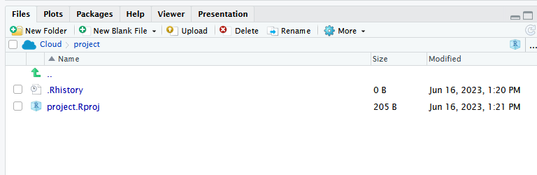

```{r setup, include=FALSE}
library(learnr)
library(gradethis)
library(magick)
# library(studyr)
# devtools::load_all()
knitr::opts_chunk$set(echo = FALSE)
gradethis::gradethis_setup()
```

<div class="img-right">
  <a href="https://meikesteinhilber.github.io/studyr/"> <i class="fa-solid fa-house" aria-label="Link zur studyr Homepage" aria-hidden="true"></i> 
  </a> 
</div>


## R und RStudio Installation

1. R Installation
unter: https://cran.r-project.org/bin/windows/base/

2. RStudio Installation
unter: https://posit.co/download/rstudio-desktop/

## RStudio Einstieg
RStudio ist eine sogenannte *integrated development environment* (IDE), also eine Entwicklungsumgebung für die Programmiersprache R.
Grundsätzlich sind auch andere IDEs möglich, wir werden in diesem Tutorial jedoch immer davon ausgehen, dass RStudio verwendet wird.

Nach dem RStudio geöffnet wird, sieht es so aus:

SCREENSHOT

Aktuell haben wir noch kein Dokument geöffnet.
Wir sehen aktuell 3 separierte Bereiche bzw. Fenster.

### Console
{.absolute left="100%" width="80%"}

In der *Console* können R Befehle direkt ausgeführt werden.
Dies ist praktisch für kleine Taschenrechner Befehle oder kleine Tests.
Der Nachteil ist jedoch, dass die R Befehle nicht gespeichert werden können.
Dafür wird ein R Skript benötigt.

{.absolute left="100%" width="60%"}


### Environment
{.absolute left="100%" width="80%"}

Das Environment ist zu Beginn einer R Session leer.
Wenn wir jedoch Variablen speichern oder Datensätze einladen, werden diese Objekte hier angezeigt.

{.absolute left="100%" width="80%"}

### Files
{.absolute left="100%" width="80%"}

Je nachdem wo die *working directory* gesetzt ist, werden hier unterschiedliche Dokumente und Ordner angezeigt.

### R Skripte

Wenn ein R Skript geöffnet wird, wird ein weiteres Fenster für das Skript angezeigt.
In einem R Skript kann Code abgespeichert werden.

## Neues R Skript öffnen

Ein neues leeres R Skript wir über diesen Button geöffnet:

{.absolute left="100%" width="80%"}

Man erhält eine große Anzahl an möglichen Formaten, unter anderem auch ein R Skript.

{.absolute left="100%" width="20%"}

Das neu geöffnete R Skript sieht nun so aus und kann direkt abgespeichert werden  mit dem Disketten-Symbol.

{.absolute left="100%" width="80%"}

## RStudio vs studyr

Die studyr Tutorials sind alle interaktiv gestaltet.
Damit wir dir Feedback geben können und du nicht immer zwischen RStudio und unserer Website wechseln musst, sind R-Bausteine eingebaut.
Siehe dir die folgenden Bilder und Aufgaben an, um zu verstehen wie in unseren Tutorials R eingebaut ist.

{.absolute left="100%" width="80%"}

So sieht derselbe R Code in unserem Tutorial Format aus

`r studyr::colorize("Übungsaufgabe:", "#CA225E")`
 *Klicke auf den Button "Run Code" und vergleiche die Ausgabe mit den obrigen Bildern*.
```{r r-vs-tutorial, exercise=TRUE}
5*5

# Dies ist ein Kommentar

print("Hallo liebe Studis!")
```

Versuche Dich nun selbst!

`r studyr::colorize("Übungsaufgabe:", "#CA225E")`
*Berechne 84 \* 15.
Gebe dazu die Berechnung in den R Code Bereich ein und klicke auf "Rund Code"*
```{r ex-r-vs-tutorial, exercise=TRUE}

```

```{r ex-r-vs-tutorial-check}
grade_result(
  pass_if(~identical(.result, 84 * 15)),
  glue_correct = "Richtig!"
)
```
