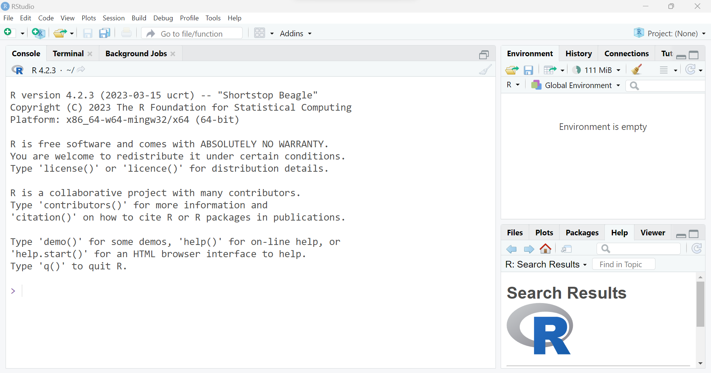
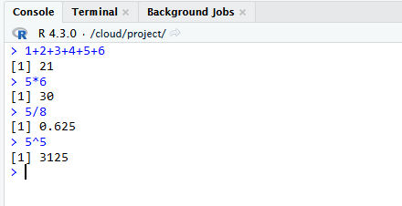
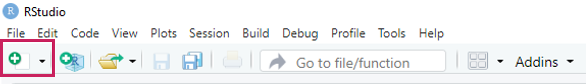
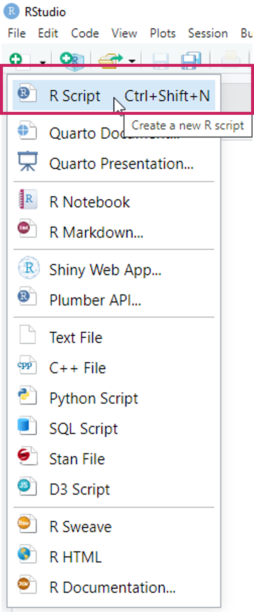
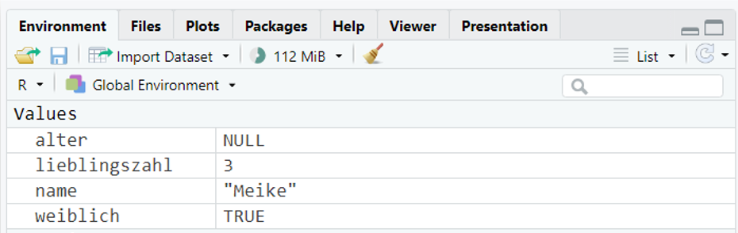

<script>
$(document).ready(function() {
  $("#tutorial-topic").prepend(`<div class="img-right">
  <a href="https://meikesteinhilber.github.io/otter/"> <i class="fa-solid fa-house" aria-label="Link zur otter Homepage" aria-hidden="true"></i>
  </a>
  </div>`);
  
  $("#learnr-tutorial-content.topics").prepend(
  `<div class="logo">
  
  </div>`);

  $("a[href^='#']").on("click", function(event) {
    const currentSection = $(".section.current");
    var href = $(this).attr("href");

    if(!$(href, currentSection).length) {
      return;
    }
    var href = href.substr(1);
    event.preventDefault();

    const el = document.getElementById(href);
    if(!el) {
      return;
    }
    window.scrollTo({
      top: el.offsetTop,
      left: 0,
      behavior: "smooth",
    });
  });
});

</script>

```{r setup, include=FALSE}
library(learnr)
library(gradethis)
library(scales)
# devtools::load_all()
# remotes::install_github("MeikeSteinhilber/otter")
# remotes::install_github("rstudio/gradethis")
# library(otter)
knitr::opts_chunk$set(echo = FALSE)
gradethis::gradethis_setup(
  pass.praise = FALSE,
  fail.encourage = FALSE,
  pass = "Richtig!",
  fail = "Das ist leider falsch."
  )
tutorial_options(exercise.reveal_solution = TRUE,
                 exercise.blanks = "___",
                 exercise.eval = TRUE)
blue <- "#00c4e6"
```

## R und RStudio Installation

{right="100%" width="10%"}

**1. R Installation**

  -   allgemein unter: https://cran.rstudio.com/

  -   für Windows: https://cran.rstudio.org/bin/windows/base/

  -   für macOS: https://cran.r-project.org/bin/macosx/


<br>
{right="100%" width="20%"}

**2. RStudio Installation**

  -   unter: https://posit.co/download/rstudio-desktop/


## RStudio Einstieg

### Kapitel


<a href="#section-console"> <i class="fa-solid fa-arrow-down"></i> Console</a>

<a href="#section-environment"><i class="fa-solid fa-arrow-down"></i> Environment</a>

<a href="#section-files"><i class="fa-solid fa-arrow-down"></i> Files</a>

<a href="#section-r-skripte"><i class="fa-solid fa-arrow-down"></i> R Skripte</a>


RStudio ist eine sogenannte *integrated development environment* (IDE), also eine Entwicklungsumgebung für die Programmiersprache R.
Grundsätzlich sind auch andere IDEs möglich, wir werden in diesem Tutorial jedoch immer davon ausgehen, dass RStudio verwendet wird.

Nach dem RStudio geöffnet wird, sieht es so aus:

{.absolute .images-shadow left="100%" width="80%"}

Aktuell haben wir noch kein Dokument geöffnet.
Wir sehen aktuell 3 separierte Bereiche bzw. Fenster.

### Console
<a href="#section-rstudio-einstieg"> <i class="fa-solid fa-arrow-up"></i></a>


{.absolute .images-shadow left="100%" width="80%"}

In der *Console* können R Befehle direkt ausgeführt werden.
Dies ist praktisch für kleine Taschenrechner Befehle oder kleine Tests.
Der Nachteil ist jedoch, dass die R Befehle nicht gespeichert werden können.
Dafür wird ein R Skript benötigt.

{.absolute .images-shadow left="100%" width="60%"}


### Environment
<a href="#section-rstudio-einstieg"> <i class="fa-solid fa-arrow-up"></i></a>

{.absolute .images-shadow left="100%" width="80%"}

Das Environment ist zu Beginn einer R Session leer.
Wenn wir jedoch Variablen speichern oder Datensätze einladen, werden diese Objekte hier angezeigt.

{.absolute .images-shadow left="100%" width="80%"}

### Files
<a href="#section-rstudio-einstieg"> <i class="fa-solid fa-arrow-up"></i></a>

{.absolute .images-shadow left="100%" width="80%"}

Je nachdem wo die *working directory* gesetzt ist, werden hier unterschiedliche Dokumente und Ordner angezeigt.

### R Skripte
<a href="#section-rstudio-einstieg"> <i class="fa-solid fa-arrow-up"></i></a>

Wenn ein R Skript geöffnet wird, wird ein weiteres Fenster für das Skript angezeigt.
In einem R Skript kann Code abgespeichert werden.


## R Skript

### Kapitel

<a href="#section-kommentare"><i class="fa-solid fa-arrow-down"></i> Kommentare</a>

<a href="#section-neues-r-skript-öffnen"><i class="fa-solid fa-arrow-down"></i> Neues R Skript öffnen</a>


In einem R Skript kann Code abgespeichert werden.

{.absolute .images-shadow left="100%" width="80%"}


### Kommentare
<a href="#section-r-skript"> <i class="fa-solid fa-arrow-up"></i></a>

Grundsätzlich wird jeder Befehl und jedes Zeichen als R Code verstanden.
Wenn man einen Kommentar schreiben möchte, muss man in jeder Zeile eine `#` davor setzen.

{.absolute .images-shadow left="100%" width="80%"}

Code wird ausgeführt in dem der gewünschte Bereich markiert wird und dann auf den *Run*-Button geklickt wird. Es kann hier der gesamte Code markiert werden, aber auch einzelne Zeilen oder sogar nur einzelne Befehle.

{.absolute .images-shadow left="100%" width="80%"}

Die Tastenkombination für *Run* ist unter Windows `Str + Enter` und unter macOS `Cmd + Enter`.

### Neues R Skript öffnen
<a href="#section-r-skript"> <i class="fa-solid fa-arrow-up"></i></a>

Ein neues leeres R Skript wir über diesen Button geöffnet:

{.absolute .images-shadow left="100%" width="80%"}

Man erhält eine große Anzahl an möglichen Formaten, unter anderem auch ein R Skript.

{.absolute .images-shadow left="100%" width="20%"}

Das neu geöffnete R Skript sieht nun so aus und kann direkt abgespeichert werden  mit dem Disketten-Symbol.

{.absolute .images-shadow left="100%" width="80%"}


## RStudio vs `otter`

Die `otter` Tutorials sind alle interaktiv gestaltet.
Damit wir dir Feedback geben können und du nicht immer zwischen RStudio und unserer Website wechseln musst, sind R-Bausteine eingebaut.
Siehe dir die folgenden Bilder und Aufgaben an, um zu verstehen wie in unseren Tutorials R eingebaut ist.

{.absolute left="100%" width="80%"}


#### Übungen
So sieht derselbe R Code in unserem Tutorial Format aus:

<div class="uebungen">

`r otter::colorize("Aufgabe", "var(--blue)")`
 *Klicke auf den Button "Run Code" und vergleiche die Ausgabe mit den obrigen Bildern*.
```{r r-vs-tutorial, exercise=TRUE, results = "hold", exercise.eval=FALSE}
5*5

# Dies ist ein Kommentar

print("Hallo Welt!")
```

Versuche Dich nun selbst!

`r otter::colorize("Aufgabe", "var(--blue)")`
*Berechne 84 \* 15.
Gebe dazu die Berechnung in den R Code Bereich ein und klicke auf "Code ausführen"*
```{r ex-r-vs-tutorial, exercise=TRUE, results = "hold", exercise.eval=FALSE}

```

```{r ex-r-vs-tutorial-check, results = "hold", exercise.eval=FALSE}
grade_result(
  pass_if(~identical(.result, 84 * 15)),
  glue_correct = "Richtig!"
)
```

</div> 

## Datentypen

### Kapitel

<a href="#section-kurze-zusammenfasssung"> <i class="fa-solid fa-arrow-down"></i> Kurze Zusammenfasssung</a>

<a href="#section-logical"> <i class="fa-solid fa-arrow-down"></i> Logical</a>

<a href="#section-integer"> <i class="fa-solid fa-arrow-down"></i> Integer</a>

<a href="#section-double"> <i class="fa-solid fa-arrow-down"></i> Double</a>

<a href="#section-character"> <i class="fa-solid fa-arrow-down"></i> Character</a>

<a href="#section-viel-nichts-in-r"> <i class="fa-solid fa-arrow-down"></i> Viel Nichts in R</a>

<a href="#section-infektiöse-fehlende-werte"> <i class="fa-solid fa-arrow-down"></i> Infektiöse fehelende Werte</a>

<a href="#section-hilfreiche-funktionen"> <i class="fa-solid fa-arrow-down"></i> Hilfreiche Funktionen</a>

### Kurze Zusammenfasssung
<a href="#section-datentypen"> <i class="fa-solid fa-arrow-up"></i></a>

-   Logical: TRUE, FALSE
-   Integer: Ganze Zahlen (Platz speichernd)
-   Double: Kommazahlen
-   Character: Buchstaben

### Logical
<a href="#section-datentypen"> <i class="fa-solid fa-arrow-up"></i></a>

Werte:   `TRUE` (entwpricht 1) und `FALSE` (entspricht 0)

Kann aufsummiert werden:

```{r logicals-1, exercise=TRUE, results = "hold"}
TRUE + TRUE 
FALSE + FALSE
TRUE + FALSE 
```

Logische Operatoren können angewandt werden

```{r logicals-2, exercise=TRUE, results = "hold"}
FALSE & TRUE
FALSE | TRUE
5 < 10
```

__Logische Operatoren__

| Symbol | Bedeutung   |
|--------|-------------|
| `<`    | kleiner als |
| `>`    | größer als  |
| `==`   | gleich      |
| `!=`   | ungleich    |
| `|`    | oder        |
| `&`    | und         |
| `!`    | Negierung   |

<!-- : Logische Operatoren -->

Mit Logischen Operatoren können auf Objekte (Variablen, Vektoren, Datensätze, ...) angewandt werden.
Als Ergebnis wird immer der Datentyp `logical` ausgegeben.

```{r logical-3, exercise=TRUE, results = "hold"}
buchstaben <- c("A", "B", "C", "D", "C")
zahlen <- c(18, 22, 16, 20)

# Welche Buchstaben sind C?
buchstaben == "C"

# Welche Zahl ist größer als 20?
zahlen > 20
```


#### Übungen
<div class="uebungen">

`r otter::colorize("Vorbereitung", "var(--blue)")`
```{r setup-logical, exercise.eval=FALSE}
namen <- c("Lisa Müller", "Peter Bauer", "Hannah Schmidt")
angemeldet <- c(TRUE, FALSE, TRUE)
alter <- c(18, 22, 16)
```

```{r, ref.label=I('setup-logical'), eval=TRUE, echo=TRUE, exercise.eval=FALSE}

```

`r otter::colorize("Aufgabe:", "var(--blue)")` *Beantworte die gestellte Frage mit R Code.*

```{r ex-logical-1, exercise=TRUE, results = "hold", exercise.setup = "setup-logical", exercise.eval=FALSE}
# Wer von den Personen heißt NICHT Lisa Müller?

```
```{r ex-logical-1-hint-1, exercise.eval=FALSE}
namen ___ "Lisa Müller"
```
```{r ex-logical-1-hint-2, exercise.eval=FALSE}
!=
```
```{r ex-logical-1-solution, exercise.eval=FALSE}
# Wer von den Personen heißt NICHT Lisa Müller?
namen != "Lisa Müller"
```

```{r ex-logical-1-check}
grade_this({
  pass_if_equal()
  fail()
})
```


`r otter::colorize("Aufgabe:", "var(--blue)")` *Beantworte die gestellte Frage mit R Code.*
```{r ex-logical-2, exercise=TRUE, results = "hold", exercise.setup = "setup-logical", exercise.eval=FALSE}
# Wer von den Personen ist jünger als 18 Jahre?

```

```{r ex-logical-2-solution, exercise.eval=FALSE}
# Wer von den Personen heißt NICHT Lisa Müller?
alter < 18
```

```{r ex-logical-2-check, exercise.eval=FALSE}
grade_this({
  pass_if_equal()
  fail()
})
```

</div>
### Integer
<a href="#section-datentypen"> <i class="fa-solid fa-arrow-up"></i></a>

`integer`-zahlen sind Ganzezahlen in R.
Sie sind platzsparender als `double` Zahlen, da Kommas ausgeschlossen sind.
R geht zuerst immer davon aus, dass es sich um `double` Zahlen handelt, somit müssen `integer`-Zahlen explizit definiert werden.

Hier gibt es zwei Möglichkeiten:

-   L muss direkt dahinter gesetzt werden, z.B. `2L`
-   `:` ermöglich schnell eine Folge an `integer` Zahlen zu generieren, z.B. `1:3` erzeugt die Zahlen von 1 bis 3 in einzer Schritten

```{r integers-1, exercise=TRUE, results = "hold"}
1L
1:10
10:1
```

Mit der Funktion `is.integer()` können wir prüfen, ob es sich um `integer`-Zahlen handelt oder nicht.

```{r integers-2, exercise=TRUE, results = "hold"}
is.integer(1)
is.integer(1L)
```

### Double
<a href="#section-datentypen"> <i class="fa-solid fa-arrow-up"></i></a>


`double`-zahlen sind sogenannte Gleitkommazahlen.
Diese Zahlentypen werden für normale Berechnungen verwendet

-   Kommazahlen
-   Sonderfälle
    -   `Inf` Positive Unendlichkeit
    -   `-Inf` Negative Unendlichkeit
    -   `NaN` Not a Number (Fehlender Wert im Datensatz)
    
```{r doubles-1, exercise=TRUE, results = "hold"}
8/5
4.44 + 2.1
```

Mit der Funktion `typeof()` können wir abfragen, um welchen Datentyp es sich handelt.

```{r doubles-2, exercise=TRUE, results = "hold"}
typeof(5)
```

### Character
<a href="#section-datentypen"> <i class="fa-solid fa-arrow-up"></i></a>

Text oder Symbole oder auch Farben, werden in Datentyp `character` gespeichert.

Text muss in `""` gesetzt werden.

Dies ist ein Beispiel für Text.
```{r character-1, exercise=TRUE, results = "hold"}
"Hallo Welt"
```

Text wird häufig als Funktionsargument verwendet, z.B. um Symbole anzuzeigen.
(Die Icons stammen von [fontawesome](https://fontawesome.com/search?o=r&m=free).)
```{r character-2, exercise=TRUE, results = "hold"}
shiny::icon("rocket")
shiny::icon("star")
```

Oder auch für Hexcode, um Farben zu definieren.

```{r character-3, exercise=TRUE, results = "hold"}
scales::show_col(c("#044a85", "#e28743", "#1F98B44D", "#1F98BC"))
```

### Viel Nichts in R
<a href="#section-datentypen"> <i class="fa-solid fa-arrow-up"></i></a>

In R gibt es viele Möglichkeit, um auszudrücken, dass etwas nicht vorhanden ist.
Alle Formen von "Nichts" haben eine leicht andere Bedeutung und werden in unterschiedlichen Fällen verwendet oder produziert.

Hier eine (nicht vollständige) Übersicht:

- `NaN`: *Not a Number* (Länge ist 1). Wir verwendet bei invaliden Rechenoperationen.

- `NA`: *Not Available* (Länge ist 1). Wird klassisch für fehlende Werte verwendet.

- `NULL`: Repräsentiert das Null-Objekt in R (Länge ist Null). Wird z.B. in Funktionen verwendet für default Argumente.

- `logical(0)`: Ein `logical`-Wert der Länge Null.

- `integer(0)`: Eine `integer`-Zahl der Länge Null.

- `double(0)`: Eine `double`-Zahl der Länge Null.

All diese Werte stellen „nichts" oder „fehlend" dar.

Die Länge dieser Werte unterscheidet sich, so sind manche 0 und andere 1.

```{r na-2, exercise=TRUE, results = "hold"}
length(NaN)
length(NA)
length(NULL)
length(integer(0))
length(double(0))
```

Beispiele für die Erzeugung von `NA`
```{r na-3, exercise=TRUE, results = "hold"}
NA == "test"
NA == 5
NaN == 5
```

Beispiele für die Erzeugung von `NaN`
```{r na-5, exercise=TRUE, results = "hold"}
0/0
Inf/1
```

Beispiele für die Erzeugung von `logical(0)`
```{r na-4, exercise=TRUE, results = "hold"}
NULL == "test"
NULL == 5
integer(0) == 5
```

### Infektiöse fehlende Werte
<a href="#section-datentypen"> <i class="fa-solid fa-arrow-up"></i></a>

Fehlende Werte wie `NaN` sind manchmal infektiös!

Bei Rechenoperationen führt z.B. ein `NaN` dazu, das das Ergebnis auch ein fehlender Wert ist.

Dies gilt jedoch nicht für `|` Operationen.

`NaN` kann NICHT mit `==` geprüft werden! Es muss mit `is.na()` geprüft werden.

```{r na-1, exercise=TRUE, results = "hold"}
NaN == NaN
NaN < 5
10 * NaN
NaN & TRUE

NaN | TRUE
is.na(NaN)
```

### Hilfreiche Funktionen
<a href="#section-datentypen"> <i class="fa-solid fa-arrow-up"></i></a>

Erstellen Dummy Variablen eines bestimmten Datentyps:

```{r data-functions1, exercise=TRUE, results = "hold"}
integer(5)
double(5)
character(5)
logical(5)
```


Prüfungen, welcher Datentyp vorliegt:

```{r data-functions2, exercise=TRUE, results = "hold"}
# Erzeugung einer Variable
number = 5
# Prüfung der Variable
is.integer(number)
is.double(number)
is.character(number)
is.logical(number)
is.numeric(number)

# Prüfung von Spezialfällen
is.na(number)
is.finite(number)
is.infinite(number)
```

## Datenstrukturen

### Variablen

Variablen sind Kontainer für Daten.
Sie zeigen auf ein Objekt im Speicher.
Sie müssen *ausgeführt* werden, um erstellt und genutzt werden zu können.
Nach Erstellung taucht die Variable im *Environment* auf.

Eine Variable kann verschiedene Inhalte enthalten, z.B eine Zahl, Buchstaben, Matrizen oder Listen.

Der Inhalt einer Variable kann auf die *Konsole* geschrieben werden, wenn der Variablenname ausgeführt wird.

```{r variable-1, exercise=TRUE, results = "hold"}
name <- "Meike"
weiblich <- TRUE
lieblingszahl <- 3
alter <- NULL
name
weiblich
lieblingszahl
```

In RStudio ist nach dem Ausführen dieses Codes im *Environment* folgendes zu sehen:

{.absolute width="500"}

Variablen können mit Operatoren Inhalte zugewiesen werden. In R gibt es hierfür zwei Zuweisungsoperatoren: `<-` und `=`.
Wobei es als guter Stil gilt einheitlich `<-` zu verwenden.


```{r variable-2, exercise=TRUE, results = "hold"}
pfeil_beispiel <- "Pfeil"
gleich_beispiel = "Gleich"
pfeil_beispiel
gleich_beispiel
```

Der Inhalt von einer Variable kann jederzeit geändert werden.
Neue Daten können mit dem Zuweisungsoperator zugewiesen werden.
Dadurch werden die alten Daten überschrieben.

```{r variable-3, exercise=TRUE, results = "hold"}
# Alte Daten
freunde <- 1:5
freunde
# Neue Daten Variante 1 (anderer Datentyp)
freunde <- c("Lisa", "Thorben", "Mara")
freunde
# Neue Daten Variante 2 (einzelne Daten ändern)
freunde[2] <- "XXXX"
freunde
# Neue Daten Variante 3 (einzelne Daten ändern)
freunde[c(FALSE, TRUE, TRUE)] <- ""
freunde
```

### Atomare Vektoren
Atomare Vektoren können mehrere Informationen desselben Datentyps enthalten.

-   Werden mit `c()` erstellt (c = combine)
-   *Skalare*: Vektoren mit nur einer Position
-   „klassische Vektoren": Vektoren mit mehr als einer Position
-   Zugriff erfolgt mit Klammern `[]` und Nummer der Position oder einem Vektor mit `TRUE` und `FALSE` Werten.

Beispiel Zugriff mit `[]`
```{r vektoren-1, exercise=TRUE, results = "hold"}
name = "Meike"
namen_freunde = c("Lisa", "Thorben", "Mara")
lieblingszahlen_freunde = c(1, 7, 8)
weiblich_freunde = c(TRUE, FALSE, TRUE)

# Zugriff erfolgt mit []
namen_freunde[2]
lieblingszahlen_freunde[2]
weiblich_freunde[c(2, 3)]
```

Beispiel Zugriff mit `TRUE` und `FALSE`

```{r vektoren-2, exercise=TRUE, results = "hold"}
namen_freunde = c("Lisa", "Thorben", "Mara")
namen_freunde[c(TRUE, TRUE, TRUE)]
namen_freunde[c(TRUE, FALSE, FALSE)]
```

### Vektorisierte Berechnungen

Die Berechnungen in R erfolgen *vektorisiert*.
Dies erlaubt effizienteres und leichteres Programmieren bei Rechenoperationen.

Beispiel: Multiplikation eines Vektors mit einem Skalar

```{r vektoren-4, exercise=TRUE, results = "hold"}
# Jede Zahl im Vektor wird hier automatisch mit 5 multipliziert
c(1, 2, 3, 4) * 5
```

Beispiel: Addition zweier Vektoren

```{r vektoren-5, exercise=TRUE, results = "hold"}
# Die Zahlen auf denselben Positionen werden mit einender addiert
zahlen_1 <- c(0, 0, 1, 1)
zahlen_2 <- c(1, 2, 3, 4)
zahlen_1 + zahlen_2
```

Beispiel: Logische Operatoren

```{r vektoren-6, exercise=TRUE, results = "hold"}
# Alle Zahlen werden mit dem logischen Operator geprüft
zahlen <- c(0, 1, 2, 3)
zahlen < 2
```


### Faktoren

### Matrizen
-   Bestehen aus Vektoren gleicher Länge
-   Können NUR einen Datentyp enthalten
-   `matrix()`
-   Zugriff mit `[,]`
-   `[Zeile,Spalte]` (erst Zeile, dann Spalte)

```{r matrix-1, exercise=TRUE, results = "hold"}
matrix <- matrix(1:12, nrow=3, ncol=4)
matrix

matrix[1,2]
matrix[1, ]
matrix[ ,2]
```

### data.frame

-   Klassischer Datensatz
-   Besteht aus Spalten gleicher Länge
-   Spalten können verschiedene Datentypen haben.
-   Auf Spalte wird mit `$` zugegriffen

{width="300"}

```{r matrix-2, exercise=TRUE, results = "hold"}
namen_freunde = c("Lisa", "Thorben", "Mara")
lieblingszahlen_freunde = c(1, 7, 8)
weiblich_freunde = c(TRUE, FALSE, TRUE)

freunde <- data.frame(namen_freunde,
                      lieblingszahlen_freunde,
                      weiblich_freunde)
freunde

freunde[2, 1]
freunde$namen_freunde
freunde$namen_freunde[2]
```

```{r setup-datenstruktur, exercise.eval=FALSE}
namen_freunde = c("Lisa", "Thorben", "Mara")
lieblingszahlen_freunde = c(1, 7, 8)
weiblich_freunde = c(TRUE, FALSE, TRUE)

freunde <- data.frame(namen_freunde,
                      lieblingszahlen_freunde,
                      weiblich_freunde)
liste <- list(matrix, freunde, name)
```

### Listen

-   Komplexe Struktur
-   Jedes Element kann jeden Datentyp annehmen
-   Eine Liste kann also auch Listen enthalten!
-   Sehr variabel

Listen sind sehr mächtig! Ich rate zu Beginn dennoch davon ab, sie zu verwenden.

```{r matrix-3, exercise=TRUE, results = "hold", exercise.setup = "setup-datenstruktur"}
liste <- list(matrix, freunde, name)
liste
```

Beispiel Listen Zugriff

```{r matrix-4, exercise=TRUE, results = "hold", exercise.setup = "setup-datenstruktur"}
liste[1]
liste[[1]][[2]]
liste[[2]][[2]]
```

## Funktionen

-   Sind elegante Möglichkeiten Code Abschnitte zu bündeln und zu strukturieren
-   Sie tun irgendetwas mit Daten, Dokumenten, Argumenten etc.
-   Können sehr klein, aber auch sehr groß und komplex sein.
double() oder length() sind z.B. Funktion, die in base R vorkommen

-   In 3 Teile strukturiert
    -   Argumente
    -   Body der Funktion
    -   Environment (kommt später)

```{r funktionen-1, exercise=TRUE, results = "hold"}
function_name <- function(argument) {
  # function_body
  # do something with the arguments
  return("Output")
}

function_name(argument = "test")
```

Es gilt als guter Stil `return()` zu nutzen.

```{r}
add_numbers <- function(number1, number2) {
  result = number1 + number2
  return(result)
}
add_numbers(5,80)
```

Es ist aber nicht zwingend erforderlich
```{r}
add_numbers <- function(number1, number2) {
  number1 + number2
}
add_numbers(5,80)
```

Mehrere Argumente

```{r}
namen = c("Lisa", "Thorben", "Mara", "Sophie", "Lara", "Tanja", "Lorenz", "Lena")

read_vector <- function(number, vector) {
  vector[number]
}

read_vector(2, namen)
```

Default Werte

```{r}
add_numbers <- function(number1 = 1, number2 = 1, argument3 = NULL) {
  number1 + number2
}
add_numbers(5,80)
add_numbers()
```
Optionale Argumente werden mit argument = NULL angegeben

### Help Seiten

Die Hilfe Seite öffnet sich mit einem `?` vor dem Funktionsnamen.

Beispiele: `?mean` oder `?t.test`

{height="600"}
### Hilfreiche Funktionen

Zahlen:

`length()`

`mean()`

`sum()`

`sqrt()`

`is.na()`

`unique()`

`round()`

`data.frame()`

`matrix()`

Daten simulieren

```{r}
# repeat a vector or a string
rep(0, 10)
rep("lala", 10)

# draw random data
sample(1:100, size = 10, replace = TRUE)

# draw random data from a normal distribution
rnorm(n = 10, mean = 0, sd = 2)

# draw random data from a uniform distribution
runif(n = 10, min = 0, max = 2)
```

Text

```{r}
variable = "Meike"
print(variable)
cat("Hello", variable, "! How are you?")
paste("Hello", variable, "! How are you?")
paste0("Hello ", variable, "! How are you?")
glue::glue("Hello {variable}! How are you?")
```

## R Pakete

## Datenverarbeitung

## Daten importieren & exportieren

### Import

### Export

## RMarkdown

## Environments

## Debugging

### Warnungen & Fehler

### Tipps

## Clean Code

## R Projekte

## Code Flow

### if-else 

### for-loop

### while-loop
