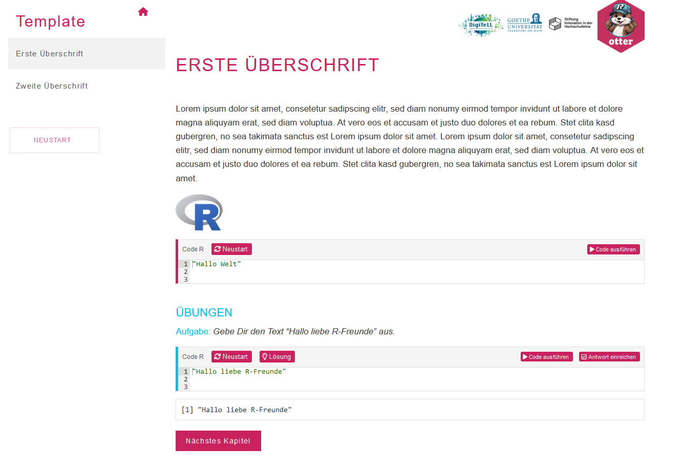
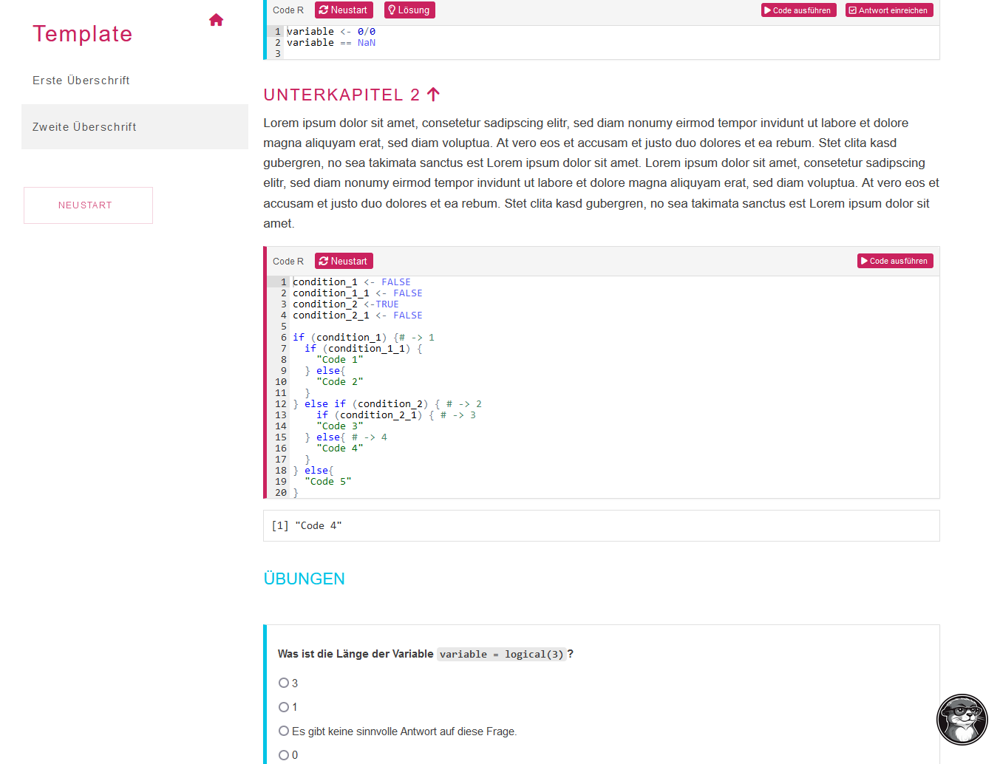

```{r setup, include=FALSE}
knitr::opts_chunk$set(
  echo = TRUE,
  collapse = TRUE,
  comment = "#>",
  # fig.path = "man/figures/README-",
  out.width = "100%"
)
options(tibble.print_min = 5, tibble.print_max = 5)
```

Du findest Otter technisch gelungen, aber du würdest gerne deine eigenen Inhalte und Übungen für die Lehre erstellen?

Dann bist du hier richtig!

In diesem technischen Handout wird ein Überblick über die wichtigsten technischen Grundlagen von Otter festgehalten und Hinweise gegeben, wie auf dieser Basis weitere Tutorials erstellt werden können.

Dabei gehen wir zuerst auf das inhaltliche Learning Design von Otter ein und anschließend auf die technischen Hintergründe.

## Otter als Learning Design

Das inhaltliche Learning Design basiert zentral darauf, dass zum einen Wissen vermittelt wird anhand von Texten, Bildern und Beispielcode. Und zum anderen auch interaktive Übungsaufgaben in echten R Umgebungen mit einer automatischen Feedbackfunktion integriert sind.

Otter Tutorials sollen damit ein Selbststudium ermöglichen, welches mit Übungsaufgaben in ansteigender Komplexität angereichert ist. Dadurch können die User das Lerntempo und die Lerntiefe selbst bestimmen.

Wir haben unser Learning Design von Otter [hier](https://learning-design.eu/en/preview/3952f0466cb81e0379c36b18/details) detaillierte dokumentiert.


## Technischer Hintergrund von Otter

Otter wurde in R als learnr Tutorial implementiert, wobei einige Anpassungen durchgeführt wurden, um die Usability des Tools zu verbessern. Das Tool wurde als R Paket entwickelt, sodass es einmal über Server des Uni-Rechenzentrums in Frankfurt gehostet, aber auch offline auf einem lokalen Rechner genutzt werden kann.

**Lizenzen:** Der gesamte Quellcode wurde auf GitHub (https://github.com/MeikeSteinhilber/otter/) veröffentlicht unter der Open Source Lizenz AGPL-3.0. Diese Lizenz erlaubt ausdrücklich das Verwenden und Weiterentwickeln des Quellcodes, jedoch sind die Entwickler*innen dazu verpflichtet, den weiterentwickelten Code auch unter eine AGPL-3.0 Lizenz zu stellen.

**Voraussetzungen**: Es ist leider nicht möglich auf alle notwendigen Inhalte einzugehen, ohne bereits ein gewisses Maß an Vorwissen zu haben.

Wenn du ein eigenes auf Otter basierendes Tutorial entwickeln möchtest, musst du dich mit mit den R Grundlagen, den Grundlagen der R Package Entwicklung, und mit R Markdown auskennen sowie auch mit den R Packages *learnr* und *gradethis.* Du kannst dein Wissen zu diesen Inhalten auch hier auffrischen oder aufbauen:

- R Grundlagen (Otter Grundlagen Tutorial, https://r4ds.hadley.nz/)

- R Package Entwicklung (https://r-pkgs.org/)

- R Markdown (https://bookdown.org/yihui/rmarkdown/)

- learnr (https://pkgs.rstudio.com/learnr/index.html)

- gradethis (https://pkgs.rstudio.com/gradethis/)

Wenn du das Tutorial auch auf einem Server hosten willst, musst du auch eventuell einen Shiny Server aufsetzen. Wir haben eine kostenlose Shiny Server Variante gewählt, welche jedoch die Konfigurationsmöglichkeiten einschränkt. Dies kann mit einem zusätzlichen Proxy Server verbessert werden.  Da auch dies den Rahmen dieser Anleitung übersteigt, kannst du hier mehr Informationen erhalten:

- https://docs.posit.co/ide/server-pro/1.3.959-1/index.html

- https://support.posit.co/hc/en-us/articles/213733868-Running-Shiny-Server-with-a-Proxy

Otter ist ein R Paket, welches aktuell zwei externe Funktionen und zwei learnr Tutorials enthält.
Die externen Funktionen sind nicht zentral für die Otter Bedienung. Sie wurden jedoch entwickelt, um es User leichter zu machen, auf die Tutorials zuzugreifen über die Kommandozeile. Die Funktionen sind im Abschnitt *Funktionen* dokumentiert auf der Otter Homepage, sowie auch in der internen Package Dokumentation.

Das Otter Grundlagen Tutorial wird aktuell vom Frankfurter Rechenzentrum über einen Shiny-Server gehostet.

Da Otter ein R Paket ist, sind die Ordner und deren Namen z.T. genau vorgeschrieben. So befinden sich die Tutorials im Pfad: inst/tutorials/

Hier gibt es derzeit zwei Tutorials:

- Grundlagen (Das Grundlagentutorial zu R und RStudio)

- template (ein Template für weitere Tutorials)

Das Design von Otter befindet sich im jeweiligen *css* Ordner, die verwendeten Bilder befinden sich im Order *images*, und verwendete Datensätze befinden sich im Ordner *data*.

Selbstverständlich kann das Design auch angepasst werden - dafür sind jedoch CSS Kenntnisse notwendig. Alternativ kann das Design auch einfach gänzlich übernommen werden.

Das Herzstück von Otter sind natürlich die Tutorials, welche aktuell *Grundlagen.Rmd* und *template.Rmd* (für das Template-Tutorial) heißen.

## Otter Template

Wie bereits erwähnt wurde ein Template für neue Otter Tutorials erstellt, welches über GitHub auch [hier](https://github.com/MeikeSteinhilber/otter/tree/master/inst/tutorials/template) eingesehen werden kann.
Das Template enthält alle relevanten Bausteine für ein Otter-Tutorial und Kommentare, welche die einzelnen Funktionen der Bausteine erklären.

So Sieht das Template aus, wenn es geknittet wurde:

{.images-shadow  width="100%"}

{.absolute .images-shadow  width="100%"}

### Ablauf eines neuen Tutorials

Wir empfehlen die folgende Reihenfolge zu beachten:

1. ein neues inhaltliches Learning Design muss entworfen werden.

2. das Otter Paket kann von GitHub geforkt werden (https://github.com/MeikeSteinhilber/otter) und der Templates Ordner kann kopiert und als Vorlage genutzt werden.

3. die Template-Kopie sollte umbenannt und mit individuellen Inhalten (aus dem bereits erstellten Learning Design) gefüllt werden.

4. das neue Template sollte regelmäßig in der Entwicklung geknittet werden, um Fehler frühzeitig zu beheben.

5. das Tutorial ist ab hier nun inhaltlich fertig und kann veröfffentlicht werden.

Ab hier gibt es mehrere Möglichkeiten in Abhängigkeit davon wie und wo das Tutorial zum Einsatz kommen soll.

1. das Tutorial soll Teil von Otter werden. Dies ist dann empfehlenswert, wenn es sich um ein Tutorial handelt, welches einer breiten Audience zur Verfügung gestellt werden soll. Dazu kann ein Pull-Request über GitHub erstellt werden. Zusätzlich müssen weitere Ports für den Server freigegeben werden. Dazu sind Änderungen der Serverkonfiguration notwendig. Nehme hierzu Kontakt zu Meike Steinhilber auf über *M.Steinhilber@em.uni-frankfurt.de*.

2. Alternativ kann das Tutorial auch über einen eigenen Shiny-Server gehostet werden.

3. Alternativ kann das Tutorial auch über den Shiny Server von Posit gehostet werden (https://posit.co/products/open-source/shinyserver/).

3. Alternativ kann das Tutorial auch als ein weiteres GitHub Repository veröffentlich werden (hier ist kein zusätzlicher Server notwendig). Die User könnten dann das Paket lokal von GitHub installieren und das Tutorial offline verwenden. Dies erfordert jedoch mehr Aufwand und Kompetenzen für die User im Vergleich zu einer öffentlich zugänglichen Website. Eine erste Anleitung dazu befindet sich bereits auf der Otter Homepage im FAQ.


